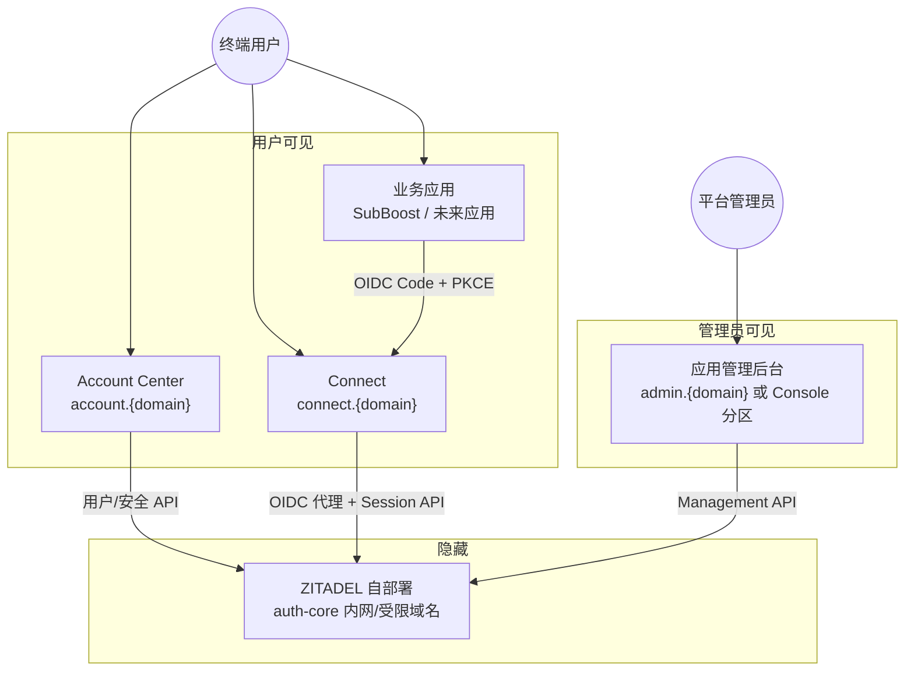
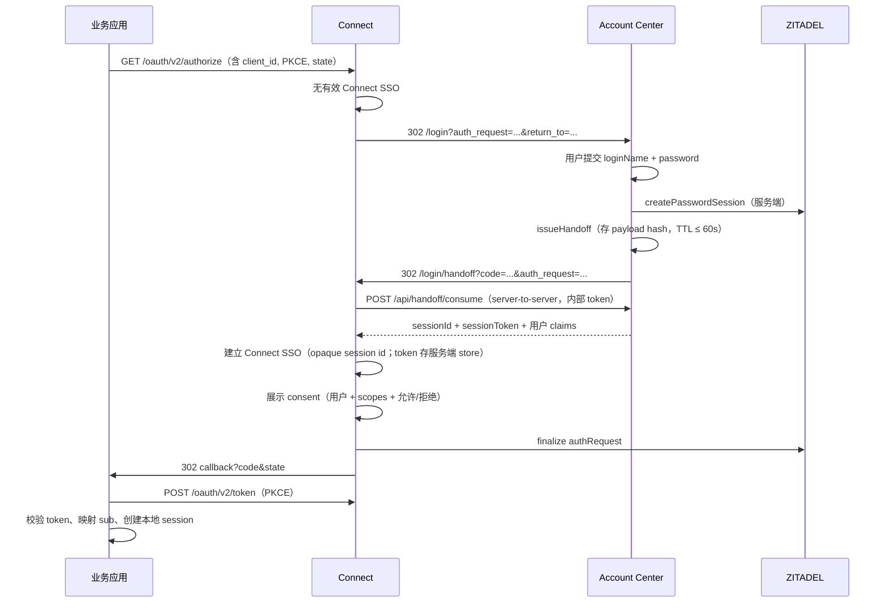

# MoAuth 产品需求文档（PRD v2.0）

**版本**：v2.2
**状态**：**已会签**（2026-06-30）；v2.2 为架构修正案（Account 收密码 + Login Handoff，见 §4.1、DEC-10、DEC-17）
**适用范围**：MoAuth 统一身份系统（Connect + Account + 应用管理 + 隐藏 ZITADEL）
**取代关系**：本文件为产品定义的**主基线**；`uuwu_02_prd.md` 等早期文档中的冲突条款以本文件为准。
**命名说明**：`Uuwu` 仅为早期草稿占位品牌；运行时产品名、域名通过配置注入（当前代码默认 `MoYuan ID`），不得固化为架构边界。

---

## 1. 产品愿景

### 1.1 一句话定义

建设一套**自维护的统一身份系统**：用户在一个账号中心注册并管理账号，通过 Connect 登录网关访问多个自有业务应用；认证协议与数据由**自部署 ZITADEL** 承担，但对终端用户和业务应用**完全隐藏**，仅暴露品牌化 Connect 与 Account。

### 1.2 核心诉求（来自产品负责人）

| 诉求 | 产品回应 |
|---|---|
| 自己维护类似「账号中心」，供用户注册 | **Account Center** 负责注册与账号生命周期 |
| 注册后可用同一账号登录一系列服务 | **Connect** 作为统一 OIDC 发行面 + SSO；各业务应用标准接入 |
| 后端为自部署 ZITADEL，用户无感知 | ZITADEL 仅作隐藏 IdP；Connect 代理 OIDC + BFF 调用 Session API |
| 前面套一层 Connect 网站 | Connect 负责登录、授权、账号选择、登出 |
| 接入很多应用时不应每次改身份系统代码 | **应用管理后台（Console）** 配置化创建 OIDC Client |

### 1.3 非目标（明确不做）

- 从零实现 OAuth2/OIDC Server
- 第三方开发者公开市场（MVP 仅一方自有应用）
- 在统一身份层承载业务权限（角色、配额、审计仍归各应用）
- 强制所有业务应用共享同一业务 session cookie
- MVP 接入外部社交登录（Google/GitHub 等），除非单独变更批准

---

## 2. 产品矩阵与职责边界

系统由 **四个用户可感知/可运维平面** + **一个隐藏核心** 组成。职责不得混用。

### 2.1 职责对照表（会签级）

| 平面 | 域名示例 | 负责 | 不负责 |
|---|---|---|---|
| **Account Center** | `account.example.com` | **密码登录 UI**（通过 Zitadel Session/AuthRequest API 完成认证，认证权威属于 Zitadel）、注册、邮箱验证、忘记密码/重置、已登录改密、资料编辑、MFA/Passkey **管理**、活跃会话查看与撤销、已授权应用查看与撤销；签发短期一次性 Login Handoff | OIDC authorize/token 发行、独立密码认证源、业务权限、应用回调、Connect SSO 管理 |
| **Connect** | `connect.example.com` | **对外唯一 OIDC issuer**（ADR-010）；Discovery/authorize/token/JWKS/userinfo、**SSO 会话复用**、授权确认（consent）、账号选择、登出引导、Passkey **登录** ceremony、跳转 Account 登录/注册/找回密码；消费 handoff 建立 Connect SSO | **密码收集与校验**、用户注册表单提交、资料持久化、应用 Client 配置后台 |
| **应用管理后台（Console）** | `admin.example.com` | 创建/编辑/停用 OIDC Client、redirect/logout URI、scopes、应用展示名/logo、每应用 provisioning 策略、环境隔离 | 终端用户自助、业务数据 |
| **业务应用** | 各应用自有域名 | 发起 OIDC 登录、校验回调、本地 `sub` 映射、本地 session、本地角色权限、按策略拒绝未授权用户 | 密码/MFA 实现、用户主数据、修改 Connect 源码 |
| **ZITADEL（隐藏）** | 不对公网用户暴露 | 用户存储、协议、令牌、内部 session、邮件触发底层、审计原始事件 | 品牌化 UI、直接作为业务应用 OIDC issuer 暴露给终端用户 |

### 2.2 关键原则（防踩坑）

1. **身份与权限分离**：统一身份只回答「你是谁」；「你能做什么」由各应用本地策略决定。
2. **业务应用只认 Connect issuer（ADR-010）**：discovery `issuer`、`id_token.iss`、`jwks_uri` 均指向 Connect；不得直接依赖 ZITADEL 域名、Session Token 或 Management API。
3. **映射主键是 `sub`**：禁止用 email 作为跨系统唯一主键。
4. **Cookie 分域**：Connect、Account、各业务应用各自 session cookie；禁止 `.example.com` 广域业务 cookie。
5. **新增应用不改 Connect 核心代码**：通过 Console 写入 Client 注册表（DB/配置中心），Connect 运行时读取。
6. **同仓、分域、可拆分**（DEC-14）：Account 与 Console 可同代码仓库；必须 `account.<主域>` / `admin.<主域>` 分域、独立 cookie 与权限守卫；模块边界须支持未来独立部署。

---

## 3. 用户角色

| 角色 | 目标 | 主要触点 |
|---|---|---|
| **终端用户** | 注册一次、登录多个应用、自助安全管理 | Account、Connect |
| **业务应用用户** | 在 SubBoost 等应用内完成工作 | 业务应用 + Connect |
| **平台管理员** | 接入新应用、配置回调、审计 | Console |
| **安全/运维** | 可用性、备份、合规、事件追溯 | ZITADEL、Connect、Account、观测栈 |

---

## 4. 核心用户旅程

### 4.1 新用户：从业务应用到完成注册并登录

#### 4.1.1 Account ↔ Connect 登录衔接契约（会签级）

**核心边界（DEC-17）**：**Account 收密码，Connect 不收密码**。Connect 仅负责 OIDC/SSO/授权；密码验证始终由 Account BFF 调用 Zitadel Session API 完成，Connect 不展示邮箱/密码表单（除非 fallback，见下）。

| 方案 | 阶段 | 行为 | 决议 |
|---|---|---|---|
| **主路径：Login Handoff** | P2 | Connect 无 SSO → `302` Account `/login?auth_request=...&return_to=...`；Account 收密码、创建 Zitadel session、签发一次性 handoff code；浏览器 `302` Connect `/login/handoff?code=...`；Connect 服务端 consume code、建立 Connect SSO、展示 consent（若需要）并 finalize | **P2 采用（DEC-10 修订、DEC-17）** |
| **Fallback：Connect 密码表单** | P1 PoC / 开发 | Connect 保留 `POST /api/login` 密码表单；由 `CONNECT_PASSWORD_LOGIN_FALLBACK=true` 开启；**生产默认关闭** | 仅作迁移/本地调试 fallback，非目标态 |

**P2 目标态流程（写死）**：

**注册后登录**：注册/验证在 Account 完成后，**不回到 Connect 输入密码**；在同一 `auth_request` 上下文内由 Account `/login` 收密码并走 handoff（与上表主路径一致）。

**Handoff 契约摘要**（完整见 `uuwu_06_interface_contracts_boundaries.md` §IC-013）：

- Account `POST /api/handoff/issue`（登录成功后内部调用）→ `{ code, expiresAt }`
- Connect → Account `POST /api/handoff/consume`（`MOAUTH_HANDOFF_INTERNAL_TOKEN` 鉴权）
- code：随机 ≥ 32 bytes，**仅存 hash**；TTL ≤ 60s；**单次消费**
- 绑定：`authRequestId` + `sub` + `clientId` + `redirectUri` + `scopes`
- 浏览器**只携带 opaque code**，不接触 `sessionId` / `sessionToken`

**Connect SSO 存储（安全修正）**：cookie 优先只存 **opaque session id**；`sessionId` / `sessionToken` 存服务端 session store（生产建议 Redis/Postgres）。开发期可先用 sealed cookie，但不得仅依赖签名而不加密封装敏感 token。

**`return_url` / `return_to` 约束**：仅允许 Connect 域下 `/login`、`/login/handoff` 等白名单路径，且必须携带可恢复的 `authRequest`（或等价 login transaction），禁止任意 open redirect。

### 4.2 老用户：SSO 快速登录第二应用

1. 用户已在 Connect 存在有效 SSO 会话（opaque `moauth_connect_session` 或等价机制；敏感 token 在服务端 store）。
2. 第二应用发起 authorize。
3. Connect 展示 consent 或「以 xxx 继续」，**无需跳转 Account、无需再次输入密码**。
4. 完成授权，回调第二应用。

**`prompt` 规则（Connect authorize 处理）**：

| `prompt` | 行为 |
|---|---|
| （默认） | 有 Connect SSO → consent/continue；无 SSO → 302 Account `/login` |
| `login` | 忽略现有 Connect SSO；302 Account 重新登录 |
| `none` | 无 Connect SSO 时返回 OIDC `login_required`（`error=login_required`），**不跳转交互页** |
| `consent` | 强制展示 consent，即使 SSO 有效 |
| `select_account` | P5：302 Account 账号选择，或展示未完成提示 |

### 4.3 平台管理员：接入新应用（目标态）

1. 在 Console 创建应用：名称、logo、redirect URIs、logout URIs、scopes、provisioning 策略。
2. Console 调用 ZITADEL Management API 创建 OIDC Application，并将元数据写入平台注册表。
3. 管理员将 `client_id`、discovery URL 交给业务应用负责人。
4. 业务应用按接入模板配置环境变量并实现回调——**无需修改 Connect 源码**。

### 4.4 未授权用户访问受控应用（以 SubBoost 为例）

1. 用户完成统一身份登录（Connect 侧成功）。
2. SubBoost 回调拿到 `sub` 与 claims。
3. SubBoost 按本地 **allowlist/invite** 策略判定：无批准映射 → 返回 `APP_ACCESS_DENIED`，**不创建**本地管理员 session。

---

## 5. 分阶段路线图

| 阶段 | 名称 | 目标 | 用户可感知交付物 |
|---|---|---|---|
| **P0** | 产品定义与架构锁定 | PRD/ADR/接口契约会签；域名与部署策略确认 | 本文档、ADR、验收清单 |
| **P1** | Connect 基础能力 | 隐藏 ZITADEL；OIDC 代理；密码登录（PoC，后续降为 fallback）；SSO continue | 可完成 authorize → login → token → userinfo |
| **P2** | Account MVP + Handoff | 用户能**自主注册**并完成邮箱验证、找回密码；**Account 收密码**；Login Handoff 建立 Connect SSO | Account 站点（:3002）；Connect 无密码表单（fallback 可开） |
| **P3** | 首应用接入 | SubBoost 端到端 OIDC + 本地 session + allowlist | 「统一账号登录 SubBoost」闭环 |
| **P4** | 应用管理后台 | 配置化接入新应用，无需改 Connect 代码 | Console 创建 client、配回调 |
| **P5** | Account 完整能力 | MFA、Passkey 管理、会话列表、授权应用管理 | 账号安全自助齐全 |
| **P6** | 多应用接入套件 | 第二应用按文档接入；SDK/示例 | 接入指南 + Next.js/Java/Go 示例 |
| **P7** | 生产加固 | 限流、观测、备份、回滚、安全测试 | Runbook + 监控面板 |

**与旧 WBS 的重要调整**：

- 旧稿将 Account 放在 Phase 3、注册写在 Connect FR-003 → **本 PRD 将 Account MVP 提前到 P2**，注册/重置密码从 Connect 范围移除。
- 旧稿 FR-305 应用管理为 Could → **本 PRD 将 Console 提升为 P4 Must**（多应用前提）。

---

## 6. 功能需求

需求 ID 规则：`FR-{平面}-{序号}`。平面：`C`=Connect，`A`=Account，`P`=Console，`B`=业务应用（通用），`X`=跨切面。

### 6.1 Connect（`FR-C-*`）

| ID | 用户故事 | 验收标准（GWT） | 阶段 | 优先级 |
|---|---|---|---|---|
| FR-C-01 | 作为业务应用，我希望 discovery/authorize/token/userinfo 指向 Connect 域名 | Given 配置完成；When 请求 `/.well-known/openid-configuration`；Then `issuer` 与各 endpoint 均为 Connect 域名 | P1 | Must |
| FR-C-02 | 作为用户，我希望在无 SSO 时被引导到 Account 完成认证 | Given 有效 authRequest、无 Connect SSO；When Connect 处理 authorize；Then 302 Account `/login`（携带 `auth_request`），**Connect 不展示密码表单**（除非 `CONNECT_PASSWORD_LOGIN_FALLBACK=true`） | P2 | Must |
| FR-C-03 | 作为用户，我希望在已登录时快速进入其他应用 | Given 有效 Connect 记住会话；When 新 authRequest；Then 可通过 continue/账号选择跳过密码 | P1 | Must |
| FR-C-04 | 作为无账号用户，我希望从登录页去注册 | Given 登录页；When 点击「创建账号」；Then 跳转 Account `/register` 并携带 `return_url` 回到当前 authRequest | P2 | Must |
| FR-C-05 | 作为忘记密码用户，我希望从登录页找回密码 | Given 登录页；When 点击「忘记密码」；Then 跳转 Account `/forgot-password`（可带 `return_url`） | P2 | Must |
| FR-C-06 | 作为用户，我希望看到授权给哪个应用 | Given handoff/SSO 已建立；When 策略要求 consent 或 `prompt=consent`；Then 展示当前用户（名/邮箱）、应用名、scopes、允许/拒绝；**不展示密码输入** | P2/P3 | Must |
| FR-C-07 | 作为用户，我希望在多账号时选择身份 | Given 多个有效会话；When `prompt=select_account`；Then 展示账号列表并继续 | P5 | Should |
| FR-C-08 | 作为用户，我希望登出当前应用或全局会话 | Given 已登录；When 选择退出；Then 业务本地 session 清除；可选跳转 Connect end_session | P3 | Must |
| FR-C-09 | 作为用户，我希望失败时看到清晰错误页 | Given 非法 redirect/state 等；When 失败；Then 品牌错误页含错误码与 trace id | P1 | Must |
| FR-C-10 | 作为用户，我希望 Passkey 登录 | Given 登录域与 RP ID 已冻结；When 选择 Passkey；Then 通过 BFF 完成 WebAuthn ceremony | P5 | Should |

**Connect 明确 Out of Scope**：**密码收集与校验**（目标态）、注册表单、邮箱验证、改密表单、OIDC Client CRUD。P1 PoC 密码表单仅作 `CONNECT_PASSWORD_LOGIN_FALLBACK` 保留项。

### 6.2 Account Center（`FR-A-*`）

| ID | 用户故事 | 验收标准（GWT） | 阶段 | 优先级 |
|---|---|---|---|---|
| FR-A-01 | 作为新用户，我想注册账号 | Given 无账号；When 提交邮箱、密码、显示名；Then ZITADEL 创建用户并进入验证流程 | P2 | Must |
| FR-A-02 | 作为新用户，我想验证邮箱 | Given 收到验证邮件；When 点击链接；Then `email_verified=true` 且 userinfo 反映 | P2 | Must |
| FR-A-03 | 作为用户，我想找回密码 | Given 忘记密码；When 提交邮箱；Then 发送重置链接且可设置新密码 | P2 | Must |
| FR-A-03b | 作为刚完成注册/验证的用户，我回到 Connect 继续登录业务应用 | Given 从 Connect 带 `authRequest` 跳转注册；When 验证完成；Then 在 Account `/login` 输入密码一次，走 handoff 回 Connect；**不在 Connect 输入密码**（DEC-10 修订） | P2 | Must |
| FR-A-11 | 作为用户，我想在 Account 用密码登录以接入业务应用 | Given 有效 `auth_request`；When 提交 `loginName`+`password`；Then Account BFF 调 Zitadel `createPasswordSession`，成功后 issue handoff 并 302 Connect `/login/handoff` | P2 | Must |
| FR-A-12 | 作为 Connect 服务端，我需要安全消费 handoff | Given 有效 opaque code + `authRequestId`；When Connect 调 `POST /api/handoff/consume`（内部 token）；Then 原子返回 session payload 并删除 code；重放/过期/绑定不匹配返回对应错误码 | P2 | Must |
| FR-A-04 | 作为已登录用户，我想查看资料 | Given Account session；When 打开首页；Then 显示名、邮箱、验证状态 | P5 | Must |
| FR-A-05 | 作为已登录用户，我想编辑资料 | Given 已登录；When 修改显示名/头像；Then userinfo 后续同步 | P5 | Must |
| FR-A-06 | 作为已登录用户，我想修改密码 | Given 已登录；When 验证当前密码后设置新密码；Then 旧密码失效 | P5 | Must |
| FR-A-07 | 作为已登录用户，我想管理 MFA | Given 已登录；When 启用/禁用 TOTP 等；Then 后续 Connect 登录按策略要求 MFA | P5 | Should |
| FR-A-08 | 作为已登录用户，我想管理 Passkey 凭据 | Given RP ID 正确；When 注册/删除 Passkey；Then 凭据与 Connect 登录域一致 | P5 | Should |
| FR-A-09 | 作为已登录用户，我想查看/撤销活跃会话 | Given 会话列表；When 撤销；Then 该会话不可继续 SSO | P5 | Should |
| FR-A-10 | 作为已登录用户，我想查看/撤销已授权应用 | Given 授权列表；When 撤销；Then 应用需重新授权 | P6 | Could |

**Account 与 Connect 协作契约**：

- `return_url` 仅允许指向 Connect 域下合法 authRequest/login 路径（防 open redirect）。
- 注册/重置完成后，优先回到发起登录的业务流，而非 Account 首页。

### 6.3 应用管理后台 Console（`FR-P-*`）

| ID | 用户故事 | 验收标准（GWT） | 阶段 | 优先级 |
|---|---|---|---|---|
| FR-P-01 | 作为平台管理员，我想在 UI 创建 OIDC 应用 | Given 管理员已认证；When 填写名称、redirect URIs、scopes；Then 生成 client_id（及 confidential secret）并写入注册表 | P4 | Must |
| FR-P-02 | 作为平台管理员，我想编辑应用回调地址 | Given 已有 client；When 修改 redirect/logout URI；Then ZITADEL 与 Connect 注册表同步更新 | P4 | Must |
| FR-P-03 | 作为平台管理员，我想配置每应用开通策略 | Given 应用配置；When 设置 provisioning（allowlist/invite/auto-create）；Then 仅影响业务应用本地开户逻辑元数据，不自动授予业务权限 | P4 | Must |
| FR-P-04 | 作为平台管理员，我想停用应用 | Given 活跃 client；When 停用；Then 新 authorize 被拒绝并审计 | P4 | Must |
| FR-P-05 | 作为平台管理员，我想区分环境 | Given dev/staging/prod；When 创建 client；Then client 与环境隔离，禁止 prod redirect 指向 localhost | P4 | Must |
| FR-P-06 | 作为开发者，我想复制接入信息 | Given client 已创建；When 查看详情；Then 展示 discovery URL、client_id、scopes、回调示例 | P4 | Must |

**演进说明（P1–P3 过渡期）**：Console 未上线前，允许通过 ZITADEL Console + 配置文件维护 client 列表；须在 P4 前迁移到注册表，且 Connect 读取逻辑不得硬编码 client。

### 6.4 业务应用接入（`FR-B-*`，SubBoost 为首个实例）

| ID | 用户故事 | 验收标准（GWT） | 阶段 | 优先级 |
|---|---|---|---|---|
| FR-B-01 | 作为应用，我发起标准 OIDC 登录 | When 点击统一账号登录；Then 生成 state/nonce/PKCE 并跳转 Connect authorize | P3 | Must |
| FR-B-02 | 作为应用后端，我安全处理回调 | When 收到 code；Then 校验 state、nonce、issuer、audience、PKCE、exp | P3 | Must |
| FR-B-03 | 作为应用后端，我换取 token 并拉取 userinfo | When token endpoint 成功；Then **必须**获得 `sub`,`email`,`email_verified`；`name`/`preferred_username`/`picture` 若存在则使用，缺失不得导致登录失败 | P3 | Must |
| FR-B-04 | 作为应用，我将 sub 映射到本地用户 | Given 已批准映射；When 首次登录；Then 绑定 `identity_subject_id` 且不重复创建 | P3 | Must |
| FR-B-05 | 作为应用，我拒绝未授权身份用户 | Given allowlist 未命中；When 回调；Then 不建本地 session，展示 `APP_ACCESS_DENIED` | P3 | Must |
| FR-B-06 | 作为应用，我维护本地 session | When OIDC 成功；Then 设置应用自有 HttpOnly cookie，不依赖 IdP session | P3 | Must |
| FR-B-07 | 作为应用，我支持本地登出与全局登出 | When 用户退出；Then 清除本地 session；可选跳转 Connect end_session | P3 | Must |

SubBoost 专项：在 FR-B-* 基础上，默认 provisioning = `allowlist`；字段名可为 `moauth_subject_id` 或项目约定名，语义为 ZITADEL `sub`。

### 6.5 跨切面（`FR-X-*`）

| ID | 需求 | 验收 | 优先级 |
|---|---|---|---|
| FR-X-01 | 全链路品牌化 | Connect/Account/错误页使用可配置品牌，不出现 ZITADEL 默认页面对终端用户 | Must |
| FR-X-02 | 审计 | 登录、注册、重置、授权、登出、Console 配置变更写审计，含 correlation_id | Must |
| FR-X-03 | 限流 | 登录/注册/重置按 IP+账号限流 | Must |
| FR-X-04 | 多应用扩展 | 第二应用仅通过 Console+接入模板完成，Connect 核心无代码变更 | P6 Must |
| FR-X-05 | 邮箱验证策略 | Connect 允许 `email_verified=false` 完成登录；业务应用可自行拒绝；Console/管理员/高敏应用入口要求已验证邮箱 | Must |
| FR-X-06 | 管理员 MFA | 平台管理员账号强制 MFA；Console 上线前须完成管理员 MFA 验收 | P4 Must |

---

## 7. 应用接入模型（回答「是否每次要写代码」）

### 7.1 两层分工

| 层级 | 谁做 | 每次新应用的工作量 |
|---|---|---|
| **身份平台侧** | Console 配置 client | **零 Connect 代码**；仅 Console 操作 + 同步注册表 |
| **业务应用侧** | 应用实现 OIDC 客户端 | **固定模板复制**：login 路由、callback、token 校验、本地 session；主要改环境变量 |

### 7.2 业务应用最小接入清单

1. 从 Console 获取：`issuer`（Connect）、`client_id`、`client_secret`（若 confidential）、`redirect_uri`
2. 实现：`GET /auth/login` → authorize；`GET /auth/callback` → token + userinfo
3. 实现：本地 `sub` 映射与 provisioning 策略（读 Console 下发的策略元数据或应用自有配置）
4. 实现：本地 session 与权限

### 7.3 Provisioning 策略（每应用可配）

| 策略 | 行为 | 典型场景 |
|---|---|---|
| `allowlist` / `invite` | 仅已批准本地账号或已绑定 sub 可进入 | SubBoost 管理后台 |
| `manual-binding` | 仅已有 sub 绑定可进入 | 高敏系统 |
| `auto-create` | 邮箱已验证可自动创建本地用户 | 面向普通用户的 C 端应用 |

**统一身份账号注册成功 ≠ 自动获得某应用权限。**

---

## 8. 非功能需求（NFR）

沿用 `uuwu_02_prd.md` 第 2.4 节量化指标，以下补充 v2 约束：

| NFR ID | 要求 |
|---|---|
| NFR-ARCH-01 | **生产目标：ZITADEL 自部署**（与 DEC-09、ADR-007 一致）；ZITADEL Cloud **仅**用于 Phase 0/1 PoC；须有 Cloud→self-host 迁移策略文档 |
| NFR-ARCH-02 | Connect Client 注册表 P4 前不得仅依赖源码硬编码 |
| NFR-SEC-01 ~ 010 | 同旧 PRD（HTTPS、Cookie、OIDC 校验、redirect 精确匹配、限流、审计等） |
| NFR-PERF-001/002 | 同旧 PRD |
| NFR-SCALE-001/002 | 同旧 PRD |

---

## 9. 数据实体

| 实体 | 归属 | 关键字段 |
|---|---|---|
| Identity User | ZITADEL | `sub`, `login_name`, `email`, `email_verified`（必填语义）；`display_name`/`picture`（可选资料） |
| Connect Session | Connect（服务端 store）/ ZITADEL | opaque `connect_session_id`（cookie）；`session_id`, `session_token`（仅 Connect BFF / 服务端 store，不暴露给浏览器 JS 或业务应用） |
| Login Handoff Record | Account handoff store | `code_hash`, 绑定字段（`authRequestId`, `sub`, `clientId`, `redirectUri`, `scopes`）, `sessionId`, `sessionToken`, `expiresAt`, `consumedAt` |
| OIDC Client Registry | Console + ZITADEL | `client_id`, `redirect_uris`, `scopes`, `display_name`, `logo`, `provisioning_policy`, `env`, `status` |
| App Local User | 各业务应用 | `id`, `identity_subject_id`, 本地 `role`, `status` |
| App Local Session | 各业务应用 | 应用自有 session cookie |
| Audit Event | 全链路 | `event_type`, `subject_id`, `client_id`, `correlation_id`, `ip`, `ua` |

### 9.1 标准 Claims（会签级）

业务应用回调处理时：

| Claim | 必填 | 缺失时行为 |
|---|---|---|
| `sub` | 是 | 登录失败 |
| `email` | 是 | 登录失败 |
| `email_verified` | 是 | 登录失败；应用可按策略拒绝 `false` |
| `name` | 否 | 忽略或使用 `preferred_username` / 邮箱本地部分 |
| `preferred_username` | 否 | 忽略 |
| `picture` | 否 | 忽略；**不得**因缺失或空值判定 OIDC 失败 |

---

## 10. 成功指标（KPI）

| KPI | P1 | P2 | P3 | P4+ |
|---|---:|---:|---:|---:|
| OIDC 登录成功率（测试环境 7 日） | ≥99% | — | — | ≥99.5%（生产 30 日） |
| 注册完成率（提交→验证通过） | — | UAT 100% | — | 监控 |
| SubBoost 绑定准确率 | — | — | UAT 100% | 生产异常 0 |
| 回调安全校验覆盖 | 100% | — | 100% | 100% |
| 新增应用是否零 Connect 代码变更 | — | — | — | 第二应用验证 |

---

## 11. 验收标准（DoD 摘要）

| 阶段 | 必须通过 |
|---|---|
| P1 | FR-C-01/03/09；OIDC 代理 issuer 为 Connect；密码登录闭环（PoC，可 fallback） |
| P2 | FR-A-01/02/03/03b/11/12；FR-C-02/04/05/06；Connect↔Account handoff 全链路；Connect **无密码表单**（fallback 关闭时）；handoff 重放/过期/绑定失败用例 |
| P3 | FR-B-01~07 对 SubBoost 全部通过；未授权用户路径 |
| P4 | FR-P-01~06；FR-X-06；新增测试应用仅 Console+模板；管理员 MFA 验收 |
| P5 | FR-A-04~09；FR-C-07/10（若启用） |
| P6 | 第二应用接入；接入文档与示例 |

---

## 12. 已决议项（Decisions Log）

| ID | 决议 | 状态 |
|---|---|---|
| DEC-01 | ZITADEL 为隐藏认证核心，不自研 OIDC Server | Accepted |
| DEC-02 | 业务应用统一 OIDC Authorization Code + PKCE（S256） | Accepted |
| DEC-03 | **注册、找回密码归 Account**；Connect 仅跳转 | Accepted（v2） |
| DEC-04 | Connect 与 Account **分域名**；Cookie 隔离 | Accepted |
| DEC-05 | 业务应用保留本地 session 与权限 | Accepted |
| DEC-06 | SubBoost 默认 allowlist，不自动授管理员权 | Accepted |
| DEC-07 | **应用接入通过 Console 配置化**；P4 必须交付 | Accepted（v2） |
| DEC-08 | 品牌名/域名配置化，不固化 Uuwu | Accepted |
| DEC-09 | 自部署 ZITADEL 为生产目标部署形态；Cloud 仅 PoC | Accepted |
| DEC-10 | P2 **主路径为 Login Handoff**（Account 收密码 → Connect SSO）；原「Connect 再登录一次」降为 `CONNECT_PASSWORD_LOGIN_FALLBACK` | Accepted（v2.2 修订） |
| DEC-17 | **Account 收密码，Connect 不收密码**；Connect 仅 OIDC/SSO/授权；handoff code 浏览器 opaque、敏感 token 服务端存储 | Accepted（v2.2） |
| DEC-11 | 域名边界冻结：`connect.<主域>`、`account.<主域>`、`admin.<主域>`；品牌默认 `MoYuan ID` | Accepted |
| DEC-12 | P2 阻塞 SubBoost **对外上线与完整 UAT**，不阻塞 P3 技术开发并行 | Accepted |
| DEC-13 | Console MVP 仅平台管理员，不对公众开放自助创建应用 | Accepted |
| DEC-14 | Console 与 Account **可同仓**；必须 `admin.<主域>` / `account.<主域>` 分域、独立 cookie、独立权限守卫；架构保留未来独立部署能力 | Accepted |
| DEC-15 | **未验证邮箱允许登录 Connect**；业务应用可据 `email_verified=false` 拒绝；Console、管理员能力与高敏应用要求已验证邮箱 | Accepted |
| DEC-16 | **平台管理员 MFA 强制**；普通用户 MFA P5 可选；**Console 上线前管理员 MFA 为验收条件** | Accepted |

---

## 13. 开放问题（会签状态）

| ID | 问题 | 决议 | 状态 |
|---|---|---|---|
| OQ-01 | 正式产品对外品牌名与域名？ | 品牌默认 **MoYuan ID**（视觉可后定）；生产域名形态固定为 `connect.<主域>`、`account.<主域>`、`admin.<主域>`；Passkey 启用前再冻结 RP ID | **Accepted（DEC-11）** |
| OQ-02 | Console 与 Account 是否同仓不同路由，还是独立部署？ | **同仓可接受**；必须 `admin.<主域>` / `account.<主域>` 分域、独立 cookie、独立权限守卫；实现保留未来独立部署能力 | **Accepted（DEC-14）** |
| OQ-03 | Account MVP（P2）是否阻塞 SubBoost？ | **阻塞对外上线与完整 UAT**（须走通「自主注册→验证→登录 SubBoost」）；**不阻塞** P3 技术开发（可用测试账号并行） | **Accepted（DEC-12）** |
| OQ-04 | 是否允许未验证邮箱登录 Connect？ | **允许**；业务应用可据 `email_verified=false` 拒绝；Console、管理员与高敏应用要求已验证邮箱 | **Accepted（DEC-15）** |
| OQ-05 | MFA 强制范围？ | 平台管理员 **强制**；普通用户 P5 可选；Console 上线前管理员 MFA 为验收条件 | **Accepted（DEC-16）** |
| OQ-06 | Console 是否对公众开放？ | MVP **仅平台管理员** | **Accepted（DEC-13）** |

---

## 14. 与旧版 PRD 差异对照

|  topic | 旧版（uuwu_02_prd） | 本版 v2 |
|---|---|---|
| 注册位置 | FR-003 在 Connect | 移至 Account FR-A-01；Connect 只跳转 |
| 忘记密码 | FR-004 未指定平面 | Account FR-A-03 |
| Account 阶段 | Phase 3 | **P2 MVP + P5 完整** |
| 应用管理 FR-305 | Could，Phase 4+ | **P4 Must**，Console 专章 |
| In Scope 第 2 条 | Connect 含注册/重置 | Connect 仅登录/授权；注册/重置归 Account |
| 品牌 | 固化 Uuwu | 配置化，Uuwu 为历史占位 |
| KPI-008 | 第二应用不改 Connect 核心 | 上升为 FR-X-04 硬需求 |
| 注册后登录 | 隐含 Connect 自动密码登录 | **DEC-10/17**：Account 收密码 + Handoff；Connect 密码表单仅 fallback |
| 密码登录平面 | Connect 主路径收密码（P1 PoC） | **Account 收密码**；Connect SSO + consent |
| Claims | `picture` 等均为必填 | **§9.1**：仅 `sub/email/email_verified` 必填 |
| 生产部署 | ADR-007 Cloud 可作生产默认 | **DEC-09/ADR-007**：生产 self-host，Cloud 仅 PoC |

---

## 15. 参考文档

| 文档 | 用途 |
|---|---|
| `docs/uuwu_04_adr.md` | 架构决策（ZITADEL、Login App、Cookie、OIDC） |
| `docs/uuwu_06_interface_contracts_boundaries.md` | 接口契约（含 **IC-013 Login Handoff**；实施时同步修订 Connect/Account 端点） |
| `docs/uuwu_05_wbs_implementation_plan.md` | 任务拆分（须按本 PRD 阶段调整） |
| `docs/oidc_client_contract.md` | 业务应用接入契约 |
| `AGENTS.md` | 仓库级 agent 原则 |

---

## 16. 会签记录

| 角色 | 姓名 | 日期 | 结论 |
|---|---|---|---|
| 产品负责人 | 会签确认 | 2026-06-30 | **Approved** — v2.1 全部开放问题已闭合（DEC-11~16） |
| 技术负责人 | 会签确认 | 2026-06-30 | **Approved** |
| 安全负责人 | 会签确认 | 2026-06-30 | **Approved** |

**会签结论**：`moauth_prd.md` v2.1 为 MoAuth 产品定义**正式基线**。后续需求变更须走 Change Request。

**会签后首批文档同步**（§17）已完成；v2.2 架构修正案（Account 收密码 + Handoff）已同步至 ADR-009 与 IC-013；可进入 P2 任务包派发。

---

## 17. 会签后首批文档同步清单

| 文档 | 同步内容 | 状态 |
|---|---|---|
| `docs/uuwu_04_adr.md` | ADR-007 生产自部署、Cloud 仅 PoC | 已同步 |
| `docs/oidc_client_contract.md` | Required vs optional claims | 已同步 |
| `docs/uuwu_05_wbs_implementation_plan.md` | 阶段划分；Register/Reset 从 Connect Epic 移至 Account | 已同步 |
| `docs/uuwu_06_interface_contracts_boundaries.md` | B-I-001 实施边界：注册/重置归 Account | 已同步 |
| `docs/uuwu_04_adr.md` | ADR-009 Account 收密码 + Handoff；ADR-008 降为 fallback | v2.2 已同步 |
| `docs/uuwu_06_interface_contracts_boundaries.md` | IC-013 Handoff、IC-014 Account 登录、consent/prompt 矩阵 | v2.2 已同步 |
| `packages/connect-contract` | `STANDARD_OIDC_CLAIMS` 拆分 required/optional | 待开发阶段同步代码 |