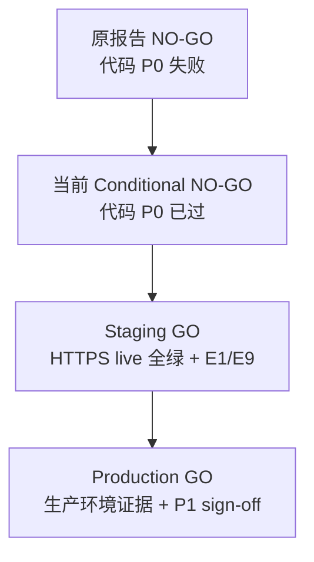

# MoAuth Release Readiness Review — Conditional NO-GO

## Executive Summary

| 字段 | 值 |
|------|-----|
| **Verdict** | **Conditional NO-GO** |
| **含义** | 代码层面 P0 已修复，**可进入 staging release readiness 复审**；**不可宣称生产 GO** |
| **审查时间** | 2026-07-06 |
| **审查环境** | 本地 loopback + 完整 env 注入；非 staging/production HTTPS |
| **前序报告** | [NO-GO](./moauth-release-readiness-2026-07-06.md) → [local follow-up](./moauth-release-readiness-2026-07-06-followup.md) |

**一句话结论**：Issue 1–3 及生产 secret/JWKS 加固已在代码与自动化中验证；`test:acceptance` / `test:ci`（完整 env 下）可绿。生产 GO 仍被 **staging HTTPS live 证据**、**真实 id_token 深验**、**浏览器全链路 E2E** 阻断。

---

## Verdict Ladder（产品把关标准）

| 阶段 | 裁决 | 当前是否达到 |
|------|------|--------------|
| 代码合并 / PR 门禁 | ✅ 可达 | `test:acceptance` + `test:ci`（完整 production env） |
| Staging release readiness | ⏳ 待复审 | 需 HTTPS staging + live gate + 核心 E2E |
| Production GO | ❌ 未达 | P0 部署项与浏览器证据未完成 |

---

## P0 Code Fixes — 已修复并确认

### Issue 1 — Consent grant 顺序（IC-008 / E7）

- **修复**：`/api/consent` allow 路径先同步 `recordConsentGrant`，失败返回 503/错误码；**仅在 grant 成功后** `finalizeAuthRequest`。
- **审计**：`recordConsentAuditEvent` 保持 best-effort（`void ...catch`），不阻塞已 finalize 的请求。
- **证据**：`consent-authorized-apps-failclosed.test.js` 断言 `callOrder = ["grant", "finalize"]`；`consent-flow.js` L75–88。

### Issue 2 — production-jwks id_token fail-closed（ADR-010 #5/#6）

- **修复**：重签/上游验签失败抛 `CONNECT_ID_TOKEN_RESIGN_FAILED`；proxy 返回 **502**，不透传上游 Zitadel `id_token`。
- **证据**：`id-token-issuer.test.js`、`zitadel-proxy.test.js`（proxy-node 502 路径）。

### Issue 3 — authorized-apps fail-closed 单测

- **修复**：单测注入 `MOAUTH_HANDOFF_INTERNAL_TOKEN`，区分 misconfiguration 与 Account projection unavailable。
- **证据**：`login-authorized-apps-failclosed.test.js`、`consent-authorized-apps-failclosed.test.js`。

### 额外加固（本轮确认）

| 项 | 说明 | 证据 |
|----|------|------|
| 生产 runtime secret 无 dev fallback | `NODE_ENV=production` 缺 `MOAUTH_CONNECT_SESSION_SECRET` / `MOAUTH_CONNECT_TRANSACTION_SECRET` / `MOAUTH_ACCOUNT_SESSION_SECRET` / `SUBBOOST_MOAUTH_TX_SECRET` 抛错 | `runtime-secret.test.js`、`account-session.test.js`、`moauth-oidc.test.ts` |
| 生产静态 gate 检查必需 secret | `oidc-production-gates.mjs` 新增 session/transaction/handoff/SubBoost TX 检查 | `oidc-production-gates.test.js` |
| Connect JWKS 仅公钥字段 | `toPublicJwk()` 过滤 `d,p,q,dp,dq,qi,oth` | `connect-jwks.js`；`zitadel-proxy.test.js` JWKS 私钥字段断言 |

### JWKS 私钥暴露修复

- **问题**：`exportJWK(privateKey)` 可能含 RSA 私钥分量。
- **修复**：`getConnectJwksDocument()` 经 `toPublicJwk()` 后再组装 `keys[]`。
- **验证**：`proxyToZitadel serves Connect JWKS locally in production-jwks mode` 断言无私钥 JWK 字段。

---

## 配置耦合结论

生产关键配置**未硬编码**在业务路径，经 env/config gate 注入：

| 配置项 | 环境变量 | 生产缺省行为 |
|--------|----------|--------------|
| Connect issuer | `MOAUTH_CONNECT_ISSUER` / `MOAUTH_CONNECT_PUBLIC_URL` | gate FAIL |
| production-jwks | `MOAUTH_CONNECT_ID_TOKEN_SIGNING_*` | mode=off 或 gate FAIL |
| Session / transaction | `MOAUTH_CONNECT_SESSION_SECRET`、`MOAUTH_CONNECT_TRANSACTION_SECRET` | **throw** |
| Account session | `MOAUTH_ACCOUNT_SESSION_SECRET` | **throw** |
| Handoff internal | `MOAUTH_HANDOFF_INTERNAL_TOKEN` | gate FAIL + client throw |
| SubBoost TX | `SUBBOOST_MOAUTH_TX_SECRET` | **throw**（SubBoost production） |

- dev fallback **仅** `NODE_ENV !== production`。
- 本地 `.env.local` / PEM 已被 `.gitignore` 覆盖；审查未打印或提交 secret 内容。

**CI 耦合提示**：`test:ci` 末段 `moauth:verify-oidc --static-only` 在 `NODE_ENV=production` 且提供 `MOAUTH_VERIFY_SUBBOOST_ENV_FILE` 时，要求 SubBoost env 含 `SUBBOOST_MOAUTH_TX_SECRET`。缺此项时静态 gate 为 12/13 FAIL（非代码缺陷，属 env 完整性要求）。

---

## Automation Results（复审采样）

### 已复现通过

| 命令 | Exit | 汇总 |
|------|------|------|
| `npm run test:acceptance` | 0 | handoff 9/9、authorized-apps 6/6、audit 3/3、zitadel-client 25/25、account 46/46、**connect 75/75**、e2e 8/8 |
| `npm run test:oidc-gates` | 0 | 11/11 |
| `npm run test:account-health-probe` | 0 | 5/5（服务运行时） |

### 报告方完整 env 下通过（未在此环境逐项复现全部 13/13）

| 命令 | 报告结果 | 说明 |
|------|----------|------|
| `npm run test:ci` | exit 0，静态 **13/13** | 需 Connect/Account/SubBoost production secrets 齐全 |
| 额外生产静态 gate | **13/13** | 同上 |
| `moauth:verify-oidc:release`（本地 live） | **21/21**，id_token SKIP | loopback，非 staging HTTPS |

### 本复审环境缺口（文档记录，非推翻代码结论）

- 未配置 `SUBBOOST_MOAUTH_TX_SECRET` 时 `test:ci` 静态段 **12/13**（`subboost_moauth_tx_secret_present` FAIL）。
- 建议在 CI/staging 文档中明确 SubBoost env 为 release gate 必需输入。

---

## ADR-010 / Release Checklist 状态

### 代码与静态门禁 — 已通过

- [x] P0 Issue 1–3 修复 + 单测
- [x] production-jwks 静态模式与 dev-hs256 生产禁用
- [x] 生产 runtime secret fail-closed
- [x] JWKS 公钥-only 暴露
- [x] authorized-apps fail-closed（自动化）
- [x] SubBoost upstream issuer fallback 生产禁用
- [x] 私钥未入库（gitignore）

### 部署与环境 — 未通过（阻断生产 GO）

- [ ] **HTTPS staging/production issuer** 与公网域名
- [ ] production-jwks、kid、Zitadel client **部署到 staging/production**（非仅本地 PEM）
- [ ] staging 上 `moauth:verify-oidc:release` **全绿**（含 discovery/JWKS live）
- [ ] `MOAUTH_VERIFY_ID_TOKEN` 实样本：`iss` + Connect JWKS 签名校验
- [ ] 浏览器 E1/E2/E6/E7/E9 作为 **production 证据** 完成
- [ ] authorized-apps file store 单实例 **正式 sign-off** 或迁移 DB（当前 WARN 可接受单实例，不可 silent 扩副本）

---

## Browser E2E — 仍非 Production 证据

| # | 场景 | 代码/单测 | Production 证据 |
|---|------|-----------|-----------------|
| E1 | 首次完整授权 | PARTIAL（chain 止于 Connect login） | ❌ |
| E2 | 静默登录 | PASS（warm SSO 脚本） | ⚠️ 非 HTTPS |
| E6 | Account 不可达 | FAIL（故障注入未生效） | ❌ |
| E7 | authorized-apps 不可用 | PASS（单测） | ⚠️ 无 live 注入 |
| E9 | 公网域名一致性 | FAIL（loopback only） | ❌ |
| E3/E4/E5/E8 | 扩展场景 | 单测覆盖 | MANUAL_REQUIRED |

---

## Security Sweep（代码复审 — 无新增 P0）

| 项 | 结论 |
|----|------|
| JWKS 私钥泄露 | **已修复**（公钥-only） |
| id_token 重签 fail-open | **已修复**（502 fail-closed） |
| Consent 授权记忆 fail-open | **已修复**（grant before finalize） |
| 生产 dev secret fallback | **已移除**（production throw） |
| Open redirect / PKCE | 静态契约保持 |
| CSRF（consent POST） | 仍建议 P1 专项复核 |

---

## Accepted Caveats（Conditional NO-GO 下可接受）

1. **authorized-apps / client-registry file store**：单实例 MVP；扩多副本前必须 DB store 或明确拒绝扩容。
2. **JWKS v1 单钥**：轮换需维护窗口；v2 双钥为 P2。
3. **browser-e2e 未纳入 `test:ci`**：release 需显式 staging 浏览器清单。
4. **本地 live 21/21**：证明 loopback 栈可用，**不能替代** staging HTTPS 证据。

---

## Recommended Actions

**执行清单**：[MoAuth Staging 部署验收清单](./moauth-staging-deployment-acceptance.md)（§1–§7 可逐项勾选；§7 验收记录模板用于 Staging GO 签字）

### 立即（进入 Staging 复审）

按 [staging 部署验收清单](./moauth-staging-deployment-acceptance.md) 推进：

1. **§1–§3** 填写 staging 域名表、注入完整 production env（含 `SUBBOOST_MOAUTH_TX_SECRET`）、完成 D1–D7 部署。
2. **§4.2** 运行 `npm run moauth:verify-oidc:release` 并归档输出（`artifacts/staging-oidc-release-<date>.log`）。
3. **§5 P0** 完成 E1 + E2 + E6 + E7 + E9 浏览器证据。
4. **§4.3** E1 后采集 `id_token`，跑深验（不得 SKIP）。

### Staging GO 后（Production GO）

1. **§5 P1** E3/E4/E5/E8 全链路或故障注入证据（E6/E7 若 staging 已测可引用同记录）。
2. **§6** file store 单实例 sign-off 或 DB 迁移决策。
3. **§8** 密钥轮换 runbook + 回滚步骤 + 告警接入。
4. 用 **§7 验收记录模板** 更新裁决为 Staging GO / Production GO。

---

## Verdict Statement（对外表述建议）

> **代码层面 P0 已修复，自动化门禁可绿，项目可进入 staging release readiness 复审。**
> **在获得 staging HTTPS live gate、真实 id_token 验签与浏览器全链路证据之前，不得宣称「可生产上线」。**

---

## Appendix

- **Staging 部署验收清单**：[moauth-staging-deployment-acceptance.md](./moauth-staging-deployment-acceptance.md)
- 基线 checklist：[moauth-release-readiness.md](./moauth-release-readiness.md) §5
- 历史 NO-GO（不修改）：[moauth-release-readiness-2026-07-06.md](./moauth-release-readiness-2026-07-06.md)
- 命令速查：`npm run test:ci` · `npm run moauth:verify-oidc:release` · `node scripts/test-account-health-probe.mjs`