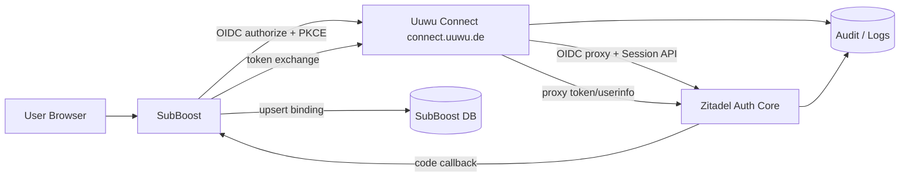

# 2. 专业 PRD（Product Requirements Document）

## 2.1 项目概述

### 2.1.1 背景

SubBoost 当前是一个 Next.js 应用，拥有本地管理员登录模型，并已经引入 OAuth2/OIDC 客户端测试路径。甲方长期目标是建设 **Uuwu Unified Identity / Uuwu Connect**，使多个 Uuwu 一方业务系统复用统一账号、统一登录、统一账号安全能力，避免每个业务系统重复实现用户密码、密码重置、MFA、Passkey、审计和 SSO。

### 2.1.2 产品目标

| 目标 ID | 目标 | SMART 描述 |
|---|---|---|
| OBJ-001 | 建立统一身份入口 | 在 Phase 1 完成 `connect.uuwu.de` 登录入口，SubBoost 可通过 OIDC Authorization Code + PKCE 完成登录 |
| OBJ-002 | 验证 SSO 体验 | 同一浏览器在完成一次 Uuwu 登录后，再进入 SubBoost 或第二个测试应用时，不需要重新输入密码，除非策略要求 |
| OBJ-003 | 保留业务边界 | SubBoost 登录后必须创建自己的本地 session cookie，不依赖 Zitadel Session Token 作为业务运行态凭证 |
| OBJ-004 | 建立账号安全自助能力 | Phase 3 完成 `account.uuwu.de` 中资料、邮箱、密码、MFA/Passkey、会话与授权应用管理 |
| OBJ-005 | 建立多应用接入标准 | Phase 4 输出 OIDC 接入指南、Next.js 示例、Java/Spring 示例、Go 示例与应用接入清单 |
| OBJ-006 | 建立可交付、可验收项目基线 | 所有 Must 需求拥有明确验收标准，所有范围变更通过 Change Request 管理 |

### 2.1.3 成功指标（KPI / OKR）

| KPI ID | 指标 | Phase 1 验收目标 | Phase 3/4 目标 |
|---|---:|---:|---:|
| KPI-001 | SubBoost OIDC 登录成功率 | UAT 用例成功率 100%；测试环境 7 日登录成功率 ≥ 99% | 生产 30 日成功率 ≥ 99.5% |
| KPI-002 | 回调安全校验覆盖率 | state、PKCE、issuer、audience、nonce、exp 校验覆盖 100% | 持续保持 100% |
| KPI-003 | 首次登录 P95 完成时间 | 不含用户输入时间，P95 < 3 秒 | P95 < 2 秒 |
| KPI-004 | 已有 SSO 会话快速登录 P95 | P95 < 1.5 秒 | P95 < 1 秒 |
| KPI-005 | SubBoost 本地账号绑定准确率 | UAT 100% 正确映射 `sub -> local_user` | 生产异常绑定 0 起 |
| KPI-006 | 安全事件 | 阻断级漏洞 0 个上线 | 阻断级漏洞 0 个生产遗留 |
| KPI-007 | 文档完备度 | SubBoost 接入文档、运维文档、回滚文档 100% 完成 | 多语言接入文档 100% 完成 |
| KPI-008 | 第二应用接入验证 | 不要求 | 第二个测试应用按指南接入成功，且无需变更 Connect 核心代码 |

### 2.1.4 范围边界（In/Out Scope 高阶）

**In Scope**

1. Zitadel 租户/实例与 Uuwu Connect 的架构设计、配置与集成。
2. `connect.uuwu.de` 登录、注册、密码重置、账号选择、基础 consent、错误页。
3. SubBoost OIDC 登录、回调、userinfo、本地用户绑定、本地 session、登出。
4. `account.uuwu.de` 账号中心 Phase 3 能力。
5. 安全基线、Cookie 策略、审计、观测性、部署、备份、回滚。
6. 多应用 OIDC 接入指南与示例。

**Out of Scope**

1. 从零实现 OAuth2/OIDC Server。
2. 第三方开发者市场。
3. 企业级复杂 IAM，例如 SCIM、复杂组织层级委派、跨企业 SAML 联邦。
4. 把所有业务权限都放入统一身份层。
5. 强制所有业务应用共享同一个业务 session。
6. MVP 阶段接入外部社交登录，除非甲方单独批准变更。

---

## 2.2 利益相关者与用户画像

| 角色 | 职责/目标 | 痛点 | 关键需求 |
|---|---|---|---|
| 终端用户 | 使用 Uuwu 账号登录 SubBoost 和其他 Uuwu 项目 | 多系统重复注册、重复输入密码、忘记密码 | 一次注册、快速登录、账号安全自助 |
| SubBoost 管理员 | 使用 SubBoost 管理功能 | 本地账号管理分散、密码安全压力 | 用 Uuwu Account 登录，但保留 SubBoost 权限控制 |
| Uuwu 产品负责人 | 建立统一品牌账号体验 | 第三方 IdP 默认 UI 不符合品牌 | Uuwu Account / Uuwu Connect 全链路品牌化 |
| Uuwu 开发者 | 将新业务应用接入统一登录 | 每个应用重复学习 OAuth/OIDC | 标准接入文档、示例代码、配置模板 |
| 安全/运维负责人 | 保障认证安全、审计、可用性 | 自研认证风险高、审计不集中 | 成熟 IdP、可观测、可备份、可回滚 |
| 乙方实施团队 | 交付可验收系统 | 需求边界易扩大 | 明确 PRD、接口契约、DoD、变更流程 |

---

## 2.3 功能需求（Functional Requirements）

### 2.3.1 Uuwu Connect 登录与 OIDC 核心

| FR ID | 用户故事 | 验收标准（Given-When-Then） | 优先级 | 理由 |
|---|---|---|---|---|
| FR-001 | 作为 SubBoost 用户，我想在登录页点击 “Use Uuwu Account”，以便使用统一账号登录 | Given 用户未登录 SubBoost；When 点击按钮；Then 浏览器跳转到 `connect.uuwu.de` 的 OIDC authorize 入口，并携带 `client_id/redirect_uri/scope/state/code_challenge` | Must | MVP 核心入口 |
| FR-002 | 作为用户，我想使用邮箱/用户名 + 密码登录，以便完成基础认证 | Given 用户已有 Uuwu Account；When 输入正确凭证；Then Connect 创建或更新 Zitadel-backed session，并继续 OIDC 授权流程 | Must | MVP 必备 |
| FR-003 | 作为新用户，我想注册 Uuwu Account，以便后续跨应用使用 | Given 用户没有账号；When 提交邮箱、密码、显示名；Then 创建 Uuwu 身份并触发邮件验证或进入明确验证流程 | Must | 统一账号闭环 |
| FR-004 | 作为用户，我想找回密码，以便恢复账号访问 | Given 用户忘记密码；When 请求密码重置；Then 系统向已验证邮箱发送重置链接或验证码，并允许设置新密码 | Must | 账号自助基础能力 |
| FR-005 | 作为用户，我想验证邮箱，以便提高账号可信度 | Given 用户注册后邮箱未验证；When 点击验证链接或输入验证码；Then `email_verified=true` 并在 userinfo 中返回 | Must | SubBoost 账号绑定与风控依据 |
| FR-006 | 作为已登录用户，我想再次进入其他 Uuwu 应用时无需重复输密码，以便快速访问 | Given 浏览器存在有效 Uuwu Connect/Zitadel-backed session；When 应用发起 OIDC authorize；Then Connect 复用 session 并直接进入账号选择或授权确认 | Must | SSO 核心体验 |
| FR-007 | 作为拥有多个账号的用户，我想选择本次登录使用的账号，以便区分个人/工作身份 | Given 浏览器缓存多个有效 session；When 发起登录；Then Connect 展示账号选择页，用户选择后继续授权 | Should | 多账号体验 |
| FR-008 | 作为用户，我想看到当前授权给哪个应用，以便明确授权边界 | Given 客户端请求首次授权或要求 consent；When 用户完成认证；Then Connect 展示应用名称、logo、请求 scopes，并记录用户确认 | Should | 多应用可信体验 |
| FR-009 | 作为用户，我想退出当前应用或退出所有 Uuwu 会话，以便控制登录状态 | Given 用户已登录；When 点击退出；Then 当前应用 session 被清除；若选择全局退出，则 Connect/Zitadel session 被终止 | Must | 安全与用户控制 |
| FR-010 | 作为用户，我想看到清晰错误页，以便理解登录失败原因 | Given 出现 redirect_uri 不匹配、state 错误、账号未授权等错误；When 流程失败；Then 展示 Uuwu 品牌错误页、错误码、可操作建议与追踪 ID | Must | 支持 UAT 与生产排障 |
| FR-011 | 作为安全负责人，我想记录关键身份事件，以便审计和追踪 | Given 用户登录、注册、重置密码、MFA 变更、session revoke；When 事件发生；Then 记录事件、主体、IP、UA、client_id、correlation_id | Must | 审计合规 |
| FR-012 | 作为产品负责人，我想全链路显示 Uuwu 品牌，以便用户感知不是第三方默认页面 | Given 用户进入登录、注册、错误、授权页；When 页面渲染；Then 页面 logo、文案、域名、样式均为 Uuwu 品牌 | Must | 核心产品愿景 |

### 2.3.2 SubBoost 集成

| FR ID | 用户故事 | 验收标准（Given-When-Then） | 优先级 | 理由 |
|---|---|---|---|---|
| FR-101 | 作为 SubBoost 用户，我想从 SubBoost 跳转至 Uuwu Connect 登录，以便复用 Uuwu Account | Given 用户未登录；When 点击 “Use Uuwu Account”；Then SubBoost 生成 state、nonce、PKCE verifier/challenge，并跳转 Connect | Must | 安全 OIDC 起点 |
| FR-102 | 作为 SubBoost 后端，我想验证 OIDC 回调，以便防止 CSRF 与 code 注入 | Given Connect 回调到 SubBoost；When 回调处理；Then 校验 state、nonce、issuer、audience、exp、PKCE，并只接受严格白名单 redirect URI | Must | 安全必需 |
| FR-103 | 作为 SubBoost 后端，我想通过 token endpoint 换取 tokens，以便获取身份信息 | Given code 有效；When 调用 token endpoint；Then 成功获得 ID Token/Access Token，并校验签名和 claims | Must | OIDC 标准流程 |
| FR-104 | 作为 SubBoost 后端，我想获取 userinfo，以便创建或绑定本地用户 | Given Access Token 有效；When 调用 userinfo；Then 获取 `sub/name/email/email_verified/picture` | Must | 本地用户映射 |
| FR-105 | 作为 SubBoost 管理员，我想让已有本地账号绑定 Uuwu Subject，以便保留历史权限 | Given 本地账号存在并满足绑定规则；When 首次 Uuwu 登录；Then 绑定 `uuwu_subject_id`，保留本地角色与权限 | Must | 平滑迁移 |
| FR-106 | 作为 SubBoost 安全负责人，我想阻止未授权 Uuwu 用户进入管理后台，以便防止越权 | Given 用户 Uuwu 登录成功但未在 SubBoost allowlist；When 回调处理；Then 不创建管理员 session，并展示明确错误 | Must | 防止权限扩散 |
| FR-107 | 作为 SubBoost 用户，我想登录后使用 SubBoost 本地 session，以便应用运行不依赖 IdP 内部 session | Given OIDC 登录成功；When SubBoost 建立 session；Then 浏览器持有 SubBoost 自有 Secure/HttpOnly cookie | Must | 架构边界 |
| FR-108 | 作为 SubBoost 用户，我想退出 SubBoost，以便结束当前应用会话 | Given 用户已登录 SubBoost；When 点击退出；Then SubBoost 清除本地 session；若选择全局退出再跳转 Connect End Session | Must | 用户控制 |

### 2.3.3 Account Center

| FR ID | 用户故事 | 验收标准（Given-When-Then） | 优先级 | 理由 |
|---|---|---|---|---|
| FR-201 | 作为用户，我想查看账号资料，以便确认当前登录身份 | Given 用户进入 `account.uuwu.de`；When session 有效；Then 显示头像、显示名、邮箱、验证状态 | Must for Phase 3 | 账号中心基础 |
| FR-202 | 作为用户，我想编辑显示名和头像，以便维护个人资料 | Given 用户已登录；When 修改资料并保存；Then Zitadel 用户资料更新，userinfo 后续返回新值 | Must for Phase 3 | 多应用资料一致 |
| FR-203 | 作为用户，我想管理邮箱，以便变更或验证联系地址 | Given 用户已登录；When 添加/修改邮箱；Then 触发验证流程，未验证邮箱不得替代主邮箱 | Must for Phase 3 | 账号安全 |
| FR-204 | 作为用户，我想修改密码，以便保持账号安全 | Given 用户已登录并通过当前密码或强认证；When 设置新密码；Then 密码更新且旧密码失效 | Must for Phase 3 | 账号安全 |
| FR-205 | 作为用户，我想管理 MFA，以便提高登录安全 | Given 用户已登录；When 设置 TOTP/邮件 OTP/Passkey MFA；Then 后续登录按策略要求二次验证 | Should | 安全增强 |
| FR-206 | 作为用户，我想管理 Passkeys，以便使用无密码登录 | Given 用户使用稳定登录域；When 注册或移除 Passkey；Then 凭据与正确 RP ID 绑定并记录 | Should | 体验与安全 |
| FR-207 | 作为用户，我想查看和撤销活跃会话，以便控制设备登录状态 | Given 用户打开会话列表；When 撤销某会话；Then 被撤销 session 不能继续用于 SSO | Should | 账号安全 |
| FR-208 | 作为用户，我想查看已授权应用，以便理解账号使用范围 | Given 用户打开授权应用；When 查看列表；Then 显示 client name、logo、授权时间、scopes | Should | 透明度 |
| FR-209 | 作为用户，我想撤销应用授权，以便停止该应用继续使用授权 | Given 应用存在授权记录；When 用户撤销；Then refresh token/授权记录失效，应用需重新授权 | Could | 多应用成熟能力 |

### 2.3.4 Developer / Application Management

| FR ID | 用户故事 | 验收标准（Given-When-Then） | 优先级 | 理由 |
|---|---|---|---|---|
| FR-301 | 作为 Uuwu 开发者，我想获取 OIDC 接入文档，以便快速接入新项目 | Given 新项目准备接入；When 阅读文档；Then 可完成 client 配置、回调、claims 映射、logout 配置 | Must for Phase 4 | 可复用目标 |
| FR-302 | 作为 Uuwu 开发者，我想使用 Next.js 示例，以便复制 SubBoost 模式 | Given 开发者拉取示例；When 配置 client；Then 本地可完成登录回调 | Must for Phase 4 | 降低接入成本 |
| FR-303 | 作为 Java/Spring 开发者，我想使用 Spring Security OIDC 示例，以便接入后端应用 | Given Java 应用准备接入；When 使用示例配置；Then 可完成 Code + PKCE/OIDC 登录 | Should | 多语言目标 |
| FR-304 | 作为 Go 开发者，我想使用 Go OIDC 示例，以便接入 Go 服务 | Given Go Web 应用准备接入；When 使用示例；Then 可完成标准 OIDC 登录 | Should | 多语言目标 |
| FR-305 | 作为平台管理员，我想配置应用 client ID、redirect URI、logo、scopes，以便管理一方应用接入 | Given 新应用审批通过；When 管理员创建应用；Then 生成环境隔离的 client 配置 | Could | Phase 4 或后续 |

---

## 2.4 非功能性需求（Non-Functional Requirements）

| NFR ID | 类别 | 量化要求 | 验收方式 |
|---|---|---|---|
| NFR-PERF-001 | 页面性能 | Login/Register/Forgot 页面首屏 LCP P95 < 2.5s，交互提交 P95 < 800ms，不含外部邮件链路 | Lighthouse + 合成监控 |
| NFR-PERF-002 | OIDC 代理性能 | `authorize/token/userinfo/well-known` 代理层 P95 增量延迟 < 150ms；端到端 token/userinfo P95 < 500ms | 压测 + tracing |
| NFR-SCALE-001 | MVP 容量 | 支持 500 个并发认证会话、50 RPS authorize、100 RPS token/userinfo 代理请求 | k6/JMeter 压测 |
| NFR-SCALE-002 | Phase 4 容量 | 架构可横向扩展至 5,000 个并发认证会话、500 RPS OIDC 相关请求 | 扩展性测试报告 |
| NFR-SEC-001 | 传输安全 | 所有公网入口 HTTPS-only，TLS 1.2+；HTTP 自动 301 到 HTTPS；HSTS 上线前灰度验证 | 安全扫描 |
| NFR-SEC-002 | Cookie 安全 | Connect、Account、SubBoost session cookie 均设置 `Secure`、`HttpOnly`、合理 `SameSite`；不得在 JS 中读取 session secret | 代码审查 + 浏览器检查 |
| NFR-SEC-003 | OIDC 安全 | 必须校验 `state`、`nonce`、`issuer`、`audience`、`exp`、`iat`、签名、PKCE S256；禁止 implicit flow | 单元测试 + 安全测试 |
| NFR-SEC-004 | Redirect URI | redirect URI 必须精确匹配白名单，禁止生产通配符回调 | 配置审查 |
| NFR-SEC-005 | CSRF | 所有状态变更 POST/DELETE 接口启用 CSRF 防护或 SameSite + 双提交 token | 安全测试 |
| NFR-SEC-006 | 密码策略 | 最低 12 字符；禁止常见弱密码；连续失败 5 次触发限速或验证码/冷却；管理员账号强制 MFA | 策略测试 |
| NFR-SEC-007 | MFA | Phase 1 支持 MFA 策略配置；Phase 3 管理员账号强制 TOTP 或 Passkey | UAT + 策略测试 |
| NFR-SEC-008 | Passkey | Passkey 仅在冻结后的登录域启用；RP ID 策略需安全评审；账号中心不得在错误域名下发起 Passkey ceremony | 安全评审 |
| NFR-SEC-009 | 速率限制 | 登录、注册、密码重置按 IP + account identifier 限流；默认每 5 分钟 10 次，超出返回统一错误 | 压测 + 安全测试 |
| NFR-SEC-010 | 审计 | 登录、注册、密码重置、MFA、Passkey、授权、登出、管理员配置变更均写审计；保留 ≥ 365 天 | 审计抽样 |
| NFR-AVAIL-001 | 可用性 | 生产首版 Uuwu Connect 月可用性目标 ≥ 99.9%，计划维护窗口除外 | 监控报表 |
| NFR-DR-001 | RTO/RPO | 身份核心数据库 RPO ≤ 15 分钟，RTO ≤ 4 小时；每季度至少一次恢复演练 | 恢复演练记录 |
| NFR-OBS-001 | 可观测性 | 100% OIDC 流程日志包含 `correlation_id`；关键指标含登录成功率、失败率、P95、错误码分布 | Dashboard 验收 |
| NFR-MAINT-001 | 可维护性 | Connect/Login App CI 必须包含 lint、typecheck、unit test、integration test、dependency scan | CI 报告 |
| NFR-COMP-001 | 浏览器兼容 | 最近两个主版本 Chrome、Safari、Firefox、Edge；移动端 iOS Safari、Android Chrome | 兼容性测试 |
| NFR-UX-001 | 移动适配 | 登录、注册、账号选择、密码重置页面 360px 宽度无横向滚动，核心操作可完成 | UI 验收 |
| NFR-COST-001 | 成本可控 | 日志、备份、监控按环境分级；非生产环境可降级保留策略 | 成本评审 |

---

## 2.5 数据与集成需求

### 2.5.1 核心数据实体

| 实体 | 所属系统 | 关键字段 | 说明 |
|---|---|---|---|
| Uuwu User | Zitadel | `subject_id`, `login_name`, `email`, `email_verified`, `display_name`, `avatar_url`, `status` | 全局身份主体 |
| Zitadel Session | Zitadel | `session_id`, `session_token`, `factors`, `verified_at`, `expires_at` | 仅供 Connect/Login UI 完成认证上下文，不给业务应用作为运行时凭证 |
| OIDC Client | Zitadel/Uuwu 管理配置 | `client_id`, `redirect_uris`, `post_logout_redirect_uris`, `scopes`, `logo`, `env` | 一方应用接入配置 |
| OIDC Token | Zitadel | `id_token`, `access_token`, `refresh_token`, `expires_in`, `scope` | 标准 OIDC/OAuth 令牌 |
| SubBoost Local User | SubBoost | `id`, `uuwu_subject_id`, `email`, `display_name`, `role`, `status` | SubBoost 本地业务用户 |
| SubBoost Session | SubBoost | `session_id`, `local_user_id`, `expires_at`, `csrf_token` | SubBoost 应用运行态 session |
| Audit Event | Zitadel + Connect + App | `event_type`, `subject_id`, `client_id`, `ip`, `user_agent`, `timestamp`, `correlation_id` | 全局与本地审计 |

### 2.5.2 标准 Claims

| Claim | 类型 | 必填 | 来源 | 说明 |
|---|---|---:|---|---|
| `sub` | string | 是 | Zitadel | 全局稳定主体 ID；业务应用不得用 email 作为主键 |
| `name` | string | 是 | Uuwu User | 显示名 |
| `preferred_username` | string | 建议 | Uuwu User | 登录名或短名 |
| `email` | string | 是 | Uuwu User | 邮箱 |
| `email_verified` | boolean | 是 | Uuwu User | 邮箱验证状态 |
| `picture` | string | 可选 | Uuwu User | 头像 URL |
| `locale` | string | 可选 | Uuwu User | 语言偏好 |
| `updated_at` | number | 可选 | Uuwu User | 用户资料更新时间 |

### 2.5.3 数据流

### 2.5.4 集成点

| 集成点 | 协议 | 方向 | 说明 |
|---|---|---|---|
| SubBoost ↔ Uuwu Connect | OIDC Authorization Code + PKCE | 双向跳转 + 后端 token exchange | MVP 首个业务应用 |
| Uuwu Connect ↔ Zitadel | HTTPS API / OIDC Proxy / Session API | 服务端 | 认证、session、auth request finalization、userinfo/token 代理 |
| Account Center ↔ Zitadel | HTTPS API | 服务端 | 用户资料、密码、MFA、Passkey、session 管理 |
| Email Provider ↔ Zitadel/Connect | SMTP 或邮件 API | 出站 | 邮箱验证、密码重置 |
| Observability Stack | OTLP/日志/指标 | 出站 | tracing、metrics、audit、alert |
| DNS/TLS/WAF | DNS + HTTPS | 入站 | `connect.uuwu.de`、`account.uuwu.de`、隐藏核心域名 |

---

## 2.6 成功标准与验收方式

| 验收域 | 验收标准 | 验收方法 |
|---|---|---|
| 功能验收 | FR-001 至 FR-108 全部 Must 通过；Phase 3 前 FR-201 至 FR-208 通过 | UAT 测试单 + 录屏 + 测试报告 |
| 安全验收 | 无阻断级漏洞；OIDC 校验覆盖 100%；无 open redirect；无 session token 泄漏 | 安全测试 + 代码审查 |
| 性能验收 | 满足 NFR-PERF-001、NFR-PERF-002、NFR-SCALE-001 | 压测报告 |
| 可用性验收 | 健康检查、告警、错误率、P95 dashboard 可用 | 监控面板演示 |
| 运维验收 | 部署、回滚、备份、恢复、日志查询文档完成 | Runbook 演练 |
| 文档验收 | PRD、ADR、接口契约、接入指南、用户/管理员说明文档完成 | 文档评审 |
| SubBoost 验收 | 新用户、已有用户、未授权用户、SSO 快速登录、登出、错误回调均通过 | SubBoost UAT |
