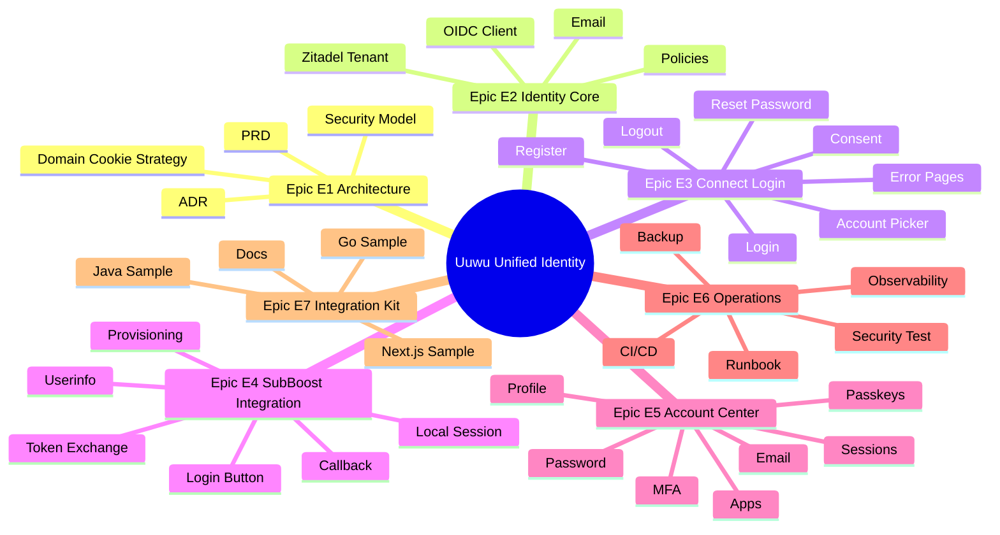

# 5. 任务拆分与实施计划（Work Breakdown Structure & Implementation Plan）

## 5.1 阶段划分

| 阶段 | 目标 | 主要输出 |
|---|---|---|
| Phase 0：需求细化与架构设计 | 锁定范围、选型、域名、部署、账号策略 | PRD、ADR、接口契约、实施计划 |
| Phase 1：OIDC MVP With SubBoost | 跑通 SubBoost OIDC 登录闭环 | Zitadel tenant、SubBoost client、callback、本地 session |
| Phase 2：Branded Connect Experience | Uuwu 品牌化登录/授权体验 | 自定义 Login App、账号选择、consent、错误页 |
| Phase 3：Account Center | 用户自助账号安全管理 | Profile、密码、MFA/Passkey、session、授权应用 |
| Phase 4：Multi-App Integration Kit | 支撑更多 Uuwu 应用接入 | 接入指南、样例代码、配置模板、checklist |
| Phase 5：生产加固与运维交接 | 安全、观测、备份、回滚、培训 | 安全报告、Runbook、培训材料 |

---

## 5.2 WBS 总览

---

## 5.3 详细任务拆分

| Task ID | Epic / Feature | 描述 | 验收标准 | 预估 | 依赖 | 责任方 | 优先级 |
|---|---|---|---|---:|---|---|---|
| T-001 | E1 / Discovery | 需求澄清工作坊，确认 SubBoost 用户类型、注册策略、部署模式 | Q-001 至 Q-014 有明确结论或默认假设签署 | 2 人天 | 无 | 甲方+乙方 | Must |
| T-002 | E1 / PRD | 输出 PRD v1 与验收标准 | 甲方会签 | 2 人天 | T-001 | 乙方 | Must |
| T-003 | E1 / ADR | 输出并评审 ADR-001 至 ADR-007 | Accepted/Proposed 状态明确 | 2 人天 | T-001 | 乙方 | Must |
| T-004 | E1 / Security | 完成威胁建模与安全边界设计 | 输出 STRIDE 风险与缓解表 | 2 人天 | T-003 | 乙方 | Must |
| T-005 | E2 / Environment | 准备 dev/staging/prod 环境变量与 secret 结构 | Secret 不进入代码仓库 | 1 人天 | T-003 | 乙方 | Must |
| T-006 | E2 / Domain | 配置 `connect.uuwu.de`、`account.uuwu.de` DNS 与 TLS | HTTPS 可访问，证书有效 | 1 人天 | DEP-001/002 | 甲方+乙方 | Must |
| T-007 | E2 / Zitadel | 创建 Zitadel instance/tenant/project | 管理员可登录控制台，项目存在 | 1 人天 | T-005 | 乙方 | Must |
| T-008 | E2 / OIDC Client | 创建 SubBoost OIDC client | client_id、redirect URI、scopes 配置完成 | 1 人天 | T-007 | 乙方 | Must |
| T-009 | E2 / Policy | 配置密码、MFA、session、邮件策略 | 策略截图/配置导出 | 1 人天 | T-007 | 乙方 | Must |
| T-010 | E2 / Email | 配置邮件验证与密码重置 | 测试邮箱收到验证/重置邮件 | 1 人天 | DEP-003 | 乙方 | Must |
| T-011 | E3 / Login App Spike | 验证 Hosted Login 或官方 Login App OIDC flow | authorize -> callback -> token 成功 | 2 人天 | T-008 | 乙方 | Must |
| T-012 | E3 / Login UI | 实现 Uuwu 品牌登录页 | 正确凭证可登录，错误凭证有统一错误 | 3 人天 | T-011 | 乙方 | Must |
| T-013 | E3 / Register | 实现注册页 | 新用户创建成功并触发邮箱验证 | 3 人天 | T-010 | 乙方 | Must |
| T-014 | E3 / Reset | 实现忘记密码与重置密码 | 用户可完成密码重置 | 2 人天 | T-010 | 乙方 | Must |
| T-015 | E3 / Session Detection | 实现已有 session 检测与快速登录 | 已登录用户二次进入无需输密码 | 2 人天 | T-012 | 乙方 | Must |
| T-016 | E3 / Account Picker | 实现账号选择页 | 多 session 时可选择账号 | 3 人天 | T-015 | 乙方 | Should |
| T-017 | E3 / Consent | 实现一方应用轻量授权确认页 | 展示 app name/logo/scopes，确认后继续 | 3 人天 | T-012 | 乙方 | Should |
| T-018 | E3 / Logout | 实现 logout 确认与全局 session terminate | 当前应用退出和全局退出路径清晰 | 2 人天 | T-015 | 乙方 | Must |
| T-019 | E3 / Error Pages | 实现统一错误页 | 主要错误码均可展示 trace ID | 1 人天 | T-012 | 乙方 | Must |
| T-020 | E4 / SubBoost Login | SubBoost 增加 “Use Uuwu Account” 按钮 | 按钮生成 state/PKCE 并跳转 | 1 人天 | T-008 | 乙方 | Must |
| T-021 | E4 / Callback | 实现 SubBoost callback handler | 校验 state、nonce、PKCE、issuer、audience | 3 人天 | T-020 | 乙方 | Must |
| T-022 | E4 / Token/Userinfo | 实现 token exchange 与 userinfo | 正确获取并校验用户 claims | 2 人天 | T-021 | 乙方 | Must |
| T-023 | E4 / User Binding | 实现 `sub -> local_user` 绑定 | 已有账号绑定成功，重复登录不重复创建 | 3 人天 | T-022 | 乙方 | Must |
| T-024 | E4 / Provisioning Policy | 实现 allowlist/invite/自动开户配置 | 未授权用户无法进入 SubBoost | 2 人天 | T-023 | 甲方+乙方 | Must |
| T-025 | E4 / Local Session | 实现 SubBoost 本地 session | 登录后可访问 SubBoost，清除 IdP session 不立即破坏当前本地 session | 2 人天 | T-024 | 乙方 | Must |
| T-026 | E4 / SubBoost Logout | 实现本地退出与全局退出选项 | 两种退出路径均通过测试 | 2 人天 | T-025 | 乙方 | Must |
| T-027 | E4 / Tests | SubBoost OIDC 单元/集成测试 | CI 测试通过 | 2 人天 | T-021-T026 | 乙方 | Must |
| T-028 | E5 / Account Dashboard | 实现账号中心首页 | 显示当前用户资料与安全状态 | 3 人天 | T-015 | 乙方 | Must P3 |
| T-029 | E5 / Profile | 实现资料编辑 | display name/avatar 更新后 userinfo 同步 | 2 人天 | T-028 | 乙方 | Must P3 |
| T-030 | E5 / Password | 实现修改密码 | 当前密码校验后可修改 | 2 人天 | T-028 | 乙方 | Must P3 |
| T-031 | E5 / MFA | 实现 TOTP/OTP 管理 | 可启用、验证、移除 | 4 人天 | T-028 | 乙方 | Should P3 |
| T-032 | E5 / Passkey | 实现 Passkey 管理 | RP ID 安全评审后可注册/移除 | 4 人天 | T-031 | 乙方 | Should P3 |
| T-033 | E5 / Sessions | 实现活跃 session 列表与撤销 | 撤销后 session 不可继续 SSO | 3 人天 | T-028 | 乙方 | Should P3 |
| T-034 | E5 / Authorized Apps | 实现授权应用列表 | 显示 app/scopes/授权时间 | 3 人天 | T-017 | 乙方 | Should P3 |
| T-035 | E6 / CI/CD | 建立 Connect/Login App CI/CD | lint/typecheck/test/build/deploy 自动化 | 2 人天 | T-005 | 乙方 | Must |
| T-036 | E6 / Observability | 建立日志、指标、tracing、dashboard | 登录成功率/失败率/P95/错误码可观测 | 3 人天 | T-012/T-021 | 乙方 | Must |
| T-037 | E6 / Rate Limit | 配置登录/注册/重置限流 | 超限返回统一错误并写日志 | 2 人天 | T-012-T014 | 乙方 | Must |
| T-038 | E6 / Security Test | 完成安全测试与修复 | 无阻断级漏洞 | 4 人天 | T-027/T-037 | 乙方 | Must |
| T-039 | E6 / Load Test | 完成 NFR-SCALE-001 压测 | 压测报告达标 | 2 人天 | T-036 | 乙方 | Must |
| T-040 | E6 / Backup Rollback | 完成备份、恢复、回滚演练 | Runbook 记录演练成功 | 2 人天 | T-035 | 乙方+甲方 | Must |
| T-041 | E7 / Docs | 输出通用 OIDC 接入指南 | 评审通过 | 2 人天 | T-027 | 乙方 | Must P4 |
| T-042 | E7 / Next.js Sample | 输出 Next.js 示例 | 本地运行可登录 | 2 人天 | T-041 | 乙方 | Must P4 |
| T-043 | E7 / Java Sample | 输出 Java/Spring 示例 | 本地运行可登录 | 3 人天 | T-041 | 乙方 | Should P4 |
| T-044 | E7 / Go Sample | 输出 Go 示例 | 本地运行可登录 | 3 人天 | T-041 | 乙方 | Should P4 |
| T-045 | E7 / Training | 培训开发、运维、产品 | 培训材料交付，Q&A 完成 | 1 人天 | T-041-T044 | 乙方 | Must |

---

## 5.4 资源与技能需求

| 角色 | 建议人数 | 核心技能 | 参与阶段 |
|---|---:|---|---|
| 解决方案/企业架构师 | 1 | IAM、OIDC、SSO、领域边界、ADR、合同范围 | 全阶段 |
| 身份平台工程师 | 1 | Zitadel、OIDC、Session API、MFA、Passkey | Phase 0-5 |
| Next.js 前端/全栈工程师 | 1-2 | Next.js、BFF、认证 UI、安全 Cookie | Phase 1-5 |
| SubBoost 应用工程师 | 1 | SubBoost 代码库、Next.js、session、权限 | Phase 1-4 |
| DevOps/SRE | 1 | DNS/TLS、CI/CD、secret、监控、备份、回滚 | Phase 0-5 |
| 安全工程师 | 0.5-1 | OIDC 安全、Web 安全、威胁建模、渗透测试 | Phase 0、4 |
| QA/Test | 1 | UAT、集成测试、浏览器兼容、压测 | Phase 1-5 |
| UI/UX 设计师 | 0.5 | 品牌、登录体验、移动适配、错误页 | Phase 2-3 |

---

## 5.5 风险驱动优先级（Spike / PoC）

| Spike ID | 目标 | 解决的风险 | 验收 |
|---|---|---|---|
| SP-001 | Zitadel Login App / Hosted Login OIDC 跑通 | 验证技术路线可行 | SubBoost 测试 client 完成 code/token/userinfo |
| SP-002 | Session API + 账号选择 | 验证多 session account picker 可实现 | 两个测试账号可选择 |
| SP-003 | Consent 行为验证 | 验证 prompt/consent 与 UI 控制边界 | 明确采用 Zitadel 行为或 Connect 自定义轻量页 |
| SP-004 | Cookie/SameSite 跨域回调测试 | 避免登录循环 | Chrome/Safari/Firefox 通过 |
| SP-005 | SubBoost allowlist 供应策略 | 防止管理员越权 | 未授权 Uuwu 用户不可进入 |
| SP-006 | Passkey RP ID 验证 | 防止域名策略错误 | 确认 MVP 是否启用 Passkey 以及 RP ID |
