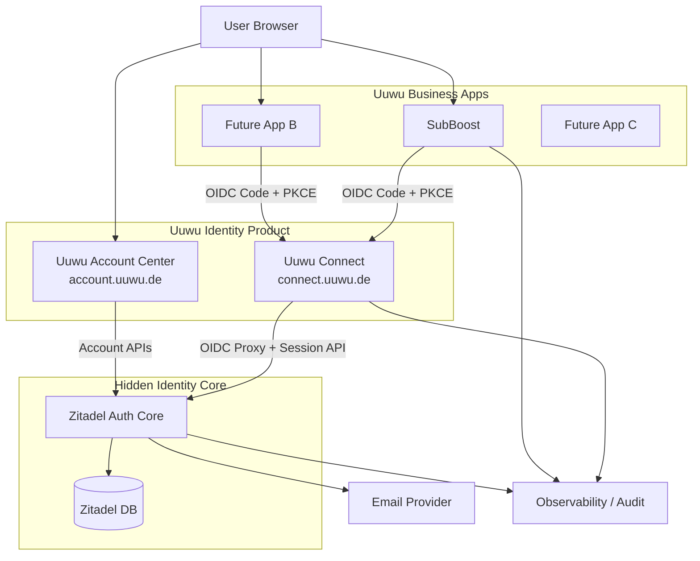
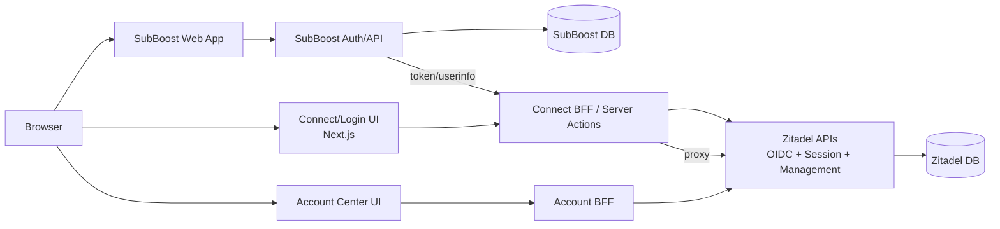
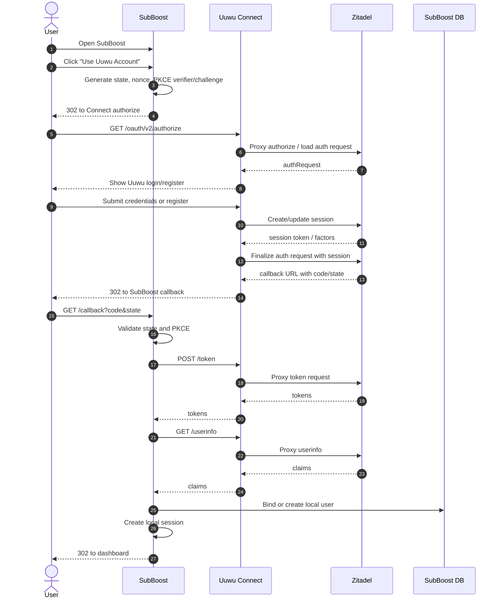
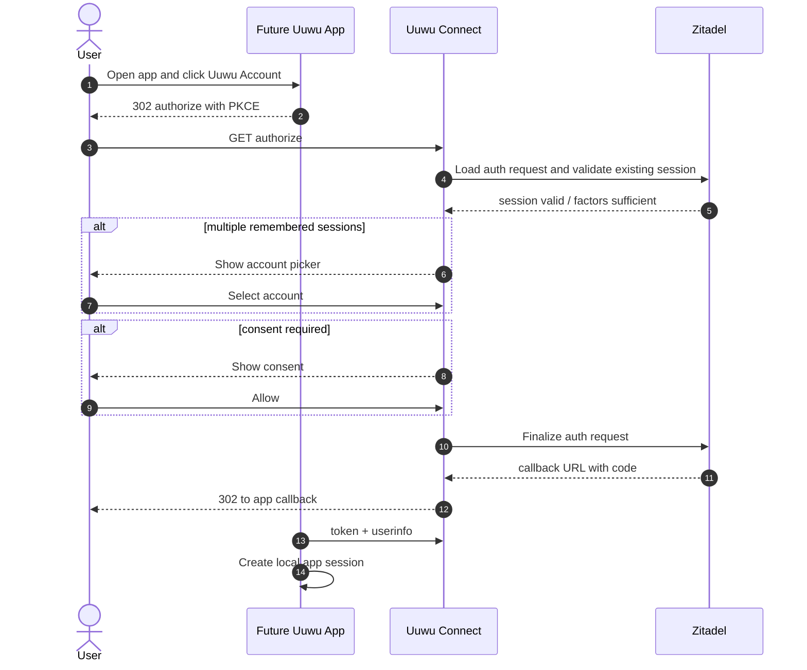
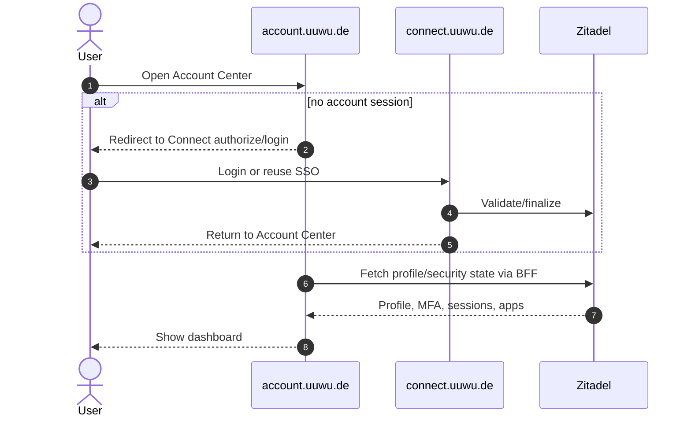
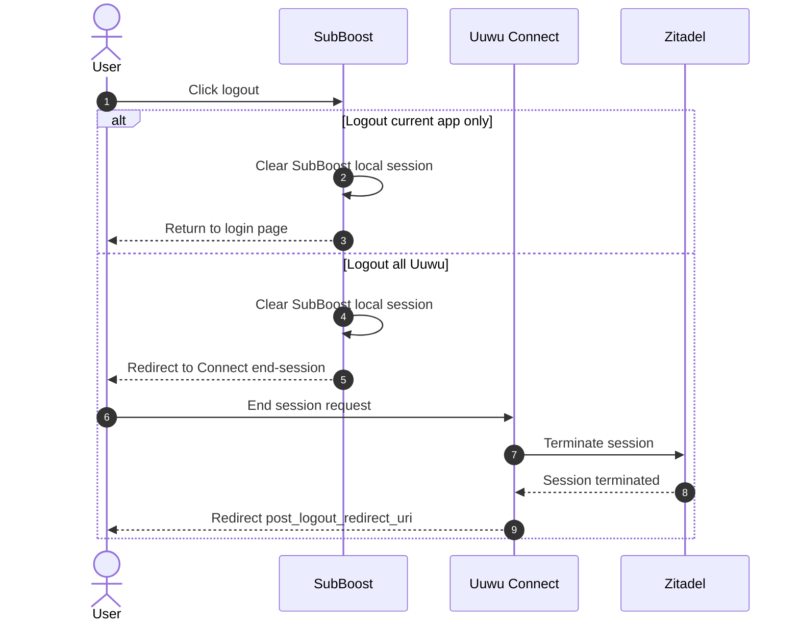

# 6. 接口契约与实施边界（Interface Contracts & Implementation Boundaries）

## 6.1 接口契约（Interface Contracts）

### 6.1.1 系统上下文图



### 6.1.2 容器图



---

### 6.1.3 核心接口清单

| 接口 ID | 名称 | 调用方 | 被调用方 | 协议 | 阶段 |
|---|---|---|---|---|---|
| IC-001 | OIDC Discovery | Business App | Uuwu Connect | HTTPS GET | Phase 1 |
| IC-002 | OIDC Authorization | Browser via Business App | Uuwu Connect | HTTPS Redirect | Phase 1 |
| IC-003 | OIDC Token | Business App backend | Uuwu Connect/Zitadel proxy | HTTPS POST | Phase 1 |
| IC-004 | OIDC UserInfo | Business App backend | Uuwu Connect/Zitadel proxy | HTTPS GET | Phase 1 |
| IC-005 | SubBoost Login Start | Browser | SubBoost | HTTPS GET | Phase 1 |
| IC-006 | SubBoost Callback | Browser | SubBoost | HTTPS GET | Phase 1 |
| IC-007 | Login Session / Account Picker | Connect UI | Zitadel Session API via BFF | HTTPS API | Phase 2 |
| IC-008 | Consent | Browser | Connect UI | HTTPS UI + API | Phase 2 |
| IC-009 | Logout / End Session | Business App / Browser | Uuwu Connect | HTTPS Redirect/API | Phase 1/2 |
| IC-010 | Account Profile | Account Center | Zitadel API via BFF | HTTPS API | Phase 3 |
| IC-011 | Account Security | Account Center | Zitadel API via BFF | HTTPS API | Phase 3 |
| IC-012 | Audit Events | Connect/SubBoost/Zitadel | Observability | Logs/OTLP | Phase 1 |

---

### 6.1.4 接口契约详情

#### IC-001：OIDC Discovery

| 字段 | 说明 |
|---|---|
| Endpoint | `GET https://connect.uuwu.de/.well-known/openid-configuration` |
| 协议 | HTTPS GET |
| 认证 | 无 |
| 响应 | OIDC Provider metadata：issuer、authorization_endpoint、token_endpoint、userinfo_endpoint、jwks_uri、scopes_supported、code_challenge_methods_supported |
| SLA | P95 < 300ms；可 CDN/cache 5 分钟 |
| 错误 | `DISCOVERY_UNAVAILABLE` |
| 版本策略 | OIDC Discovery URL 保持稳定；变更需公告所有业务应用 |

#### IC-002：OIDC Authorization Request

| 字段 | 说明 |
|---|---|
| Endpoint | `GET https://connect.uuwu.de/oauth/v2/authorize` |
| 调用方式 | 浏览器重定向 |
| 必填参数 | `client_id`, `redirect_uri`, `response_type=code`, `scope`, `state`, `code_challenge`, `code_challenge_method=S256` |
| 建议参数 | `nonce`, `login_hint`, `prompt`, `ui_locales` |
| 认证 | 用户未登录时进入 Connect 登录；已登录时复用 session |
| 成功响应 | 302 到业务应用 callback，携带 `code` 与原始 `state` |
| 错误响应 | 302 到 callback 携带 `error/error_description/state`，或展示 Connect 错误页 |
| 安全要求 | redirect URI 精确匹配；state 不可复用；PKCE 必须为 S256 |
| SLA | 授权入口 P95 < 800ms，不含用户输入时间 |
| 幂等性 | GET 请求不可改变业务状态；auth request ID 可一次性完成 |

请求参数模型：

| 字段 | 类型 | 必填 | 约束 | 示例 |
|---|---|---:|---|---|
| `client_id` | string | 是 | 已注册 OIDC client | `subboost-prod` |
| `redirect_uri` | string | 是 | 精确匹配白名单 | `https://subboost.example.com/auth/uuwu/callback` |
| `response_type` | string | 是 | 固定 `code` | `code` |
| `scope` | string | 是 | 至少 `openid profile email` | `openid profile email` |
| `state` | string | 是 | 高熵随机，绑定浏览器 session | `base64url(...)` |
| `nonce` | string | 建议 | 高熵随机，校验 ID Token | `base64url(...)` |
| `code_challenge` | string | 是 | S256(verifier) | `...` |
| `code_challenge_method` | string | 是 | 固定 `S256` | `S256` |
| `prompt` | string | 可选 | `login/select_account/consent/none` | `select_account` |

#### IC-003：OIDC Token Exchange

| 字段 | 说明 |
|---|---|
| Endpoint | `POST https://connect.uuwu.de/oauth/v2/token` |
| 调用方 | Business App backend |
| Content-Type | `application/x-www-form-urlencoded` |
| 认证 | confidential client 使用 client secret 或私钥 JWT；public client 使用 PKCE |
| 请求字段 | `grant_type=authorization_code`, `code`, `redirect_uri`, `client_id`, `code_verifier` |
| 响应字段 | `access_token`, `id_token`, `refresh_token`（如允许）, `token_type`, `expires_in`, `scope` |
| 安全要求 | 仅服务端调用；不得在浏览器暴露 client secret；校验 ID Token 签名和 claims |
| SLA | P95 < 500ms |
| 错误码 | `invalid_grant`, `invalid_client`, `invalid_request`, `PKCE_VERIFICATION_FAILED` |
| 幂等性 | 同一 authorization code 只能兑换一次 |

Token Response 模型：

| 字段 | 类型 | 必填 | 说明 |
|---|---|---:|---|
| `access_token` | string | 是 | 用于 userinfo |
| `id_token` | JWT | 是 | 用于身份验证 |
| `refresh_token` | string | 可选 | 仅允许需要长期会话的 confidential client |
| `token_type` | string | 是 | `Bearer` |
| `expires_in` | number | 是 | 秒 |
| `scope` | string | 是 | 实际授权 scopes |

#### IC-004：OIDC UserInfo

| 字段 | 说明 |
|---|---|
| Endpoint | `GET https://connect.uuwu.de/oidc/v1/userinfo` |
| 调用方 | Business App backend |
| 认证 | `Authorization: Bearer <access_token>` |
| 响应 | 标准 claims |
| SLA | P95 < 500ms |
| 错误码 | `invalid_token`, `insufficient_scope`, `USERINFO_UNAVAILABLE` |
| 缓存 | 业务应用可短期缓存 5 分钟；权限不得仅依赖缓存资料 |

UserInfo 响应模型：

```json
{
  "sub": "uuwu_01H...",
  "name": "Alice Example",
  "preferred_username": "alice",
  "email": "alice@example.com",
  "email_verified": true,
  "picture": "https://account.uuwu.de/avatar/uuwu_01H...",
  "updated_at": 1760000000
}
```

#### IC-005：SubBoost Login Start

| 字段 | 说明 |
|---|---|
| Endpoint | `GET https://<subboost-domain>/api/auth/uuwu/login` |
| 调用方 | Browser |
| 行为 | 生成 state、nonce、PKCE verifier；verifier 存入 SubBoost 安全临时 cookie/server session；302 到 IC-002 |
| Cookie | `Secure`, `HttpOnly`, `SameSite=Lax`, 短有效期 ≤ 10 分钟 |
| 错误码 | `OIDC_CONFIG_MISSING`, `STATE_INIT_FAILED` |
| SLA | P95 < 300ms |

#### IC-006：SubBoost Callback

| 字段 | 说明 |
|---|---|
| Endpoint | `GET https://<subboost-domain>/api/auth/uuwu/callback` |
| 调用方 | Browser via Connect redirect |
| 入参 | `code`, `state` 或 `error`, `error_description`, `state` |
| 行为 | 校验 state；用 code + verifier 兑换 token；校验 ID Token；获取 userinfo；绑定/创建本地用户；创建 SubBoost session |
| 成功响应 | 302 到原始 return URL 或 SubBoost dashboard |
| 失败响应 | 302 到 SubBoost 登录页并显示错误 |
| 错误码 | `STATE_MISMATCH`, `TOKEN_EXCHANGE_FAILED`, `ID_TOKEN_INVALID`, `APP_ACCESS_DENIED`, `USER_BINDING_FAILED` |
| 幂等性 | 同一 code 仅处理一次；本地绑定按 `uuwu_subject_id` 唯一约束 |

SubBoost 本地用户绑定表建议：

| 字段 | 类型 | 约束 |
|---|---|---|
| `id` | string/uuid | PK |
| `uuwu_subject_id` | string | Unique, nullable until bound |
| `email` | string | Indexed |
| `email_verified` | boolean | Required |
| `display_name` | string | Required |
| `avatar_url` | string | Nullable |
| `role` | enum | `admin/member/viewer` |
| `status` | enum | `active/disabled/pending` |
| `last_login_at` | datetime | Nullable |

#### IC-007：Connect Session / Account Picker

| 字段 | 说明 |
|---|---|
| UI Endpoint | `GET https://connect.uuwu.de/select-account` |
| BFF 行为 | 从安全 cookie 读取 remembered session IDs；服务端调用 Zitadel sessions search；展示可选账号 |
| Cookie | 仅 `connect.uuwu.de`；HttpOnly；session token 加密存储；有效期按策略 |
| 安全要求 | 不在前端 JS 暴露 session token；账号列表不泄漏完整邮箱，可脱敏 |
| SLA | P95 < 800ms |
| 错误码 | `SESSION_LOOKUP_FAILED`, `SESSION_EXPIRED`, `ACCOUNT_SELECTION_REQUIRED` |

##### MVP 可执行契约：密码登录与单会话 Continue

**Scope / Trigger**

- 适用范围：Connect Login App 通过 Zitadel Session API v2 完成密码登录、authRequest finalize，以及使用已记住的 Connect session 继续新的 OIDC authRequest。
- 触发条件：业务应用进入 `GET /oauth/v2/authorize?...code_challenge=...` 后，Connect 登录页收到 `authRequest`。

**Signatures**

| Endpoint / Function | 调用方 | 输入 | 输出 |
|---|---|---|---|
| `POST /api/login` | Connect Login UI | JSON `{authRequest, loginName, password, rememberSession}` | `{status:"AUTH_REQUEST_FINALIZED", callbackUrl}`；可选设置 `moauth_connect_session` |
| `POST /api/login/continue` | Connect Login UI | JSON `{authRequest}` + cookie `moauth_connect_session` | `{status:"AUTH_REQUEST_FINALIZED", callbackUrl, loginName}` |
| `finalizeAuthRequest(authRequestId, session)` | Connect BFF | `authRequestId`, `{sessionId, sessionToken?}` | Zitadel callback payload containing `callbackUrl` |
| `rewriteLocation(value, upstreamIssuer, connectIssuer)` | Connect OIDC proxy | `Location` header value | absolute URL under Connect issuer when Zitadel returns relative login paths |

**Contracts**

| Boundary | Contract |
|---|---|
| Connect UI -> `/api/login` | `authRequest` is required and must be a valid Zitadel auth request id; `loginName` and `password` are required for password flow. |
| Connect BFF -> Zitadel session creation | Password verification uses Zitadel Session API v2 server-side only. Service user PAT is never exposed to browser code. |
| Connect BFF -> Zitadel CreateCallback | Request body MUST be nested: `{ "session": { "sessionId": "...", "sessionToken": "..." } }`. Flat `{sessionId, sessionToken}` is invalid. |
| Continue cookie | `moauth_connect_session` stores signed `sessionId`, `sessionToken`, `loginName`, `authRequestId`, and timestamp. It is HttpOnly and scoped to the Connect host. Production MUST set `MOAUTH_CONNECT_SESSION_SECRET`. |
| `/api/login/continue` | Must read `sessionId` + `sessionToken` from the signed cookie and call `finalizeAuthRequest` for the new `authRequest`; it must not ask the browser to handle `sessionToken`. |
| OIDC proxy | Discovery issuer, URL fields, `Location`, and Set-Cookie Domain are rewritten to the Connect issuer/host. Token, userinfo, and callback code semantics are otherwise passed through Zitadel. |
| Client callback | Zitadel returns `callbackUrl` directly pointing to the registered client redirect URI with `code` and `state`; Connect must redirect to it without rewriting it through Connect. |

**Validation & Error Matrix**

| Case | Expected behavior |
|---|---|
| Missing Zitadel config | `/api/login` and `/api/login/continue` return `ZITADEL_NOT_CONFIGURED` with HTTP 503. |
| Invalid/missing JSON | Return `LOGIN_BAD_REQUEST` with HTTP 400. |
| Missing continue cookie | `/api/login/continue` returns `CONNECT_SESSION_REQUIRED` with HTTP 401. |
| Tampered/expired continue cookie | Clear `moauth_connect_session`; return HTTP 401; do not call `finalizeAuthRequest`. |
| Unknown authRequest | Return `ZITADEL_AUTH_REQUEST_NOT_FOUND` with HTTP 404 and ask user to restart from the application. |
| Required policies not satisfied | `finalizeAuthRequest` returns `ZITADEL_AUTH_REQUEST_NOT_READY` with HTTP 409. |
| Service user lacks `session.link` | Return `ZITADEL_UNAUTHORIZED`; operator must grant `IAM_LOGIN_CLIENT` to the service user. |
| Zitadel relative `Location` | Proxy must convert `/ui/v2/login?...` to `${CONNECT_ISSUER}/ui/v2/login?...` to avoid Next.js Invalid URL failures. |

**Good / Base / Bad Cases**

- Good: password login creates a Zitadel session, finalizes authRequest, exchanges code with original PKCE verifier, and userinfo returns `sub`, `email`, `preferred_username`.
- Base: remembered session with `sessionId` + `sessionToken` finalizes a fresh authRequest through `/api/login/continue` and returns the existing `loginName`.
- Bad: flat CreateCallback body `{sessionId, sessionToken}` must not be used; Zitadel rejects it with callback kind validation errors.
- Bad: using a service user PAT without `IAM_LOGIN_CLIENT` must be treated as an operator configuration error, not as invalid user credentials.

**Tests Required**

- `apps/connect/test/zitadel-session.test.js`: assert nested CreateCallback body, 409 mapping, and 403 `session.link` guidance.
- `apps/connect/test/zitadel-proxy.test.js`: assert relative and upstream `Location` rewrite behavior.
- `apps/connect/test/connect-continue.test.js`: assert signed cookie read, tampered cookie rejection, missing cookie handling, and successful continue payload.
- `apps/connect/test/connect-app.test.js`: assert login UI and `/api/login` behaviors remain compatible with the password flow.

**Wrong vs Correct**

Wrong:

```json
{
  "sessionId": "sess_123",
  "sessionToken": "token_abc"
}
```

Correct:

```json
{
  "session": {
    "sessionId": "sess_123",
    "sessionToken": "token_abc"
  }
}
```

#### IC-008：Consent

| 字段 | 说明 |
|---|---|
| UI Endpoint | `GET https://connect.uuwu.de/consent` |
| 入参 | `authRequest` |
| 展示内容 | 应用名称、logo、发布者、请求 scopes、资料使用说明 |
| 用户动作 | `Allow` / `Cancel` |
| 成功 | 继续 finalize auth request |
| 取消 | 返回业务应用 `access_denied` |
| 记录 | 记录 consent audit event |
| SLA | P95 < 800ms |

#### IC-009：Logout / End Session

| 字段 | 当前应用退出 | 全局退出 |
|---|---|---|
| 入口 | Business App logout | Business App 跳转 Connect end session |
| 行为 | 清除业务应用本地 session | 终止 Connect/Zitadel session，并可返回 post logout URL |
| 影响范围 | 当前应用 | 后续 SSO 需重新认证；其他应用本地 session 是否立即失效取决于各应用策略 |
| MVP 策略 | 必须支持 | 必须支持基础全局退出 |
| 后续增强 | 无 | back-channel/front-channel logout、session revocation webhook |

#### IC-010：Account Profile

| 字段 | 说明 |
|---|---|
| Endpoint | `GET/PUT https://account.uuwu.de/api/profile` |
| 调用方 | Account Center UI |
| 认证 | Account session + CSRF |
| 请求字段 | `display_name`, `avatar_url`, `locale` |
| 响应 | 更新后的 profile |
| 错误码 | `PROFILE_VALIDATION_FAILED`, `ACCOUNT_SESSION_EXPIRED` |
| 幂等性 | PUT 对同一 payload 幂等 |

#### IC-011：Account Security

| 子接口 | 方法 | 行为 | 安全要求 |
|---|---|---|---|
| Password Change | `POST /api/security/password` | 修改密码 | 当前密码或强认证；CSRF |
| MFA Enroll | `POST /api/security/mfa/totp` | 生成 TOTP secret 并验证 | 不记录 secret 明文 |
| Passkey Register | `POST /api/security/passkeys/register/options` + `verify` | 注册 Passkey | RP ID 已冻结；HTTPS |
| Session Revoke | `DELETE /api/security/sessions/{id}` | 撤销 session | 用户只能撤销自己的 session |
| Authorized App Revoke | `DELETE /api/apps/{client_id}/grant` | 撤销授权 | 记录审计 |

#### IC-012：错误码规范

| 错误码 | HTTP | 用户提示 | 处理策略 |
|---|---:|---|---|
| `INVALID_REDIRECT_URI` | 400 | 应用配置错误，请联系管理员 | 不跳转未知 URI；写安全日志 |
| `STATE_MISMATCH` | 400 | 登录状态已过期，请重试 | 清理临时 cookie |
| `PKCE_VERIFICATION_FAILED` | 400 | 登录验证失败，请重试 | 安全告警计数 |
| `SESSION_EXPIRED` | 401 | 登录已过期，请重新登录 | 回到登录页 |
| `APP_ACCESS_DENIED` | 403 | 当前账号无权访问该应用 | 不创建本地 session |
| `EMAIL_NOT_VERIFIED` | 403 | 请先验证邮箱 | 引导验证 |
| `RATE_LIMITED` | 429 | 操作过于频繁，请稍后再试 | 限流日志 |
| `TOKEN_EXCHANGE_FAILED` | 502 | 登录服务暂时不可用 | 重试或联系支持 |
| `USER_BINDING_FAILED` | 500 | 账号绑定失败 | 写入 trace ID，人工排查 |
| `CONFIGURATION_ERROR` | 500 | 应用配置错误 | 阻断上线 |

---

### 6.1.5 关键业务流程序列图

#### 首次登录 SubBoost



#### 已有 SSO 会话进入另一个应用



#### Account Center 访问



#### Logout



---

## 6.2 实施边界（Implementation Boundaries）

### 6.2.1 精确 In Scope

| 编号 | In Scope |
|---|---|
| B-I-001 | Connect/Login App 的 Uuwu 品牌页面：登录、注册、密码重置、账号选择、授权确认、logout、错误页 |
| B-I-002 | Connect/Login App 对 Zitadel OIDC endpoints 的代理与 Session API 服务端调用 |
| B-I-003 | SubBoost OIDC client 集成与本地 session 建立 |
| B-I-004 | SubBoost `uuwu_subject_id` 绑定、allowlist/invite 策略 |
| B-I-005 | Account Center Phase 3 基础账号安全能力 |
| B-I-006 | 日志、审计、监控、告警、备份、回滚 |
| B-I-007 | 接入文档与多语言示例 |
| B-I-008 | 安全基线测试、压测、UAT 支持 |

### 6.2.2 精确 Out of Scope

| 编号 | Out of Scope | 不做理由 |
|---|---|---|
| B-O-001 | OAuth2/OIDC 协议栈自研 | 安全与兼容风险高 |
| B-O-002 | Zitadel Session Token 给业务应用直接消费 | 令牌语义错误，破坏边界 |
| B-O-003 | SubBoost 业务权限迁移到 Zitadel | 身份与业务授权职责分离 |
| B-O-004 | 第三方开发者开放平台注册与审核 | 超出 MVP |
| B-O-005 | 跨所有应用即时强制本地 session 注销 | 需 back-channel/front-channel logout 与应用适配，后续增强 |
| B-O-006 | 复杂组织、企业客户、SAML federation、SCIM | 后续企业 IAM 需求 |
| B-O-007 | 大规模用户迁移 | 需单独数据清洗、映射、通知、回滚计划 |
| B-O-008 | 法务合同最终条款撰写 | 需甲方法务确认 |

### 6.2.3 外部依赖与集成点

| 依赖 | 必须提供内容 | 验收 |
|---|---|---|
| DNS | `connect.uuwu.de`, `account.uuwu.de`, 可选隐藏核心域名 | DNS 解析正确 |
| TLS | 证书自动签发或证书文件 | HTTPS 正常 |
| Email | 发件域名、SMTP/API Key、模板策略 | 验证/重置邮件可达 |
| SubBoost | 代码仓库、测试环境、部署权限、现有用户表结构 | CI 可运行 |
| Zitadel | Cloud tenant 或 self-host 环境、管理员权限 | OIDC client 可配置 |
| Observability | 日志/指标/Tracing 平台 | Dashboard 可见 |
| Secret 管理 | Vault/平台 secret/env 管理 | Secret 不进入仓库 |
| UI 规范 | Logo、颜色、文案、错误页语气 | UI 评审通过 |

### 6.2.4 数据迁移与遗留系统处理策略

| 场景 | 策略 |
|---|---|
| Casdoor 仅测试账号 | 不迁移，关闭或保留只读归档 |
| Casdoor 有真实用户 | 导出用户标识、邮箱、验证状态；密码不可明文迁移；采用密码重置或一次性绑定 |
| SubBoost 现有本地管理员 | 保留本地账号；首次 OIDC 登录时按邮箱/邀请令牌绑定 `uuwu_subject_id` |
| 邮箱冲突 | 不自动合并；进入人工审核或管理员确认 |
| 多账号合并 | MVP 不支持自助合并；由管理员后台或脚本处理 |
| Audit 历史 | 保留在原系统；新身份事件写入新审计链路 |

### 6.2.5 技术债务与未来路线图

| 阶段 | 建议项 | 价值 |
|---|---|---|
| Phase 2+ | 完善 consent 存储与授权撤销 | 支持更透明的多应用授权 |
| Phase 3+ | Passkey 全面启用 | 降低密码风险，提高登录体验 |
| Phase 4+ | 应用管理后台 | 减少人工配置 OIDC client |
| Phase 4+ | Back-channel logout | 提升全局退出一致性 |
| Phase 4+ | SDK / Starter Kit | 降低新应用接入成本 |
| Phase 5+ | 细粒度授权服务 | 将身份认证与授权策略服务进一步解耦 |
| Phase 5+ | 用户风险评分 | 异常登录检测、地理位置/IP/设备风险 |
| Phase 5+ | 企业组织模型 | 支持组织、团队、成员邀请、企业 SSO |

### 6.2.6 Definition of Done（DoD）

| 维度 | DoD |
|---|---|
| 代码 | 已合并主分支；无阻断级 lint/typecheck/test 问题；关键路径有单元/集成测试 |
| 安全 | 无阻断级漏洞；OIDC 校验完整；secret 不入库；Cookie 安全属性正确 |
| 功能 | 对应 FR 的 Given-When-Then 用例全部通过 |
| 性能 | 满足 NFR-PERF 与 NFR-SCALE 对应阶段目标 |
| 文档 | README、部署文档、接口契约、运维 Runbook、回滚步骤完整 |
| 监控 | 登录成功率、失败率、P95、错误码、Zitadel/API 健康状态有 dashboard |
| 审计 | 登录、注册、密码重置、MFA、Passkey、logout、授权事件可查询 |
| 部署 | dev/staging/prod 配置分离；CI/CD 可重复部署；回滚演练通过 |
| 知识转移 | 管理员、开发者、运维培训完成 |
| 验收 | 甲方 UAT 签署，遗留问题分级登记 |

### 6.2.7 运维与支持边界

| 项目 | 乙方支持期 | 甲方接管后 |
|---|---|---|
| Connect/Login App bug | 修复合同范围内缺陷 | 按维护合同或内部团队处理 |
| Zitadel 配置 | 提供配置、导出、说明 | 甲方运维按 Runbook 操作 |
| Secret 轮换 | 首次上线协助 | 甲方定期轮换 |
| 监控告警 | 建立 dashboard 与告警规则 | 甲方值班响应 |
| 安全升级 | 提供升级建议和影响评估 | 甲方审批并执行或委托乙方 |
| 用户支持 | 提供二线技术支持 | 甲方一线客服/管理员处理 |
| 新应用接入 | 提供指南和样例 | 甲方开发者按指南接入 |

---

## 最终输出 Checklist

| 检查项 | 结果 |
|---|---|
| 是否完整覆盖甲方所有明确需求 | 已覆盖：Uuwu Account、Connect、SubBoost、Account Center、MVP、Phase Roadmap、边界、安全、部署、接口 |
| 是否识别重大假设、风险和差距 | 已输出 Assumptions、Risk Register、Clarification Questions |
| PRD、ADR、WBS、接口契约是否一致 | 已按统一模块与 ID 对齐 |
| 量化指标是否合理且可验证 | 已提供性能、容量、安全、RTO/RPO、审计、UAT 指标 |
| 语言是否专业、无歧义、便于决策者理解 | 已采用合同/PRD/ADR 风格 |
| 是否提供变更控制和验收机制 | 已提供 Scope、Deliverables、Milestones、RACI、Change Request、付款里程碑 |
| 是否明确不做事项 | 已在 Non-Goals、Out-of-Scope、Implementation Boundaries 中列明 |
| 是否明确身份层与业务应用边界 | 已明确 Identity Layer 与 Business Apps 的职责，并禁止业务应用直接使用 Zitadel Session Token |
