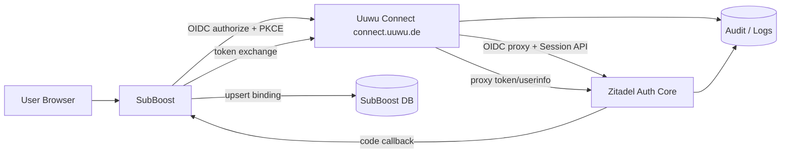
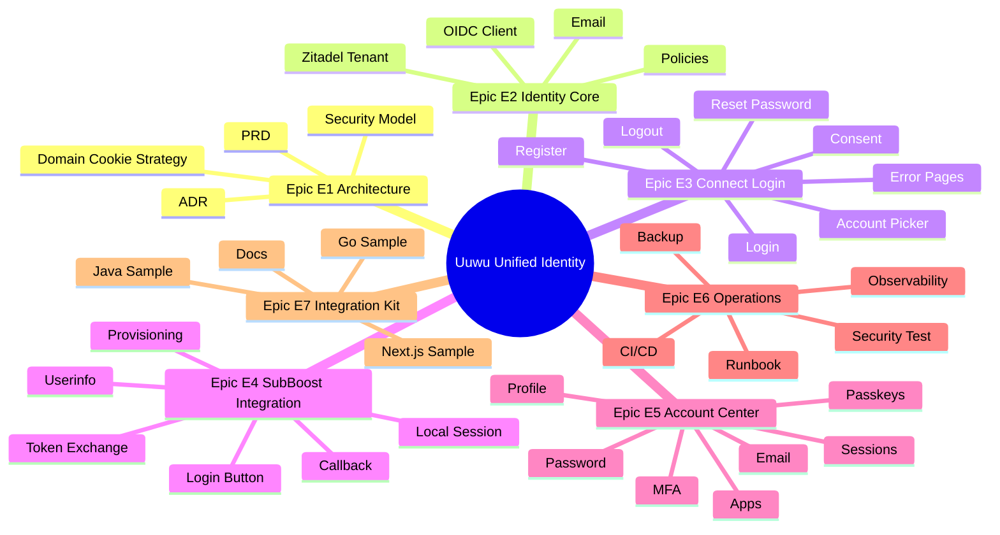
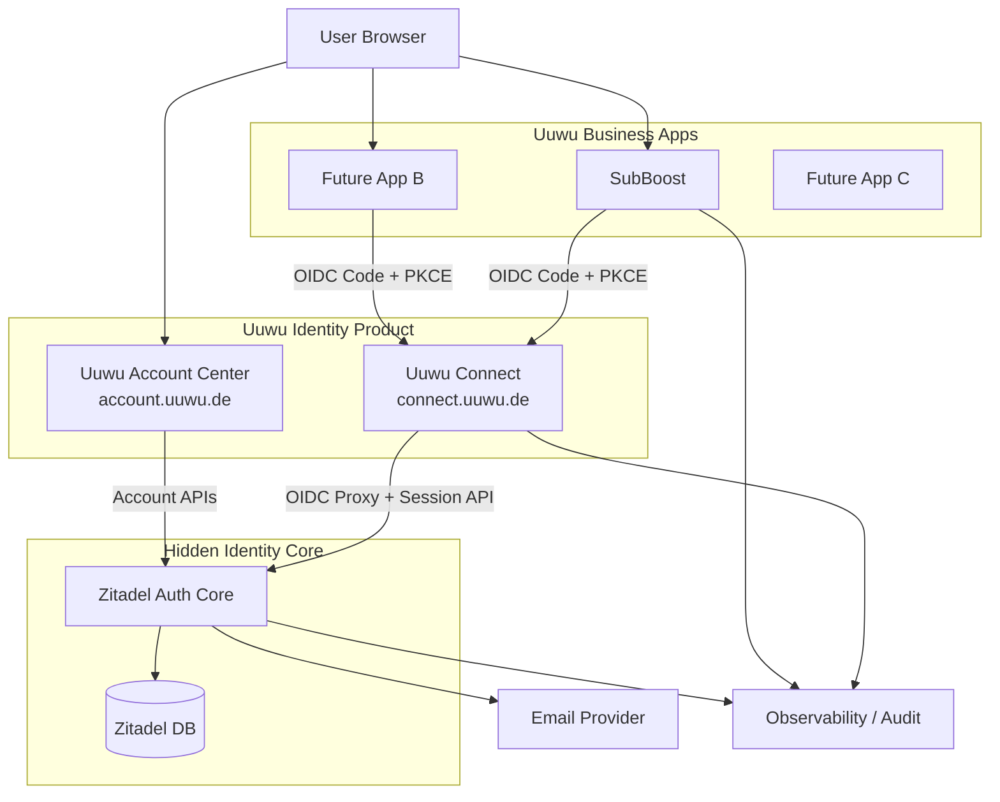
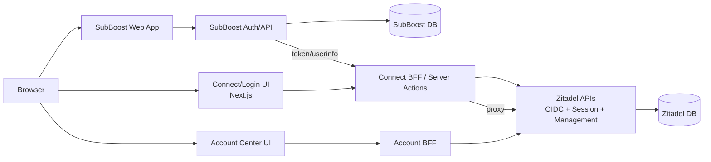
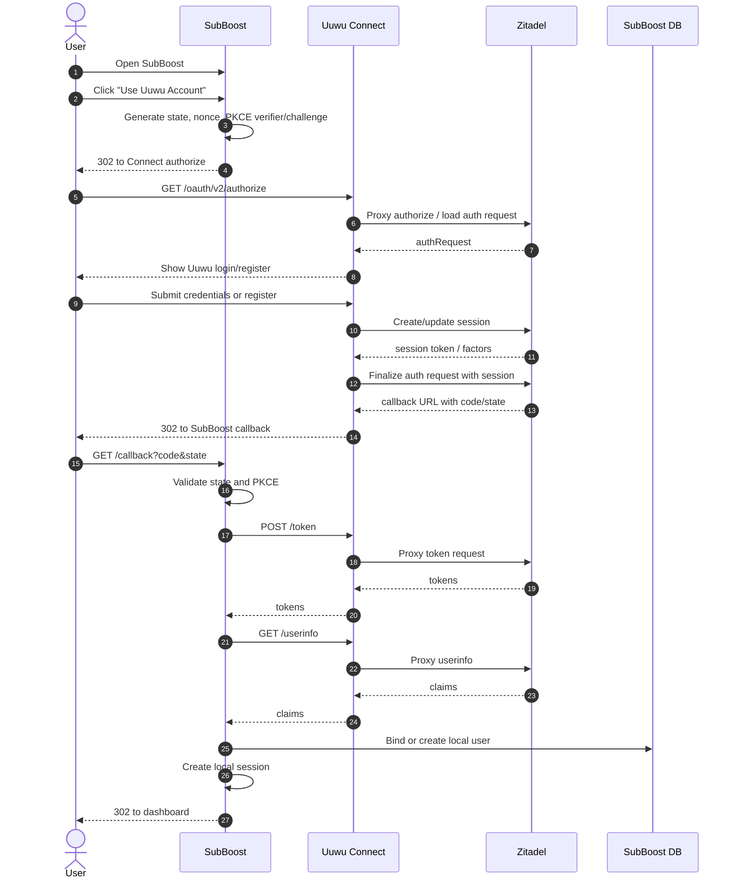
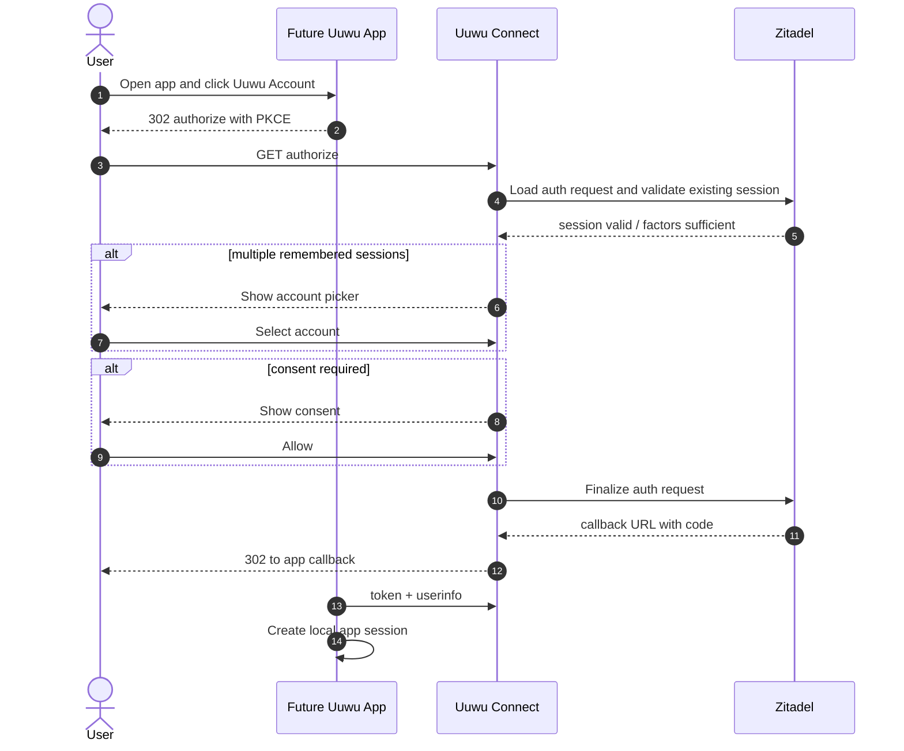
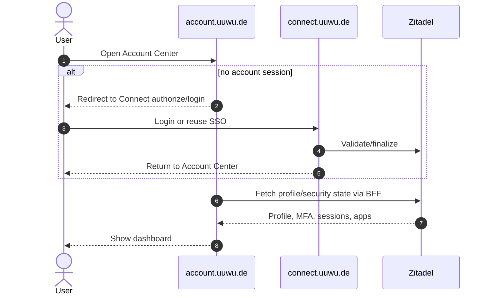
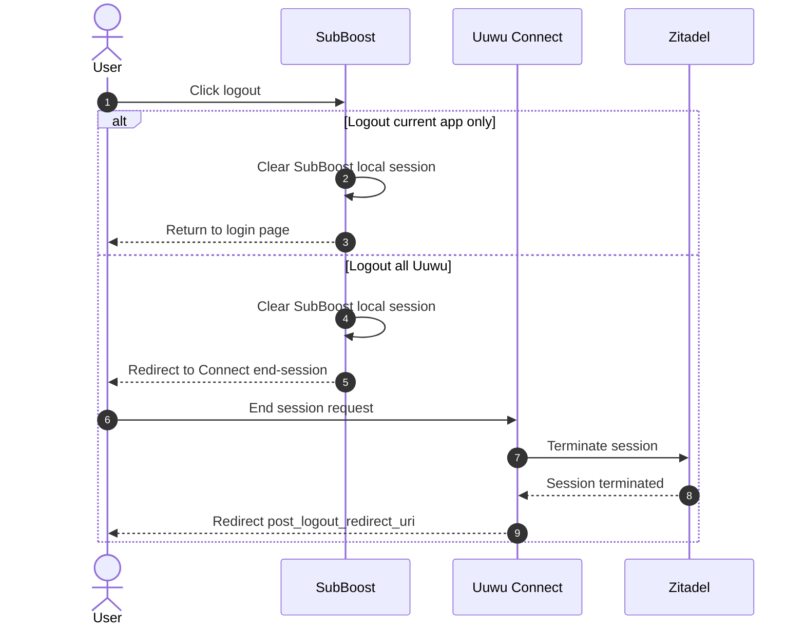

<!-- Source file: uuwu_00_index.md -->

# Uuwu Unified Identity / Connect 交付文档包

**版本**：v1.0  
**交付身份**：乙方解决方案架构师 / 企业架构师  
**目标用途**：需求确认、合同谈判、项目启动、技术评审、实施指导  
**输入基线**：甲方《Uuwu Unified Identity / Connect Requirements Draft》  
**输出格式**：Markdown 分卷文档，可直接纳入 Git 仓库进行版本控制。

---

## 文档结构

| 文件 | 内容 | 建议评审对象 |
|---|---|---|
| `uuwu_00_index.md` | 文档包索引、基线结论、评审顺序、参考基线、版本管理建议 | 全体评审参与方 |
| `uuwu_01_executive_summary.md` | 执行摘要、需求理解、假设约束、风险、澄清问题 | 甲方决策层、产品负责人、技术负责人 |
| `uuwu_02_prd.md` | 专业 PRD：目标、用户画像、FR/NFR、数据集成、验收标准 | 产品、研发、测试、安全、运维 |
| `uuwu_03_delivery_contract.md` | 交付契约：范围、交付物、里程碑、RACI、变更、付款、依赖 | 商务、法务、项目管理、交付负责人 |
| `uuwu_04_adr.md` | 架构决策记录 ADR：Zitadel、Login App、域名 Cookie、OIDC、部署等 | 架构委员会、研发负责人、安全负责人 |
| `uuwu_05_wbs_implementation_plan.md` | 任务拆分与实施计划：WBS、任务表、团队、Spike | 项目经理、研发、测试、DevOps |
| `uuwu_06_interface_contracts_boundaries.md` | 接口契约与实施边界：C4 图、接口、错误码、序列图、DoD | 后端、前端、客户端、测试、安全、运维 |
| `uuwu_99_full_combined.md` | 完整合并版，按 `00` 至 `06` 顺序汇总全部内容 | 需要单文件审阅、归档或发送的评审方 |

---

## 基线结论摘要

1. **目标不是“给 SubBoost 加一个第三方登录按钮”**，而是建设可复用的一方统一身份产品：Uuwu Account + Uuwu Connect。
2. **Zitadel 建议作为隐藏认证核心（IdP/Auth Core）**，负责协议、用户、会话、MFA、Passkey、令牌与审计；Uuwu 自有 Connect/Login UI 负责用户可见体验。
3. **业务应用统一采用 OIDC Authorization Code + PKCE**，并在应用内保留本地 session、业务角色、权限、审计与业务数据。
4. **SubBoost 是首个落地应用**，MVP 必须证明注册/登录/SSO 快速登录/OIDC callback/userinfo/本地账号绑定/本地 session 的完整闭环。
5. **生产 MVP 推荐 fork 或 self-host Zitadel Login App**，Hosted Login V2 可用于 Phase 0/1 快速技术验证。
6. **`connect.uuwu.de` 与 `account.uuwu.de` 建议从 Day 1 保留域名边界**；实现上可先同仓/同服务分区部署，避免后续 Passkey、Cookie、品牌与用户认知迁移成本。
7. **SubBoost 首版默认 invite/allowlist**，防止任何 Uuwu 新注册账号自动成为 SubBoost 管理员。

---

## 推荐评审顺序

1. 先评审 `uuwu_01_executive_summary.md`，确认业务目标、范围、假设和风险。
2. 再评审 `uuwu_04_adr.md`，锁定关键架构选择，避免后续反复。
3. 接着评审 `uuwu_02_prd.md` 和 `uuwu_06_interface_contracts_boundaries.md`，确认需求与接口。
4. 最后评审 `uuwu_03_delivery_contract.md` 和 `uuwu_05_wbs_implementation_plan.md`，进入商务与实施计划。

---

## 外部标准与参考基线

| 类别 | 官方来源 | URL | 访问日期 | 本方案采用基线 |
|---|---|---|---|---|
| OIDC 身份层 | OpenID Connect Core 1.0 incorporating errata set 2 | [OpenID Connect Core 1.0](https://openid.net/specs/openid-connect-core-1_0.html) | 2026-06-28 | OIDC 是构建在 OAuth 2.0 之上的身份层，用于让客户端验证最终用户身份并获取基本用户资料。 |
| OAuth 安全实践 | RFC 9700：Best Current Practice for OAuth 2.0 Security | [RFC 9700](https://www.rfc-editor.org/rfc/rfc9700.html) | 2026-06-28 | Authorization Code Flow 应结合 PKCE；本方案将 `S256` 设为强制要求。 |
| Zitadel Login UI / Login App | ZITADEL Docs：Build your own Login UI、Login App、OIDC endpoints、Session API | [Build your own Login UI](https://zitadel.com/docs/guides/integrate/login-ui)；[Login App](https://zitadel.com/docs/guides/integrate/login-ui/login-app)；[OpenID Connect Endpoints in ZITADEL](https://zitadel.com/docs/apis/openidoauth/endpoints)；[Session API](https://zitadel.com/docs/reference/api/session)；[ZITADEL login app source](https://github.com/zitadel/zitadel/tree/main/apps/login) | 2026-06-28 | Zitadel Login UI/Login App 路线支持自定义登录体验；OIDC endpoints 可按自定义域暴露；Session API 用于自定义登录流程中的 session 创建、校验与 MFA/Passkey 等认证步骤。 |
| WebAuthn / Passkey | W3C Web Authentication Level 3 | [Web Authentication: An API for accessing Public Key Credentials Level 3](https://www.w3.org/TR/webauthn-3/) | 2026-06-28 | Passkey/Public Key Credential 与 WebAuthn Relying Party、RP ID、Origin 作用域绑定，登录域名与 RP ID 策略必须在上线前冻结。 |

---

## 版本管理建议

| 字段 | 建议 |
|---|---|
| 文档仓库 | `uuwu-identity-docs` 或项目根目录 `/docs/identity/` |
| 分支策略 | `main` 保存已签署版本，`draft/*` 保存评审版本 |
| 版本命名 | `v1.0-contract-baseline`、`v1.1-post-uat` |
| 变更管理 | 所有新增需求、指标调整、域名变更、部署模式变更必须创建 Change Request |
| 会签对象 | 甲方产品负责人、甲方技术负责人、甲方法务/商务、乙方交付负责人、乙方架构师 |


---

<!-- Source file: uuwu_01_executive_summary.md -->

# 1. 执行摘要与需求理解（Executive Summary & Requirements Understanding）

## 1.1 执行摘要

甲方当前的核心诉求不是在 SubBoost 中增加一个孤立的 OAuth 登录按钮，而是建设一个可复用、可扩展、可品牌化的一方统一身份系统。目标体验类似“QQ 登录”：用户注册一个 **Uuwu Account**，即可跨 SubBoost 和未来多个 Uuwu 一方业务应用完成统一登录；业务应用可将用户重定向到统一的 **Uuwu Connect** 登录/授权入口；若用户已经存在有效 SSO 会话，登录流程应快速完成；必要时展示账号选择或授权确认页面；业务应用仍保留自己的本地会话、业务权限和业务数据。

本方案建议采用 **Zitadel 作为隐藏身份认证核心（Authentication Core / IdP）**，并在其前方建设 Uuwu 品牌的 `connect.uuwu.de` 和 `account.uuwu.de`。Zitadel 负责 OAuth2/OIDC、用户、会话、令牌、MFA、Passkey、安全审计等高风险能力；Uuwu Connect / Account Center 负责用户可见品牌体验、登录流程、账号中心和业务应用接入体验。SubBoost 作为首个生产级客户端，使用标准 **OIDC Authorization Code + PKCE** 接入，并在登录成功后创建自己的本地业务 session。

---

## 1.2 高阶需求分类

### 1.2.1 功能性需求分类

| 分类 | 需求摘要 | 来源 | 验收方向 |
|---|---|---|---|
| 统一账号 | 用户注册一个 Uuwu Account，可跨多个 Uuwu 一方项目登录 | 甲方原文 | 同一 `sub` 可被 SubBoost 与第二个测试应用识别 |
| Uuwu Connect | `connect.uuwu.de` 作为 OIDC 登录、授权、账号选择、logout 入口 | 甲方原文 | 业务应用只接入标准 OIDC，不直接依赖 Zitadel Session API |
| Uuwu Account Center | `account.uuwu.de` 提供资料、邮箱、密码、MFA、Passkey、会话、授权应用管理 | 甲方原文 | 用户可完成账号安全自助操作 |
| SubBoost 首发集成 | SubBoost 增加 “Use Uuwu Account”，完成 callback、token exchange、userinfo、本地绑定、本地 session | 甲方原文 | 新用户/已有用户/未授权用户路径均通过 UAT |
| 业务应用接入标准 | 后续 Java、JavaScript、TypeScript、Go、移动端、API 服务按 OIDC 接入 | 甲方原文 | 输出接入指南和样例应用 |
| 授权与账号选择 | 已登录用户快速登录；多账号时选择账号；必要时展示授权确认 | 甲方原文 | account picker、consent 页面按策略出现 |
| 登出与会话 | 区分业务应用本地登出和 Uuwu 全局会话登出 | 架构补充 | 当前应用退出与全局退出路径清晰 |

### 1.2.2 非功能性需求分类

| 分类 | 需求摘要 | 验收方向 |
|---|---|---|
| 安全 | HTTPS、Secure/HttpOnly/SameSite Cookie、CSRF、state、nonce、PKCE、redirect URI 精确匹配、限流、审计 | 安全测试、代码审查、配置审查 |
| 性能 | 首次登录、已有 SSO 快速登录、OIDC proxy 延迟、token/userinfo 延迟可量化 | 压测、合成监控、APM |
| 可用性 | 身份入口是多应用关键基础设施，需要健康检查、告警、备份、恢复、回滚 | Runbook、故障演练 |
| 可扩展性 | 支持更多一方应用、多语言技术栈、未来移动端、API 服务 | 第二个测试应用接入成功 |
| 可维护性 | 自定义 Login App 必须可升级、可测试、可观测、可回滚 | CI/CD、自动化测试、文档 |
| 合规与审计 | 认证、注册、MFA、Passkey、授权、登出等事件可追踪 | 审计日志抽样、保留策略 |

---

## 1.3 本稿基线决策

| 决策 ID | 基线决策 | 说明 |
|---|---|---|
| BD-001 | 认证核心采用 Zitadel，Casdoor 保留为实验对照与迁移源 | Casdoor 已可用但 UI 定制上限不满足长期目标；Zitadel 官方 Login App 与 Session API 更贴合自有品牌 Connect 产品路线。 |
| BD-002 | 业务应用统一使用 OIDC Authorization Code + PKCE | 与未来多语言、多应用接入目标一致；`S256` 作为强制 PKCE 方法。 |
| BD-003 | Phase 1 可用 Hosted Login V2 做技术验证；生产 MVP 以 fork/self-host Login App 为目标 | Hosted Login 快速，但品牌和流程控制有限；Login App 更适合长期产品化。 |
| BD-004 | SubBoost 首版采用“本地账号绑定 + 本地 session” | Uuwu Connect 只证明身份；SubBoost 仍控制本地角色、权限、配额、业务审计。 |
| BD-005 | 默认注册策略：Uuwu Account 可注册；SubBoost 管理访问默认 invite/allowlist | 避免任何新注册 Uuwu 账号自动成为 SubBoost 管理员。 |
| BD-006 | Passkey MVP 先固定在 `connect.uuwu.de` 登录域 | WebAuthn/Passkey 凭据受 RP ID 与 Origin 约束，域名变化会影响可用性。 |
| BD-007 | 隐藏 Zitadel 核心不作为普通用户入口 | 用户可见品牌应为 Uuwu Account / Uuwu Connect。 |

---

## 1.4 假设与约束日志（Assumptions & Constraints Log）

| ID | 描述 | 来源 | 影响 | 验证方式 |
|---|---|---|---|---|
| A-001 | SubBoost 是首个真实业务客户端，MVP 不同时接入多个生产应用 | 甲方原文 | 范围收敛，优先验证端到端 OIDC 与本地 session | Phase 0 需求确认会签 |
| A-002 | `connect.uuwu.de` 是 OIDC 登录入口，`account.uuwu.de` 是账号中心入口 | 甲方原文 | 域名、Cookie、Passkey RP ID、回调 URL 均围绕该结构设计 | DNS、TLS、反向代理配置验收 |
| A-003 | 业务应用不得直接依赖 Zitadel Session API 作为运行时登录凭证 | 甲方原文 + 架构约束 | 防止业务应用与 IdP 内部会话耦合 | 代码审查与接口契约检查 |
| A-004 | MVP 用户规模按 500 并发认证会话、50 RPS 授权入口设计 | 架构师假设 | 影响部署规格、压测目标与成本 | 甲方提供 DAU/峰值登录数据后校准 |
| A-005 | SubBoost 当前包含本地管理员登录模型，OIDC 用户是否自动成为管理员需受控 | 甲方原文 + 风险判断 | 影响账号绑定、权限授予、UAT 用例 | 甲方确认 SubBoost 用户类型与开放策略 |
| A-006 | 生产首版不从零实现 OAuth2/OIDC Server | 甲方原文 | 降低协议实现风险与安全责任 | ADR-001 会签 |
| A-007 | 初期不建设第三方开发者市场和动态自助应用注册 | 甲方原文 | 减少管理后台与审批流程开发量 | Scope Statement 锁定 |
| A-008 | 邮件服务、DNS、TLS 证书、域名所有权由甲方提供或授权乙方配置 | 架构师假设 | 影响注册、验证、密码重置、Passkey 与部署进度 | 项目启动清单验收 |
| A-009 | 生产环境审计日志建议至少保留 365 天 | 架构师假设 | 影响日志存储、合规与成本 | 安全评审确认 |
| A-010 | Zitadel Cloud 可用于 PoC；生产是否使用 Cloud 需由甲方法务、数据合规与成本评审确认 | 架构师假设 | 影响运维责任、备份、DPA、SLA 与数据驻留 | Phase 0 架构决策门 |
| A-011 | Account Center 可在 Phase 3 交付，不阻塞 SubBoost OIDC MVP | 甲方 roadmap | 优先上线登录闭环，账号中心后续完善 | 里程碑评审 |
| A-012 | 外部社交登录不是 MVP 必须项 | 甲方原文 optional | 避免扩大范围和合规风险 | Scope Statement 锁定 |

---

## 1.5 风险与缓解措施（Risk Register）

| 风险 ID | 优先级 | 风险描述 | 触发条件 | 影响 | 缓解措施 | 责任方 |
|---|---:|---|---|---|---|---|
| R-001 | 高 | 自定义 Login UI 错误使用 Zitadel Session API，削弱认证安全模型 | 在浏览器暴露服务账号 token、跳过 session 验证、业务应用消费 session token | 账号接管、令牌泄漏、认证绕过 | Login App 采用 BFF 模式；服务账号 token 仅保存在服务端；安全代码审查；渗透测试 | 乙方 |
| R-002 | 高 | SubBoost 将 Uuwu 身份误映射为管理员权限 | 自动开户策略未受控 | 越权访问管理功能 | 默认 invite/allowlist；权限由 SubBoost 本地角色控制；UAT 覆盖未授权用户 | 甲方 + 乙方 |
| R-003 | 高 | 域名变化导致 Passkey 不可用或体验割裂 | 先在临时域启用 Passkey，后迁移到 `connect.uuwu.de` | 用户无法使用既有 Passkey | MVP 前冻结登录域；Passkey 延后到域名稳定后启用；RP ID 策略单独评审 | 甲方 + 乙方 |
| R-004 | 高 | Consent 页面能力与产品诉求不一致 | 默认 IdP 行为不满足 Uuwu 授权确认体验 | 阻塞品牌体验与多应用扩展 | Phase 0 做 consent Spike；MVP 可先做一方应用轻量授权确认，第三方复杂 consent 延后 | 乙方 |
| R-005 | 中 | Hosted Login V2 品牌定制无法完全满足 Uuwu 产品感 | 只使用 Hosted Login 而不 fork Login App | 用户看到 IdP 痕迹，产品体验不统一 | Hosted Login 仅用于技术验证；生产 MVP 切到 self-host/fork Login App | 乙方 |
| R-006 | 中 | Cookie、SameSite、跨子域回调配置不当 | 浏览器阻止 Cookie 或 CSRF 防护误伤 | 登录循环、无法回调、Safari 兼容问题 | Cookie 设计审查；浏览器矩阵测试；callback 白名单；CSRF 集成测试 | 乙方 |
| R-007 | 中 | Zitadel Cloud 与自托管切换成本被低估 | 后续合规要求强制迁移 | 延期、数据迁移风险 | 所有业务应用只依赖 OIDC Discovery 与标准 claims；避免绑定 Cloud-only 特性 | 乙方 |
| R-008 | 中 | 邮件验证、密码重置链路受垃圾邮件或域名信誉影响 | SMTP 配置不稳定，SPF/DKIM/DMARC 缺失 | 注册、找回密码失败 | 配置发信域名、模板测试、告警与重试、手动恢复流程 | 甲方 + 乙方 |
| R-009 | 中 | 审计日志量增长导致成本不可控 | 多应用接入后登录量增长 | 运维成本上升 | 日志分级、冷热存储、保留策略、脱敏 | 乙方 |
| R-010 | 低 | Casdoor / Zitadel / Ory 争议导致决策拖延 | Phase 0 未签署核心选型 | 后续设计反复 | 使用 ADR-001 在 Phase 0 签署决策 | 甲方 |
| R-011 | 中 | 用户资料同步与本地业务字段混淆 | 业务应用把 email 作为唯一主键 | 账号合并、邮箱修改后错误绑定 | 所有应用必须以 `sub` 为唯一身份映射键，email 仅作为属性 | 乙方 |
| R-012 | 中 | 全局登出预期与实际应用本地 session 行为不一致 | 用户以为“一处退出处处退出” | 安全投诉和体验误解 | MVP 明确“当前应用退出”和“全局 Uuwu 会话退出”的差异；Phase 4 再做 back-channel logout | 甲方 + 乙方 |

---

## 1.6 澄清问题列表（Clarification Questions）

| ID | 澄清问题 | 本稿默认假设 | 需确认时间点 |
|---|---|---|---|
| Q-001 | SubBoost 是面向管理员、普通用户，还是两者都有？ | MVP 按管理员/内部用户处理，自动开户关闭 | Phase 0 |
| Q-002 | Uuwu Account 是否允许公开注册？ | 允许注册 Uuwu Account，但具体应用访问需本地授权 | Phase 0 |
| Q-003 | 是否必须生产自托管 Zitadel？ | PoC 用 Zitadel Cloud；生产部署模式作为架构门决策 | Phase 0 |
| Q-004 | `account.uuwu.de` 与 `connect.uuwu.de` 是否必须 Day 1 分离部署？ | Day 1 保留两个域名；实现上可同一 Next.js 应用内分区 | Phase 0 |
| Q-005 | 是否需要正式 consent 页面？ | MVP 对一方应用展示轻量授权确认；第三方复杂 consent 延后 | Phase 1 |
| Q-006 | 是否需要外部社交登录？ | MVP 不接外部 IdP；Phase 2 后评估 Google/GitHub 等 | Phase 1 |
| Q-007 | MFA 强制策略是什么？ | 管理员类账号强制 TOTP 或 Passkey；普通账号先可选 | Phase 1 |
| Q-008 | 用户资料字段是否需要手机号、地址、生日等？ | MVP 标准 claims 为 `sub/name/email/email_verified/picture` | Phase 1 |
| Q-009 | Logout 是否需要跨所有应用立即生效？ | MVP 区分“退出当前应用”和“退出所有 Uuwu 会话”；跨应用强制同步延后 | Phase 1 |
| Q-010 | Casdoor 现有用户是否需要迁移？ | 若现有仅测试账号，则不迁移；若有真实账号，需单独迁移计划 | Phase 0 |
| Q-011 | 邮件服务由谁提供？ | 甲方提供发信域名与 SMTP/API Key，乙方配置模板 | Phase 0 |
| Q-012 | 是否有 GDPR / 德国 / EU 数据驻留要求？ | 按 EU 数据保护基线设计，具体 DPA 与数据驻留由甲方法务确认 | Phase 0 |
| Q-013 | SubBoost 的 signup allowed 策略是否按环境区分？ | dev/staging 可自动开户，prod 使用 allowlist/invite | Phase 0 |
| Q-014 | Uuwu 未来是否允许第三方开发者接入？ | Phase 4 前仅支持一方应用 | Phase 0 |


---

<!-- Source file: uuwu_02_prd.md -->

# 2. 专业 PRD（Product Requirements Document）

## 2.1 项目概述

### 2.1.1 背景

SubBoost 当前是一个 Next.js 应用，拥有本地管理员登录模型，并已经引入 OAuth2/OIDC 客户端测试路径。甲方长期目标是建设 **Uuwu Unified Identity / Uuwu Connect**，使多个 Uuwu 一方业务系统复用统一账号、统一登录、统一账号安全能力，避免每个业务系统重复实现用户密码、密码重置、MFA、Passkey、审计和 SSO。

### 2.1.2 产品目标

| 目标 ID | 目标 | SMART 描述 |
|---|---|---|
| OBJ-001 | 建立统一身份入口 | 在 Phase 1 完成 `connect.uuwu.de` 登录入口，SubBoost 可通过 OIDC Authorization Code + PKCE 完成登录 |
| OBJ-002 | 验证 SSO 体验 | 同一浏览器在完成一次 Uuwu 登录后，再进入 SubBoost 或第二个测试应用时，不需要重新输入密码，除非策略要求 |
| OBJ-003 | 保留业务边界 | SubBoost 登录后必须创建自己的本地 session cookie，不依赖 Zitadel Session Token 作为业务运行态凭证 |
| OBJ-004 | 建立账号安全自助能力 | Phase 3 完成 `account.uuwu.de` 中资料、邮箱、密码、MFA/Passkey、会话与授权应用管理 |
| OBJ-005 | 建立多应用接入标准 | Phase 4 输出 OIDC 接入指南、Next.js 示例、Java/Spring 示例、Go 示例与应用接入清单 |
| OBJ-006 | 建立可交付、可验收项目基线 | 所有 Must 需求拥有明确验收标准，所有范围变更通过 Change Request 管理 |

### 2.1.3 成功指标（KPI / OKR）

| KPI ID | 指标 | Phase 1 验收目标 | Phase 3/4 目标 |
|---|---:|---:|---:|
| KPI-001 | SubBoost OIDC 登录成功率 | UAT 用例成功率 100%；测试环境 7 日登录成功率 ≥ 99% | 生产 30 日成功率 ≥ 99.5% |
| KPI-002 | 回调安全校验覆盖率 | state、PKCE、issuer、audience、nonce、exp 校验覆盖 100% | 持续保持 100% |
| KPI-003 | 首次登录 P95 完成时间 | 不含用户输入时间，P95 < 3 秒 | P95 < 2 秒 |
| KPI-004 | 已有 SSO 会话快速登录 P95 | P95 < 1.5 秒 | P95 < 1 秒 |
| KPI-005 | SubBoost 本地账号绑定准确率 | UAT 100% 正确映射 `sub -> local_user` | 生产异常绑定 0 起 |
| KPI-006 | 安全事件 | 阻断级漏洞 0 个上线 | 阻断级漏洞 0 个生产遗留 |
| KPI-007 | 文档完备度 | SubBoost 接入文档、运维文档、回滚文档 100% 完成 | 多语言接入文档 100% 完成 |
| KPI-008 | 第二应用接入验证 | 不要求 | 第二个测试应用按指南接入成功，且无需变更 Connect 核心代码 |

### 2.1.4 范围边界（In/Out Scope 高阶）

**In Scope**

1. Zitadel 租户/实例与 Uuwu Connect 的架构设计、配置与集成。
2. `connect.uuwu.de` 登录、注册、密码重置、账号选择、基础 consent、错误页。
3. SubBoost OIDC 登录、回调、userinfo、本地用户绑定、本地 session、登出。
4. `account.uuwu.de` 账号中心 Phase 3 能力。
5. 安全基线、Cookie 策略、审计、观测性、部署、备份、回滚。
6. 多应用 OIDC 接入指南与示例。

**Out of Scope**

1. 从零实现 OAuth2/OIDC Server。
2. 第三方开发者市场。
3. 企业级复杂 IAM，例如 SCIM、复杂组织层级委派、跨企业 SAML 联邦。
4. 把所有业务权限都放入统一身份层。
5. 强制所有业务应用共享同一个业务 session。
6. MVP 阶段接入外部社交登录，除非甲方单独批准变更。

---

## 2.2 利益相关者与用户画像

| 角色 | 职责/目标 | 痛点 | 关键需求 |
|---|---|---|---|
| 终端用户 | 使用 Uuwu 账号登录 SubBoost 和其他 Uuwu 项目 | 多系统重复注册、重复输入密码、忘记密码 | 一次注册、快速登录、账号安全自助 |
| SubBoost 管理员 | 使用 SubBoost 管理功能 | 本地账号管理分散、密码安全压力 | 用 Uuwu Account 登录，但保留 SubBoost 权限控制 |
| Uuwu 产品负责人 | 建立统一品牌账号体验 | 第三方 IdP 默认 UI 不符合品牌 | Uuwu Account / Uuwu Connect 全链路品牌化 |
| Uuwu 开发者 | 将新业务应用接入统一登录 | 每个应用重复学习 OAuth/OIDC | 标准接入文档、示例代码、配置模板 |
| 安全/运维负责人 | 保障认证安全、审计、可用性 | 自研认证风险高、审计不集中 | 成熟 IdP、可观测、可备份、可回滚 |
| 乙方实施团队 | 交付可验收系统 | 需求边界易扩大 | 明确 PRD、接口契约、DoD、变更流程 |

---

## 2.3 功能需求（Functional Requirements）

### 2.3.1 Uuwu Connect 登录与 OIDC 核心

| FR ID | 用户故事 | 验收标准（Given-When-Then） | 优先级 | 理由 |
|---|---|---|---|---|
| FR-001 | 作为 SubBoost 用户，我想在登录页点击 “Use Uuwu Account”，以便使用统一账号登录 | Given 用户未登录 SubBoost；When 点击按钮；Then 浏览器跳转到 `connect.uuwu.de` 的 OIDC authorize 入口，并携带 `client_id/redirect_uri/scope/state/code_challenge` | Must | MVP 核心入口 |
| FR-002 | 作为用户，我想使用邮箱/用户名 + 密码登录，以便完成基础认证 | Given 用户已有 Uuwu Account；When 输入正确凭证；Then Connect 创建或更新 Zitadel-backed session，并继续 OIDC 授权流程 | Must | MVP 必备 |
| FR-003 | 作为新用户，我想注册 Uuwu Account，以便后续跨应用使用 | Given 用户没有账号；When 提交邮箱、密码、显示名；Then 创建 Uuwu 身份并触发邮件验证或进入明确验证流程 | Must | 统一账号闭环 |
| FR-004 | 作为用户，我想找回密码，以便恢复账号访问 | Given 用户忘记密码；When 请求密码重置；Then 系统向已验证邮箱发送重置链接或验证码，并允许设置新密码 | Must | 账号自助基础能力 |
| FR-005 | 作为用户，我想验证邮箱，以便提高账号可信度 | Given 用户注册后邮箱未验证；When 点击验证链接或输入验证码；Then `email_verified=true` 并在 userinfo 中返回 | Must | SubBoost 账号绑定与风控依据 |
| FR-006 | 作为已登录用户，我想再次进入其他 Uuwu 应用时无需重复输密码，以便快速访问 | Given 浏览器存在有效 Uuwu Connect/Zitadel-backed session；When 应用发起 OIDC authorize；Then Connect 复用 session 并直接进入账号选择或授权确认 | Must | SSO 核心体验 |
| FR-007 | 作为拥有多个账号的用户，我想选择本次登录使用的账号，以便区分个人/工作身份 | Given 浏览器缓存多个有效 session；When 发起登录；Then Connect 展示账号选择页，用户选择后继续授权 | Should | 多账号体验 |
| FR-008 | 作为用户，我想看到当前授权给哪个应用，以便明确授权边界 | Given 客户端请求首次授权或要求 consent；When 用户完成认证；Then Connect 展示应用名称、logo、请求 scopes，并记录用户确认 | Should | 多应用可信体验 |
| FR-009 | 作为用户，我想退出当前应用或退出所有 Uuwu 会话，以便控制登录状态 | Given 用户已登录；When 点击退出；Then 当前应用 session 被清除；若选择全局退出，则 Connect/Zitadel session 被终止 | Must | 安全与用户控制 |
| FR-010 | 作为用户，我想看到清晰错误页，以便理解登录失败原因 | Given 出现 redirect_uri 不匹配、state 错误、账号未授权等错误；When 流程失败；Then 展示 Uuwu 品牌错误页、错误码、可操作建议与追踪 ID | Must | 支持 UAT 与生产排障 |
| FR-011 | 作为安全负责人，我想记录关键身份事件，以便审计和追踪 | Given 用户登录、注册、重置密码、MFA 变更、session revoke；When 事件发生；Then 记录事件、主体、IP、UA、client_id、correlation_id | Must | 审计合规 |
| FR-012 | 作为产品负责人，我想全链路显示 Uuwu 品牌，以便用户感知不是第三方默认页面 | Given 用户进入登录、注册、错误、授权页；When 页面渲染；Then 页面 logo、文案、域名、样式均为 Uuwu 品牌 | Must | 核心产品愿景 |

### 2.3.2 SubBoost 集成

| FR ID | 用户故事 | 验收标准（Given-When-Then） | 优先级 | 理由 |
|---|---|---|---|---|
| FR-101 | 作为 SubBoost 用户，我想从 SubBoost 跳转至 Uuwu Connect 登录，以便复用 Uuwu Account | Given 用户未登录；When 点击 “Use Uuwu Account”；Then SubBoost 生成 state、nonce、PKCE verifier/challenge，并跳转 Connect | Must | 安全 OIDC 起点 |
| FR-102 | 作为 SubBoost 后端，我想验证 OIDC 回调，以便防止 CSRF 与 code 注入 | Given Connect 回调到 SubBoost；When 回调处理；Then 校验 state、nonce、issuer、audience、exp、PKCE，并只接受严格白名单 redirect URI | Must | 安全必需 |
| FR-103 | 作为 SubBoost 后端，我想通过 token endpoint 换取 tokens，以便获取身份信息 | Given code 有效；When 调用 token endpoint；Then 成功获得 ID Token/Access Token，并校验签名和 claims | Must | OIDC 标准流程 |
| FR-104 | 作为 SubBoost 后端，我想获取 userinfo，以便创建或绑定本地用户 | Given Access Token 有效；When 调用 userinfo；Then 获取 `sub/name/email/email_verified/picture` | Must | 本地用户映射 |
| FR-105 | 作为 SubBoost 管理员，我想让已有本地账号绑定 Uuwu Subject，以便保留历史权限 | Given 本地账号存在并满足绑定规则；When 首次 Uuwu 登录；Then 绑定 `uuwu_subject_id`，保留本地角色与权限 | Must | 平滑迁移 |
| FR-106 | 作为 SubBoost 安全负责人，我想阻止未授权 Uuwu 用户进入管理后台，以便防止越权 | Given 用户 Uuwu 登录成功但未在 SubBoost allowlist；When 回调处理；Then 不创建管理员 session，并展示明确错误 | Must | 防止权限扩散 |
| FR-107 | 作为 SubBoost 用户，我想登录后使用 SubBoost 本地 session，以便应用运行不依赖 IdP 内部 session | Given OIDC 登录成功；When SubBoost 建立 session；Then 浏览器持有 SubBoost 自有 Secure/HttpOnly cookie | Must | 架构边界 |
| FR-108 | 作为 SubBoost 用户，我想退出 SubBoost，以便结束当前应用会话 | Given 用户已登录 SubBoost；When 点击退出；Then SubBoost 清除本地 session；若选择全局退出再跳转 Connect End Session | Must | 用户控制 |

### 2.3.3 Account Center

| FR ID | 用户故事 | 验收标准（Given-When-Then） | 优先级 | 理由 |
|---|---|---|---|---|
| FR-201 | 作为用户，我想查看账号资料，以便确认当前登录身份 | Given 用户进入 `account.uuwu.de`；When session 有效；Then 显示头像、显示名、邮箱、验证状态 | Must for Phase 3 | 账号中心基础 |
| FR-202 | 作为用户，我想编辑显示名和头像，以便维护个人资料 | Given 用户已登录；When 修改资料并保存；Then Zitadel 用户资料更新，userinfo 后续返回新值 | Must for Phase 3 | 多应用资料一致 |
| FR-203 | 作为用户，我想管理邮箱，以便变更或验证联系地址 | Given 用户已登录；When 添加/修改邮箱；Then 触发验证流程，未验证邮箱不得替代主邮箱 | Must for Phase 3 | 账号安全 |
| FR-204 | 作为用户，我想修改密码，以便保持账号安全 | Given 用户已登录并通过当前密码或强认证；When 设置新密码；Then 密码更新且旧密码失效 | Must for Phase 3 | 账号安全 |
| FR-205 | 作为用户，我想管理 MFA，以便提高登录安全 | Given 用户已登录；When 设置 TOTP/邮件 OTP/Passkey MFA；Then 后续登录按策略要求二次验证 | Should | 安全增强 |
| FR-206 | 作为用户，我想管理 Passkeys，以便使用无密码登录 | Given 用户使用稳定登录域；When 注册或移除 Passkey；Then 凭据与正确 RP ID 绑定并记录 | Should | 体验与安全 |
| FR-207 | 作为用户，我想查看和撤销活跃会话，以便控制设备登录状态 | Given 用户打开会话列表；When 撤销某会话；Then 被撤销 session 不能继续用于 SSO | Should | 账号安全 |
| FR-208 | 作为用户，我想查看已授权应用，以便理解账号使用范围 | Given 用户打开授权应用；When 查看列表；Then 显示 client name、logo、授权时间、scopes | Should | 透明度 |
| FR-209 | 作为用户，我想撤销应用授权，以便停止该应用继续使用授权 | Given 应用存在授权记录；When 用户撤销；Then refresh token/授权记录失效，应用需重新授权 | Could | 多应用成熟能力 |

### 2.3.4 Developer / Application Management

| FR ID | 用户故事 | 验收标准（Given-When-Then） | 优先级 | 理由 |
|---|---|---|---|---|
| FR-301 | 作为 Uuwu 开发者，我想获取 OIDC 接入文档，以便快速接入新项目 | Given 新项目准备接入；When 阅读文档；Then 可完成 client 配置、回调、claims 映射、logout 配置 | Must for Phase 4 | 可复用目标 |
| FR-302 | 作为 Uuwu 开发者，我想使用 Next.js 示例，以便复制 SubBoost 模式 | Given 开发者拉取示例；When 配置 client；Then 本地可完成登录回调 | Must for Phase 4 | 降低接入成本 |
| FR-303 | 作为 Java/Spring 开发者，我想使用 Spring Security OIDC 示例，以便接入后端应用 | Given Java 应用准备接入；When 使用示例配置；Then 可完成 Code + PKCE/OIDC 登录 | Should | 多语言目标 |
| FR-304 | 作为 Go 开发者，我想使用 Go OIDC 示例，以便接入 Go 服务 | Given Go Web 应用准备接入；When 使用示例；Then 可完成标准 OIDC 登录 | Should | 多语言目标 |
| FR-305 | 作为平台管理员，我想配置应用 client ID、redirect URI、logo、scopes，以便管理一方应用接入 | Given 新应用审批通过；When 管理员创建应用；Then 生成环境隔离的 client 配置 | Could | Phase 4 或后续 |

---

## 2.4 非功能性需求（Non-Functional Requirements）

| NFR ID | 类别 | 量化要求 | 验收方式 |
|---|---|---|---|
| NFR-PERF-001 | 页面性能 | Login/Register/Forgot 页面首屏 LCP P95 < 2.5s，交互提交 P95 < 800ms，不含外部邮件链路 | Lighthouse + 合成监控 |
| NFR-PERF-002 | OIDC 代理性能 | `authorize/token/userinfo/well-known` 代理层 P95 增量延迟 < 150ms；端到端 token/userinfo P95 < 500ms | 压测 + tracing |
| NFR-SCALE-001 | MVP 容量 | 支持 500 个并发认证会话、50 RPS authorize、100 RPS token/userinfo 代理请求 | k6/JMeter 压测 |
| NFR-SCALE-002 | Phase 4 容量 | 架构可横向扩展至 5,000 个并发认证会话、500 RPS OIDC 相关请求 | 扩展性测试报告 |
| NFR-SEC-001 | 传输安全 | 所有公网入口 HTTPS-only，TLS 1.2+；HTTP 自动 301 到 HTTPS；HSTS 上线前灰度验证 | 安全扫描 |
| NFR-SEC-002 | Cookie 安全 | Connect、Account、SubBoost session cookie 均设置 `Secure`、`HttpOnly`、合理 `SameSite`；不得在 JS 中读取 session secret | 代码审查 + 浏览器检查 |
| NFR-SEC-003 | OIDC 安全 | 必须校验 `state`、`nonce`、`issuer`、`audience`、`exp`、`iat`、签名、PKCE S256；禁止 implicit flow | 单元测试 + 安全测试 |
| NFR-SEC-004 | Redirect URI | redirect URI 必须精确匹配白名单，禁止生产通配符回调 | 配置审查 |
| NFR-SEC-005 | CSRF | 所有状态变更 POST/DELETE 接口启用 CSRF 防护或 SameSite + 双提交 token | 安全测试 |
| NFR-SEC-006 | 密码策略 | 最低 12 字符；禁止常见弱密码；连续失败 5 次触发限速或验证码/冷却；管理员账号强制 MFA | 策略测试 |
| NFR-SEC-007 | MFA | Phase 1 支持 MFA 策略配置；Phase 3 管理员账号强制 TOTP 或 Passkey | UAT + 策略测试 |
| NFR-SEC-008 | Passkey | Passkey 仅在冻结后的登录域启用；RP ID 策略需安全评审；账号中心不得在错误域名下发起 Passkey ceremony | 安全评审 |
| NFR-SEC-009 | 速率限制 | 登录、注册、密码重置按 IP + account identifier 限流；默认每 5 分钟 10 次，超出返回统一错误 | 压测 + 安全测试 |
| NFR-SEC-010 | 审计 | 登录、注册、密码重置、MFA、Passkey、授权、登出、管理员配置变更均写审计；保留 ≥ 365 天 | 审计抽样 |
| NFR-AVAIL-001 | 可用性 | 生产首版 Uuwu Connect 月可用性目标 ≥ 99.9%，计划维护窗口除外 | 监控报表 |
| NFR-DR-001 | RTO/RPO | 身份核心数据库 RPO ≤ 15 分钟，RTO ≤ 4 小时；每季度至少一次恢复演练 | 恢复演练记录 |
| NFR-OBS-001 | 可观测性 | 100% OIDC 流程日志包含 `correlation_id`；关键指标含登录成功率、失败率、P95、错误码分布 | Dashboard 验收 |
| NFR-MAINT-001 | 可维护性 | Connect/Login App CI 必须包含 lint、typecheck、unit test、integration test、dependency scan | CI 报告 |
| NFR-COMP-001 | 浏览器兼容 | 最近两个主版本 Chrome、Safari、Firefox、Edge；移动端 iOS Safari、Android Chrome | 兼容性测试 |
| NFR-UX-001 | 移动适配 | 登录、注册、账号选择、密码重置页面 360px 宽度无横向滚动，核心操作可完成 | UI 验收 |
| NFR-COST-001 | 成本可控 | 日志、备份、监控按环境分级；非生产环境可降级保留策略 | 成本评审 |

---

## 2.5 数据与集成需求

### 2.5.1 核心数据实体

| 实体 | 所属系统 | 关键字段 | 说明 |
|---|---|---|---|
| Uuwu User | Zitadel | `subject_id`, `login_name`, `email`, `email_verified`, `display_name`, `avatar_url`, `status` | 全局身份主体 |
| Zitadel Session | Zitadel | `session_id`, `session_token`, `factors`, `verified_at`, `expires_at` | 仅供 Connect/Login UI 完成认证上下文，不给业务应用作为运行时凭证 |
| OIDC Client | Zitadel/Uuwu 管理配置 | `client_id`, `redirect_uris`, `post_logout_redirect_uris`, `scopes`, `logo`, `env` | 一方应用接入配置 |
| OIDC Token | Zitadel | `id_token`, `access_token`, `refresh_token`, `expires_in`, `scope` | 标准 OIDC/OAuth 令牌 |
| SubBoost Local User | SubBoost | `id`, `uuwu_subject_id`, `email`, `display_name`, `role`, `status` | SubBoost 本地业务用户 |
| SubBoost Session | SubBoost | `session_id`, `local_user_id`, `expires_at`, `csrf_token` | SubBoost 应用运行态 session |
| Audit Event | Zitadel + Connect + App | `event_type`, `subject_id`, `client_id`, `ip`, `user_agent`, `timestamp`, `correlation_id` | 全局与本地审计 |

### 2.5.2 标准 Claims

| Claim | 类型 | 必填 | 来源 | 说明 |
|---|---|---:|---|---|
| `sub` | string | 是 | Zitadel | 全局稳定主体 ID；业务应用不得用 email 作为主键 |
| `name` | string | 是 | Uuwu User | 显示名 |
| `preferred_username` | string | 建议 | Uuwu User | 登录名或短名 |
| `email` | string | 是 | Uuwu User | 邮箱 |
| `email_verified` | boolean | 是 | Uuwu User | 邮箱验证状态 |
| `picture` | string | 可选 | Uuwu User | 头像 URL |
| `locale` | string | 可选 | Uuwu User | 语言偏好 |
| `updated_at` | number | 可选 | Uuwu User | 用户资料更新时间 |

### 2.5.3 数据流



### 2.5.4 集成点

| 集成点 | 协议 | 方向 | 说明 |
|---|---|---|---|
| SubBoost ↔ Uuwu Connect | OIDC Authorization Code + PKCE | 双向跳转 + 后端 token exchange | MVP 首个业务应用 |
| Uuwu Connect ↔ Zitadel | HTTPS API / OIDC Proxy / Session API | 服务端 | 认证、session、auth request finalization、userinfo/token 代理 |
| Account Center ↔ Zitadel | HTTPS API | 服务端 | 用户资料、密码、MFA、Passkey、session 管理 |
| Email Provider ↔ Zitadel/Connect | SMTP 或邮件 API | 出站 | 邮箱验证、密码重置 |
| Observability Stack | OTLP/日志/指标 | 出站 | tracing、metrics、audit、alert |
| DNS/TLS/WAF | DNS + HTTPS | 入站 | `connect.uuwu.de`、`account.uuwu.de`、隐藏核心域名 |

---

## 2.6 成功标准与验收方式

| 验收域 | 验收标准 | 验收方法 |
|---|---|---|
| 功能验收 | FR-001 至 FR-108 全部 Must 通过；Phase 3 前 FR-201 至 FR-208 通过 | UAT 测试单 + 录屏 + 测试报告 |
| 安全验收 | 无阻断级漏洞；OIDC 校验覆盖 100%；无 open redirect；无 session token 泄漏 | 安全测试 + 代码审查 |
| 性能验收 | 满足 NFR-PERF-001、NFR-PERF-002、NFR-SCALE-001 | 压测报告 |
| 可用性验收 | 健康检查、告警、错误率、P95 dashboard 可用 | 监控面板演示 |
| 运维验收 | 部署、回滚、备份、恢复、日志查询文档完成 | Runbook 演练 |
| 文档验收 | PRD、ADR、接口契约、接入指南、用户/管理员说明文档完成 | 文档评审 |
| SubBoost 验收 | 新用户、已有用户、未授权用户、SSO 快速登录、登出、错误回调均通过 | SubBoost UAT |


---

<!-- Source file: uuwu_03_delivery_contract.md -->

# 3. 交付契约（Delivery Contract / 项目契约）

## 3.1 项目范围声明（Scope Statement）

### 3.1.1 In-Scope

| 编号 | 范围项 | 验收口径 |
|---|---|---|
| S-I-001 | Uuwu 统一身份总体架构设计 | PRD、ADR、组件图、序列图、边界说明会签 |
| S-I-002 | Zitadel 租户/实例、项目、应用、OIDC client 配置 | SubBoost client 可完成标准 OIDC 登录 |
| S-I-003 | `connect.uuwu.de` 登录入口 | 登录、注册、忘记密码、错误页、SSO session 检测可用 |
| S-I-004 | Uuwu 品牌化 UI | 正常用户流程不出现 Casdoor/Zitadel 默认品牌页面 |
| S-I-005 | SubBoost OIDC 接入 | 登录按钮、authorize、callback、token exchange、userinfo、本地 session |
| S-I-006 | SubBoost 本地账号绑定策略 | `uuwu_subject_id` 与本地用户绑定，未授权用户不可登录管理功能 |
| S-I-007 | Logout 策略 | 支持当前应用退出；支持跳转全局退出流程 |
| S-I-008 | Cookie 与域名策略 | Connect、Account、SubBoost cookie 归属清晰并通过浏览器测试 |
| S-I-009 | 安全基线 | HTTPS、CSRF、state、PKCE、redirect URI、限流、审计 |
| S-I-010 | 基础运维能力 | CI/CD、环境变量、secret 管理、日志、指标、告警、备份、回滚 |
| S-I-011 | Phase 3 Account Center | 资料、邮箱、密码、MFA/Passkey、session、授权应用基础管理 |
| S-I-012 | Phase 4 接入套件 | OIDC 接入文档、Next.js、Java/Spring、Go 示例 |

### 3.1.2 Out-of-Scope

| 编号 | 不做项 | 理由 |
|---|---|---|
| S-O-001 | 从零实现 OAuth2/OIDC Server | 协议复杂且安全责任高；甲方原则明确禁止 |
| S-O-002 | 第三方开发者市场 | MVP 目标是一方项目统一登录 |
| S-O-003 | 复杂企业 IAM / SCIM / 外部企业 SAML 联邦 | 超出首版业务价值，后续按企业客户需求评估 |
| S-O-004 | 业务应用统一共享 session | 违反边界原则；应用需本地 session |
| S-O-005 | 将 SubBoost 业务权限迁入身份层 | 身份层只表达身份，不承载业务授权 |
| S-O-006 | 移动 App 原生 Passkey 深度集成 | Phase 4 后按移动端需求单独设计 |
| S-O-007 | 所有历史 Casdoor 用户自动迁移 | 需确认是否存在真实用户；若存在，作为独立迁移工作包 |
| S-O-008 | 生产法务条款最终文本 | 本稿只提供高阶建议，正式合同由法务确认 |

---

## 3.2 交付物清单（Deliverables）

| ID | 交付物 | 内容 | 验收标准 |
|---|---|---|---|
| D-001 | 最终 PRD | 需求、KPI、范围、FR/NFR、UAT 标准 | 甲方产品/技术负责人签字 |
| D-002 | ADR 集 | 关键架构决策 5+ 条 | 决策状态 Accepted 或带明确待确认项 |
| D-003 | 系统架构图 | Context、Container、核心序列图 | 甲方技术评审通过 |
| D-004 | Zitadel 配置清单 | instance/tenant/project/app/client/scopes/redirect URI | 配置可复现 |
| D-005 | Uuwu Connect/Login App | 登录、注册、密码重置、账号选择、错误页、基础 consent | UAT 通过 |
| D-006 | SubBoost OIDC 集成代码 | 登录按钮、回调、token/userinfo、用户绑定、本地 session | 测试通过并合并 |
| D-007 | Account Center | 资料、密码、MFA/Passkey、session、授权应用基础管理 | Phase 3 UAT 通过 |
| D-008 | 安全设计与测试报告 | OIDC 校验、Cookie、CSRF、限流、审计、漏洞扫描 | 无阻断级问题 |
| D-009 | 运维 Runbook | 部署、回滚、备份恢复、告警处理、日志查询 | 演练通过 |
| D-010 | 接入指南 | Next.js、Java/Spring、Go、通用 OIDC 模板 | 新测试应用按指南接入成功 |
| D-011 | 培训材料 | 管理员、开发者、运维交接 | 培训完成并有签到/录屏 |
| D-012 | 生产上线计划 | 灰度、监控、回滚、通知、值守安排 | 甲方上线评审通过 |

---

## 3.3 里程碑与高阶时间表

> 实际日历排期需结合甲方环境准备、决策效率与人员排期在合同中锁定；以下作为相对里程碑与验收门。

| 里程碑 | 阶段 | 主要成果 | 入口标准 | 出口标准 |
|---|---|---|---|---|
| M0 | 需求细化与架构决策 | PRD v1、ADR、域名/部署/核心选型确认 | 草稿评审完成 | ADR-001/002/003 会签 |
| M1 | OIDC 技术验证 | Zitadel tenant、SubBoost 测试 client、Code + PKCE 跑通 | DNS/TLS/测试环境可用 | 新用户和已有用户可登录 SubBoost 测试环境 |
| M2 | Uuwu Connect MVP | 品牌登录、注册、密码重置、错误页、session 检测 | M1 通过 | 正常流程不展示第三方默认 UI |
| M3 | SubBoost 生产级集成 | 本地账号绑定、本地 session、allowlist、logout、审计 | M2 通过 | UAT 全量通过 |
| M4 | 安全与运维加固 | 压测、安全测试、监控、备份、回滚 | M3 代码冻结 | 无阻断级问题，Runbook 演练通过 |
| M5 | Account Center | 资料、密码、MFA/Passkey、session、授权应用 | M4 通过 | Phase 3 UAT 通过 |
| M6 | Multi-App Integration Kit | 多语言接入指南与示例 | M5 通过 | 第二个测试应用按指南接入成功 |

---

## 3.4 责任矩阵（RACI Matrix）

| 工作项 | 甲方产品 | 甲方技术/运维 | 乙方架构师 | 乙方开发 | 第三方/供应商 |
|---|---|---|---|---|---|
| 需求确认 | A | C | R | C | I |
| 架构决策 | C | A | R | C | I |
| 域名/DNS/TLS 准备 | I | A/R | C | C | C |
| Zitadel 选型与配置 | C | A | R | R | C |
| Connect UI 设计 | A | C | R | R | I |
| SubBoost 接入 | C | A/R | C | R | I |
| 邮件服务配置 | C | A/R | C | R | C |
| 安全测试 | C | A | R | R | C |
| UAT | A/R | R | C | C | I |
| 生产部署 | I | A/R | C | R | C |
| 运维交接 | A | R | R | C | I |
| 变更审批 | A | A | R/C | C | I |

说明：R = Responsible，A = Accountable，C = Consulted，I = Informed。

---

## 3.5 变更管理流程

### 3.5.1 流程

1. **提出变更**：任何新增范围、指标调整、技术栈变更、域名变更、上线策略变更必须提交 Change Request。
2. **影响分析**：乙方评估对范围、工期、成本、风险、安全、兼容性、运维的影响。
3. **方案评审**：甲乙双方评审是否纳入当前阶段、后续阶段或拒绝。
4. **审批签署**：甲方授权人书面确认后进入执行。
5. **基线更新**：更新 PRD、ADR、WBS、接口契约、验收标准与付款里程碑。
6. **实施与验证**：按变更验收标准完成测试与会签。

### 3.5.2 影响分析模板

| 字段 | 内容 |
|---|---|
| CR ID | CR-YYYYMMDD-XXX |
| 变更标题 | 例如：MVP 增加 Google 外部登录 |
| 变更原因 | 业务价值/合规要求/技术约束 |
| 影响范围 | PRD、ADR、代码、测试、部署、文档 |
| 工作量影响 | 人天/故事点 |
| 时间影响 | 影响的里程碑 |
| 成本影响 | 人力、云资源、第三方服务 |
| 风险影响 | 新增风险与缓解措施 |
| 安全影响 | 是否需额外安全评审 |
| 验收标准 | Given-When-Then 或测试项 |
| 审批人 | 甲方授权人、乙方项目负责人 |

---

## 3.6 验收与付款里程碑建议

| 付款节点 | 对应里程碑 | 建议比例 | 付款条件 |
|---|---|---:|---|
| P-001 | M0 完成 | 15% | PRD/ADR/范围基线会签 |
| P-002 | M1 完成 | 20% | SubBoost 测试环境 OIDC 跑通 |
| P-003 | M3 完成 | 30% | Uuwu Connect MVP + SubBoost UAT 通过 |
| P-004 | M4 完成 | 20% | 安全、压测、运维演练通过 |
| P-005 | M6 或项目收尾 | 15% | 文档、培训、交接、二应用示例验收 |

---

## 3.7 知识产权与保密条款高阶建议

| 条款 | 建议 |
|---|---|
| 业务代码 IP | 为甲方定制开发的 Connect UI、SubBoost 集成代码、配置模板归甲方所有 |
| 第三方开源 | Zitadel、OIDC SDK、UI 组件等遵循各自开源许可证；交付时提供 SBOM |
| 乙方通用方法论 | 乙方保留通用架构方法、模板、非甲方专属经验 |
| 密钥与数据 | 乙方不得在本地长期保存生产 secret、用户数据、备份文件 |
| 保密 | 域名、client secret、用户数据、架构细节、漏洞报告均为保密信息 |
| 安全漏洞披露 | 发现高危漏洞后应在约定时限内通知甲方并提供修复方案 |

---

## 3.8 假设与依赖

| 依赖 ID | 依赖项 | 提供方 | 缺失影响 |
|---|---|---|---|
| DEP-001 | `uuwu.de` DNS 管理权限 | 甲方 | 无法配置 `connect/account` 域名 |
| DEP-002 | TLS 证书或证书自动化权限 | 甲方/乙方 | 无法满足 HTTPS 与 WebAuthn 要求 |
| DEP-003 | 邮件发送域名、SMTP/API Key | 甲方 | 注册验证、密码重置不可用 |
| DEP-004 | SubBoost 代码仓库和部署权限 | 甲方 | 无法实现集成 |
| DEP-005 | 测试用户与测试邮箱 | 甲方 | UAT 阻塞 |
| DEP-006 | 生产部署环境与 secret 管理 | 甲方/乙方 | 上线阻塞 |
| DEP-007 | 法务对 Zitadel Cloud/DPA 的确认 | 甲方 | 生产核心部署模式无法锁定 |
| DEP-008 | UI 品牌规范 | 甲方 | 品牌化体验无法验收 |
| DEP-009 | SubBoost 用户表、权限模型、登录现状说明 | 甲方 | 本地账号绑定策略无法落地 |


---

<!-- Source file: uuwu_04_adr.md -->

# 4. ADR（Architecture Decision Records 架构决策记录）

## ADR-001：选择 Zitadel 作为 Uuwu 隐藏认证核心

**状态**：Proposed，建议 Phase 0 签署为 Accepted。

### 上下文

甲方已部署 Casdoor 实验环境，但对 Casdoor 原生登录 UI 定制上限不满意。Uuwu 的目标不是暴露第三方 IdP 默认页面，而是建设自有品牌的 Uuwu Account / Uuwu Connect。候选包括 Casdoor、Zitadel、Ory Hydra/Kratos、自研认证核心。Zitadel 官方 Login App 提供 Next.js、OIDC proxy、Session API、账号选择、自助账号、多因素和 Passkey 能力，且 OIDC 相关端点可由 Login UI 代理到 Zitadel 后端。

### 决策

采用 **Zitadel 作为认证核心 / IdP**。Casdoor 保留为实验参照，不作为 Uuwu Connect 长期核心。Ory 作为后续替代方案保留，不进入 MVP 主线。禁止自研 OAuth2/OIDC Server。

### 备选方案与权衡

| 方案 | 优点 | 缺点 | 结论 |
|---|---|---|---|
| Zitadel | 官方支持 Hosted Login、Login App、Session API、OIDC、MFA、Passkeys、账号选择；适合自有品牌 Login UI | 需要学习 Zitadel API 与 Login App 架构；自定义 UI 需安全审查 | 采用 |
| Casdoor | 已有部署；支持 OAuth2/OIDC/SAML/WebAuthn/MFA 等能力；接入成本低 | 甲方已明确 UI 定制不满意；长期产品化 Connect 受限 | 不作为长期核心 |
| Ory Hydra + Kratos | Hydra 是 OIDC/OAuth Provider，Kratos 负责身份与自助流程；UI 控制力强 | 组合复杂度高，需要 Hydra/Kratos/Consent/Login 多组件编排 | 作为备选 |
| 自研 OIDC Server | 最大控制力 | 协议、安全、兼容、审计、令牌生命周期风险极高 | 禁止 |

### 后果

**正面影响**

- 复用成熟协议栈与安全能力。
- 业务应用只需标准 OIDC 接入。
- Uuwu 可通过自定义 Login App 控制品牌体验。
- 支持后续 MFA、Passkey、账号选择、Account Center。

**负面影响**

- 需维护 Login App 与 Zitadel API 集成。
- Zitadel 版本升级需回归测试 OIDC 与 Session API。
- Hosted Login 与 forked Login App 的功能差异需持续跟踪。

**迁移/回滚策略**

- 所有业务应用只依赖 OIDC Discovery、标准 endpoints、标准 claims。
- 若未来迁移到 Ory 或其他 IdP，应用侧主要变更 discovery URL、client 配置、claims 映射。

### 与业务目标关联

支撑“一个 Uuwu 账号、多 Uuwu 应用、标准 OIDC、Uuwu 品牌体验、不自研协议栈”的核心目标。

---

## ADR-002：生产 MVP 采用 Uuwu 自有品牌 Login App，Hosted Login V2 仅作为技术验证捷径

**状态**：Proposed。

### 上下文

Zitadel Hosted Login 可提供集中登录与品牌定制，并支持多认证方式、MFA、Passkey、自助流程；但 Hosted Login 的 UI/文案/流程控制不如自托管 Login App 灵活。官方 Login App 是可自托管的 Next.js 实现，适合更深品牌控制。

### 决策

- Phase 0/1 技术验证允许使用 Hosted Login V2 或官方 Login App 原型，以最快验证 OIDC、SubBoost、session、userinfo。
- 面向用户的生产 MVP 采用 **Uuwu 自有品牌 Login App**：优先 fork/self-host Zitadel Login App，并按 Uuwu UI 重构。
- 不从零实现 OIDC 端点；Login App 仅代理 OIDC endpoints 并调用 Zitadel Session/OIDC APIs。

### 备选方案与权衡

| 方案 | 优点 | 缺点 | 结论 |
|---|---|---|---|
| Hosted Login V2 | 最快、低维护、安全面小 | 品牌与流程定制上限较低 | 技术验证可用 |
| Fork/Self-host Login App | UI 控制强，官方模式，仍复用 Zitadel 协议能力 | 需要维护前端/BFF 与安全审查 | 生产 MVP 采用 |
| Fully Custom Account/Connect | 完全自由 | 工作量和安全风险最高 | 不用于 MVP |

### 后果

- 项目分为“技术可行性验证”和“产品级品牌体验”两个层次。
- Login App 后端必须是 confidential server/BFF，服务账号 token 不得暴露到浏览器。
- 升级 Zitadel Login App 上游版本时需要回归自定义页面与 OIDC 代理。

### 与业务目标关联

保证 Uuwu 品牌体验，同时不牺牲协议正确性与安全性。

---

## ADR-003：域名、Cookie 与 Passkey 边界策略

**状态**：Proposed。

### 上下文

甲方目标域名为 `account.uuwu.de` 和 `connect.uuwu.de`。Passkeys/WebAuthn 与 RP ID 作用域强相关，Public Key Credential 只能在其注册时绑定的 RP ID 所标识的实体范围内使用。

### 决策

1. `connect.uuwu.de`：统一 OIDC 登录、授权、账号选择、logout、Passkey 登录 ceremony。
2. `account.uuwu.de`：账号中心；涉及 Passkey 注册/验证的操作可跳转或内嵌到 `connect.uuwu.de` 安全上下文完成。
3. 隐藏 Zitadel 核心不得作为普通用户入口；必要 OIDC endpoints 通过 Connect/Login App 代理。
4. MVP 不启用跨多个无治理子域的 domain-wide RP ID。Passkey RP ID 策略在 Phase 2 安全评审后冻结。
5. Cookie 归属：
   - Connect cookie：仅 `connect.uuwu.de`，用于 Login App session/account picker。
   - Account cookie：仅 `account.uuwu.de`，用于 Account Center UI。
   - Business App cookie：仅业务应用自身域名，例如 SubBoost。
   - 不使用 `.uuwu.de` 广域业务 session cookie。

### 备选方案与权衡

| 方案 | 优点 | 缺点 | 结论 |
|---|---|---|---|
| `connect` 与 `account` Day 1 分域 | 架构清晰，符合长期产品模型 | 初始部署复杂度略高 | 采用域名分离，代码可同仓 |
| MVP 单域 `auth.uuwu.de` | 简单快速 | 后续 Passkey、品牌与迁移风险 | 只可做内部 PoC |
| `.uuwu.de` 广域 cookie | 跨子域共享方便 | 安全面扩大，不利于业务边界 | 禁止业务 session 使用 |

### 后果

- 用户认知清晰：登录授权看 Connect，资料安全看 Account。
- Cookie 隔离降低跨应用风险。
- Passkey 上线前必须冻结登录域名与 RP ID。

### 与业务目标关联

保障 Uuwu 品牌一致性、安全边界与未来多应用可扩展性。

---

## ADR-004：业务应用统一采用 OIDC Authorization Code + PKCE，并保留本地 session

**状态**：Accepted 建议。

### 上下文

甲方明确要求业务应用使用标准 OIDC，不直接依赖 proprietary session APIs。OIDC 是 OAuth 2.0 之上的身份层，可向客户端提供身份验证结果与用户资料。OAuth 2.0 安全最佳实践建议 PKCE 用于 OAuth 客户端，并推荐 S256。

### 决策

所有 Uuwu 一方业务应用采用：

```text
OIDC Authorization Code + PKCE
Scopes: openid profile email
Claims: sub, name, email, email_verified, picture
Business mapping: Uuwu sub -> local app user ID
```

业务应用登录成功后必须建立自己的本地 session，并在本地管理角色、权限、配额、业务审计。

### 备选方案与权衡

| 方案 | 优点 | 缺点 | 结论 |
|---|---|---|---|
| OIDC Code + PKCE | 标准、安全、跨语言生态成熟 | 需要每个应用实现回调与 session | 采用 |
| 业务应用直接读 Zitadel Session | 接入看似简单 | 与 IdP 内部 session 耦合，令牌语义错误 | 禁止 |
| 统一反向代理注入用户头 | 对老系统接入快 | 复杂授权与 CSRF/SSRF/边界风险 | 后续特定场景评估 |

### 后果

- 新应用接入有统一模式。
- Identity 与业务权限解耦。
- 每个应用需完成本地 session、CSRF 与权限控制。

### 与业务目标关联

支撑未来 Java、JavaScript、TypeScript、Go、移动端与 API 服务接入。

---

## ADR-005：SubBoost 本地账号供应策略采用 invite/allowlist 优先

**状态**：Proposed。

### 上下文

SubBoost 当前存在本地管理员登录模型。若任何 Uuwu 新注册账号都能自动进入 SubBoost，存在管理后台越权风险。

### 决策

SubBoost MVP 默认策略：

1. Uuwu Account 可注册。
2. SubBoost 管理功能访问需满足本地 allowlist、邀请、预创建账号或管理员批准。
3. 若本地账号已绑定 `uuwu_subject_id`，直接登录并同步基础资料。
4. 若本地账号未绑定但邮箱匹配已批准账号，执行一次性绑定。
5. 若未批准，显示 `APP_ACCESS_DENIED`，不创建 SubBoost session。

### 备选方案与权衡

| 方案 | 优点 | 缺点 | 结论 |
|---|---|---|---|
| 自动创建 SubBoost 用户 | 用户体验最好 | 管理后台风险高 | 不用于管理员 MVP |
| Invite/allowlist | 安全可控 | 需要管理员配置 | 采用 |
| 纯手动绑定 | 风险最低 | 运营成本高 | 作为高敏环境可选 |

### 后果

- 保护 SubBoost 业务权限边界。
- 需要提供管理员配置 allowlist 的流程或数据库初始化脚本。
- 普通用户产品化时可为不同 client 配置不同 provisioning policy。

### 与业务目标关联

满足“身份层负责身份，业务应用负责本地权限”的边界原则。

---

## ADR-006：Consent 首版采用一方应用轻量授权确认，复杂授权市场延后

**状态**：Proposed。

### 上下文

甲方需要用户在必要时看到授权或账号选择页面。Uuwu 当前仅面向一方应用，不建设第三方开发者市场。

### 决策

MVP consent 策略：

1. 一方应用首次登录展示轻量授权确认页：应用名称、logo、请求资料、隐私说明。
2. 若应用是 Uuwu 内部可信应用，可配置“首次确认后记住”。
3. 第三方应用、细粒度 scope、用户撤销授权、动态 consent 文案进入 Phase 4+。
4. 若 Zitadel 当前 consent 行为无法满足 Uuwu UI，则在 Connect/Login App 中实现轻量展示，但不绕过 Zitadel 授权语义。

### 备选方案与权衡

| 方案 | 优点 | 缺点 | 结论 |
|---|---|---|---|
| 不展示 consent | 最快 | 用户透明度不足 | 不推荐 |
| 一方轻量 consent | 平衡透明度与复杂度 | 需维护应用元数据 | 采用 |
| 完整第三方 consent 平台 | 可扩展到开放生态 | 远超 MVP 范围 | 延后 |

### 后果

- 用户理解“正在授权哪个 Uuwu 应用”。
- 应用元数据需纳入 client 配置。
- 复杂授权撤销进入 Account Center 后续增强。

### 与业务目标关联

增强信任感和品牌体验，为未来多应用接入打基础。

---

## ADR-007：部署策略采用“Cloud PoC + 可迁移生产架构”基线

**状态**：Proposed。

### 上下文

甲方候选部署模型包括 Zitadel Hosted Login、fork/self-host Login App、完全自定义 Account/Connect。Zitadel 可采用 Cloud 或 self-hosted 两类部署方式。Cloud 适合快速启动，self-hosted 适合完全控制组件和环境。

### 决策

1. Phase 0/1 技术验证默认使用 Zitadel Cloud 测试租户或轻量自托管测试实例。
2. 生产部署在 M0 决策门二选一：
   - **推荐默认**：Zitadel Cloud + Uuwu custom domain + self-host Uuwu Login App。
   - **合规优先**：self-hosted Zitadel + self-host Uuwu Login App。
3. 无论选择 Cloud 还是 self-host，业务应用只依赖 OIDC 标准接口，不依赖环境私有 API。

### 备选方案与权衡

| 方案 | 优点 | 缺点 | 结论 |
|---|---|---|---|
| Zitadel Cloud | 启动快、运维负担低 | 需法务确认 DPA、数据驻留、SLA | 默认 PoC，生产可选 |
| Self-hosted Zitadel | 控制力强、可隐藏核心 | 运维、备份、升级责任高 | 合规优先场景采用 |
| 完全自托管 + 自研 UI/协议 | 控制最大 | 风险最大 | 不采用 |

### 后果

- 早期交付速度与长期可控性兼顾。
- 需明确 Cloud 到 self-host 的数据迁移策略。
- Secret、备份、版本升级、监控策略需按最终部署模式细化。

### 与业务目标关联

支持快速验证 SubBoost，同时为长期统一身份平台保留部署自主权。


---

<!-- Source file: uuwu_05_wbs_implementation_plan.md -->

# 5. 任务拆分与实施计划（Work Breakdown Structure & Implementation Plan）

## 5.1 阶段划分

| 阶段 | 目标 | 主要输出 |
|---|---|---|
| Phase 0：需求细化与架构设计 | 锁定范围、选型、域名、部署、账号策略 | PRD、ADR、接口契约、实施计划 |
| Phase 1：OIDC MVP With SubBoost | 跑通 SubBoost OIDC 登录闭环 | Zitadel tenant、SubBoost client、callback、本地 session |
| Phase 2：Branded Connect Experience | Uuwu 品牌化登录/授权体验 | 自定义 Login App、账号选择、consent、错误页 |
| Phase 3：Account Center | 用户自助账号安全管理 | Profile、密码、MFA/Passkey、session、授权应用 |
| Phase 4：Multi-App Integration Kit | 支撑更多 Uuwu 应用接入 | 接入指南、样例代码、配置模板、checklist |
| Phase 5：生产加固与运维交接 | 安全、观测、备份、回滚、培训 | 安全报告、Runbook、培训材料 |

---

## 5.2 WBS 总览



---

## 5.3 详细任务拆分

| Task ID | Epic / Feature | 描述 | 验收标准 | 预估 | 依赖 | 责任方 | 优先级 |
|---|---|---|---|---:|---|---|---|
| T-001 | E1 / Discovery | 需求澄清工作坊，确认 SubBoost 用户类型、注册策略、部署模式 | Q-001 至 Q-014 有明确结论或默认假设签署 | 2 人天 | 无 | 甲方+乙方 | Must |
| T-002 | E1 / PRD | 输出 PRD v1 与验收标准 | 甲方会签 | 2 人天 | T-001 | 乙方 | Must |
| T-003 | E1 / ADR | 输出并评审 ADR-001 至 ADR-007 | Accepted/Proposed 状态明确 | 2 人天 | T-001 | 乙方 | Must |
| T-004 | E1 / Security | 完成威胁建模与安全边界设计 | 输出 STRIDE 风险与缓解表 | 2 人天 | T-003 | 乙方 | Must |
| T-005 | E2 / Environment | 准备 dev/staging/prod 环境变量与 secret 结构 | Secret 不进入代码仓库 | 1 人天 | T-003 | 乙方 | Must |
| T-006 | E2 / Domain | 配置 `connect.uuwu.de`、`account.uuwu.de` DNS 与 TLS | HTTPS 可访问，证书有效 | 1 人天 | DEP-001/002 | 甲方+乙方 | Must |
| T-007 | E2 / Zitadel | 创建 Zitadel instance/tenant/project | 管理员可登录控制台，项目存在 | 1 人天 | T-005 | 乙方 | Must |
| T-008 | E2 / OIDC Client | 创建 SubBoost OIDC client | client_id、redirect URI、scopes 配置完成 | 1 人天 | T-007 | 乙方 | Must |
| T-009 | E2 / Policy | 配置密码、MFA、session、邮件策略 | 策略截图/配置导出 | 1 人天 | T-007 | 乙方 | Must |
| T-010 | E2 / Email | 配置邮件验证与密码重置 | 测试邮箱收到验证/重置邮件 | 1 人天 | DEP-003 | 乙方 | Must |
| T-011 | E3 / Login App Spike | 验证 Hosted Login 或官方 Login App OIDC flow | authorize -> callback -> token 成功 | 2 人天 | T-008 | 乙方 | Must |
| T-012 | E3 / Login UI | 实现 Uuwu 品牌登录页 | 正确凭证可登录，错误凭证有统一错误 | 3 人天 | T-011 | 乙方 | Must |
| T-013 | E3 / Register | 实现注册页 | 新用户创建成功并触发邮箱验证 | 3 人天 | T-010 | 乙方 | Must |
| T-014 | E3 / Reset | 实现忘记密码与重置密码 | 用户可完成密码重置 | 2 人天 | T-010 | 乙方 | Must |
| T-015 | E3 / Session Detection | 实现已有 session 检测与快速登录 | 已登录用户二次进入无需输密码 | 2 人天 | T-012 | 乙方 | Must |
| T-016 | E3 / Account Picker | 实现账号选择页 | 多 session 时可选择账号 | 3 人天 | T-015 | 乙方 | Should |
| T-017 | E3 / Consent | 实现一方应用轻量授权确认页 | 展示 app name/logo/scopes，确认后继续 | 3 人天 | T-012 | 乙方 | Should |
| T-018 | E3 / Logout | 实现 logout 确认与全局 session terminate | 当前应用退出和全局退出路径清晰 | 2 人天 | T-015 | 乙方 | Must |
| T-019 | E3 / Error Pages | 实现统一错误页 | 主要错误码均可展示 trace ID | 1 人天 | T-012 | 乙方 | Must |
| T-020 | E4 / SubBoost Login | SubBoost 增加 “Use Uuwu Account” 按钮 | 按钮生成 state/PKCE 并跳转 | 1 人天 | T-008 | 乙方 | Must |
| T-021 | E4 / Callback | 实现 SubBoost callback handler | 校验 state、nonce、PKCE、issuer、audience | 3 人天 | T-020 | 乙方 | Must |
| T-022 | E4 / Token/Userinfo | 实现 token exchange 与 userinfo | 正确获取并校验用户 claims | 2 人天 | T-021 | 乙方 | Must |
| T-023 | E4 / User Binding | 实现 `sub -> local_user` 绑定 | 已有账号绑定成功，重复登录不重复创建 | 3 人天 | T-022 | 乙方 | Must |
| T-024 | E4 / Provisioning Policy | 实现 allowlist/invite/自动开户配置 | 未授权用户无法进入 SubBoost | 2 人天 | T-023 | 甲方+乙方 | Must |
| T-025 | E4 / Local Session | 实现 SubBoost 本地 session | 登录后可访问 SubBoost，清除 IdP session 不立即破坏当前本地 session | 2 人天 | T-024 | 乙方 | Must |
| T-026 | E4 / SubBoost Logout | 实现本地退出与全局退出选项 | 两种退出路径均通过测试 | 2 人天 | T-025 | 乙方 | Must |
| T-027 | E4 / Tests | SubBoost OIDC 单元/集成测试 | CI 测试通过 | 2 人天 | T-021-T026 | 乙方 | Must |
| T-028 | E5 / Account Dashboard | 实现账号中心首页 | 显示当前用户资料与安全状态 | 3 人天 | T-015 | 乙方 | Must P3 |
| T-029 | E5 / Profile | 实现资料编辑 | display name/avatar 更新后 userinfo 同步 | 2 人天 | T-028 | 乙方 | Must P3 |
| T-030 | E5 / Password | 实现修改密码 | 当前密码校验后可修改 | 2 人天 | T-028 | 乙方 | Must P3 |
| T-031 | E5 / MFA | 实现 TOTP/OTP 管理 | 可启用、验证、移除 | 4 人天 | T-028 | 乙方 | Should P3 |
| T-032 | E5 / Passkey | 实现 Passkey 管理 | RP ID 安全评审后可注册/移除 | 4 人天 | T-031 | 乙方 | Should P3 |
| T-033 | E5 / Sessions | 实现活跃 session 列表与撤销 | 撤销后 session 不可继续 SSO | 3 人天 | T-028 | 乙方 | Should P3 |
| T-034 | E5 / Authorized Apps | 实现授权应用列表 | 显示 app/scopes/授权时间 | 3 人天 | T-017 | 乙方 | Should P3 |
| T-035 | E6 / CI/CD | 建立 Connect/Login App CI/CD | lint/typecheck/test/build/deploy 自动化 | 2 人天 | T-005 | 乙方 | Must |
| T-036 | E6 / Observability | 建立日志、指标、tracing、dashboard | 登录成功率/失败率/P95/错误码可观测 | 3 人天 | T-012/T-021 | 乙方 | Must |
| T-037 | E6 / Rate Limit | 配置登录/注册/重置限流 | 超限返回统一错误并写日志 | 2 人天 | T-012-T014 | 乙方 | Must |
| T-038 | E6 / Security Test | 完成安全测试与修复 | 无阻断级漏洞 | 4 人天 | T-027/T-037 | 乙方 | Must |
| T-039 | E6 / Load Test | 完成 NFR-SCALE-001 压测 | 压测报告达标 | 2 人天 | T-036 | 乙方 | Must |
| T-040 | E6 / Backup Rollback | 完成备份、恢复、回滚演练 | Runbook 记录演练成功 | 2 人天 | T-035 | 乙方+甲方 | Must |
| T-041 | E7 / Docs | 输出通用 OIDC 接入指南 | 评审通过 | 2 人天 | T-027 | 乙方 | Must P4 |
| T-042 | E7 / Next.js Sample | 输出 Next.js 示例 | 本地运行可登录 | 2 人天 | T-041 | 乙方 | Must P4 |
| T-043 | E7 / Java Sample | 输出 Java/Spring 示例 | 本地运行可登录 | 3 人天 | T-041 | 乙方 | Should P4 |
| T-044 | E7 / Go Sample | 输出 Go 示例 | 本地运行可登录 | 3 人天 | T-041 | 乙方 | Should P4 |
| T-045 | E7 / Training | 培训开发、运维、产品 | 培训材料交付，Q&A 完成 | 1 人天 | T-041-T044 | 乙方 | Must |

---

## 5.4 资源与技能需求

| 角色 | 建议人数 | 核心技能 | 参与阶段 |
|---|---:|---|---|
| 解决方案/企业架构师 | 1 | IAM、OIDC、SSO、领域边界、ADR、合同范围 | 全阶段 |
| 身份平台工程师 | 1 | Zitadel、OIDC、Session API、MFA、Passkey | Phase 0-5 |
| Next.js 前端/全栈工程师 | 1-2 | Next.js、BFF、认证 UI、安全 Cookie | Phase 1-5 |
| SubBoost 应用工程师 | 1 | SubBoost 代码库、Next.js、session、权限 | Phase 1-4 |
| DevOps/SRE | 1 | DNS/TLS、CI/CD、secret、监控、备份、回滚 | Phase 0-5 |
| 安全工程师 | 0.5-1 | OIDC 安全、Web 安全、威胁建模、渗透测试 | Phase 0、4 |
| QA/Test | 1 | UAT、集成测试、浏览器兼容、压测 | Phase 1-5 |
| UI/UX 设计师 | 0.5 | 品牌、登录体验、移动适配、错误页 | Phase 2-3 |

---

## 5.5 风险驱动优先级（Spike / PoC）

| Spike ID | 目标 | 解决的风险 | 验收 |
|---|---|---|---|
| SP-001 | Zitadel Login App / Hosted Login OIDC 跑通 | 验证技术路线可行 | SubBoost 测试 client 完成 code/token/userinfo |
| SP-002 | Session API + 账号选择 | 验证多 session account picker 可实现 | 两个测试账号可选择 |
| SP-003 | Consent 行为验证 | 验证 prompt/consent 与 UI 控制边界 | 明确采用 Zitadel 行为或 Connect 自定义轻量页 |
| SP-004 | Cookie/SameSite 跨域回调测试 | 避免登录循环 | Chrome/Safari/Firefox 通过 |
| SP-005 | SubBoost allowlist 供应策略 | 防止管理员越权 | 未授权 Uuwu 用户不可进入 |
| SP-006 | Passkey RP ID 验证 | 防止域名策略错误 | 确认 MVP 是否启用 Passkey 以及 RP ID |


---

<!-- Source file: uuwu_06_interface_contracts_boundaries.md -->

# 6. 接口契约与实施边界（Interface Contracts & Implementation Boundaries）

## 6.1 接口契约（Interface Contracts）

### 6.1.1 系统上下文图



### 6.1.2 容器图



---

### 6.1.3 核心接口清单

| 接口 ID | 名称 | 调用方 | 被调用方 | 协议 | 阶段 |
|---|---|---|---|---|---|
| IC-001 | OIDC Discovery | Business App | Uuwu Connect | HTTPS GET | Phase 1 |
| IC-002 | OIDC Authorization | Browser via Business App | Uuwu Connect | HTTPS Redirect | Phase 1 |
| IC-003 | OIDC Token | Business App backend | Uuwu Connect/Zitadel proxy | HTTPS POST | Phase 1 |
| IC-004 | OIDC UserInfo | Business App backend | Uuwu Connect/Zitadel proxy | HTTPS GET | Phase 1 |
| IC-005 | SubBoost Login Start | Browser | SubBoost | HTTPS GET | Phase 1 |
| IC-006 | SubBoost Callback | Browser | SubBoost | HTTPS GET | Phase 1 |
| IC-007 | Login Session / Account Picker | Connect UI | Zitadel Session API via BFF | HTTPS API | Phase 2 |
| IC-008 | Consent | Browser | Connect UI | HTTPS UI + API | Phase 2 |
| IC-009 | Logout / End Session | Business App / Browser | Uuwu Connect | HTTPS Redirect/API | Phase 1/2 |
| IC-010 | Account Profile | Account Center | Zitadel API via BFF | HTTPS API | Phase 3 |
| IC-011 | Account Security | Account Center | Zitadel API via BFF | HTTPS API | Phase 3 |
| IC-012 | Audit Events | Connect/SubBoost/Zitadel | Observability | Logs/OTLP | Phase 1 |

---

### 6.1.4 接口契约详情

#### IC-001：OIDC Discovery

| 字段 | 说明 |
|---|---|
| Endpoint | `GET https://connect.uuwu.de/.well-known/openid-configuration` |
| 协议 | HTTPS GET |
| 认证 | 无 |
| 响应 | OIDC Provider metadata：issuer、authorization_endpoint、token_endpoint、userinfo_endpoint、jwks_uri、scopes_supported、code_challenge_methods_supported |
| SLA | P95 < 300ms；可 CDN/cache 5 分钟 |
| 错误 | `DISCOVERY_UNAVAILABLE` |
| 版本策略 | OIDC Discovery URL 保持稳定；变更需公告所有业务应用 |

#### IC-002：OIDC Authorization Request

| 字段 | 说明 |
|---|---|
| Endpoint | `GET https://connect.uuwu.de/oauth/v2/authorize` |
| 调用方式 | 浏览器重定向 |
| 必填参数 | `client_id`, `redirect_uri`, `response_type=code`, `scope`, `state`, `code_challenge`, `code_challenge_method=S256` |
| 建议参数 | `nonce`, `login_hint`, `prompt`, `ui_locales` |
| 认证 | 用户未登录时进入 Connect 登录；已登录时复用 session |
| 成功响应 | 302 到业务应用 callback，携带 `code` 与原始 `state` |
| 错误响应 | 302 到 callback 携带 `error/error_description/state`，或展示 Connect 错误页 |
| 安全要求 | redirect URI 精确匹配；state 不可复用；PKCE 必须为 S256 |
| SLA | 授权入口 P95 < 800ms，不含用户输入时间 |
| 幂等性 | GET 请求不可改变业务状态；auth request ID 可一次性完成 |

请求参数模型：

| 字段 | 类型 | 必填 | 约束 | 示例 |
|---|---|---:|---|---|
| `client_id` | string | 是 | 已注册 OIDC client | `subboost-prod` |
| `redirect_uri` | string | 是 | 精确匹配白名单 | `https://subboost.example.com/auth/uuwu/callback` |
| `response_type` | string | 是 | 固定 `code` | `code` |
| `scope` | string | 是 | 至少 `openid profile email` | `openid profile email` |
| `state` | string | 是 | 高熵随机，绑定浏览器 session | `base64url(...)` |
| `nonce` | string | 建议 | 高熵随机，校验 ID Token | `base64url(...)` |
| `code_challenge` | string | 是 | S256(verifier) | `...` |
| `code_challenge_method` | string | 是 | 固定 `S256` | `S256` |
| `prompt` | string | 可选 | `login/select_account/consent/none` | `select_account` |

#### IC-003：OIDC Token Exchange

| 字段 | 说明 |
|---|---|
| Endpoint | `POST https://connect.uuwu.de/oauth/v2/token` |
| 调用方 | Business App backend |
| Content-Type | `application/x-www-form-urlencoded` |
| 认证 | confidential client 使用 client secret 或私钥 JWT；public client 使用 PKCE |
| 请求字段 | `grant_type=authorization_code`, `code`, `redirect_uri`, `client_id`, `code_verifier` |
| 响应字段 | `access_token`, `id_token`, `refresh_token`（如允许）, `token_type`, `expires_in`, `scope` |
| 安全要求 | 仅服务端调用；不得在浏览器暴露 client secret；校验 ID Token 签名和 claims |
| SLA | P95 < 500ms |
| 错误码 | `invalid_grant`, `invalid_client`, `invalid_request`, `PKCE_VERIFICATION_FAILED` |
| 幂等性 | 同一 authorization code 只能兑换一次 |

Token Response 模型：

| 字段 | 类型 | 必填 | 说明 |
|---|---|---:|---|
| `access_token` | string | 是 | 用于 userinfo |
| `id_token` | JWT | 是 | 用于身份验证 |
| `refresh_token` | string | 可选 | 仅允许需要长期会话的 confidential client |
| `token_type` | string | 是 | `Bearer` |
| `expires_in` | number | 是 | 秒 |
| `scope` | string | 是 | 实际授权 scopes |

#### IC-004：OIDC UserInfo

| 字段 | 说明 |
|---|---|
| Endpoint | `GET https://connect.uuwu.de/oidc/v1/userinfo` |
| 调用方 | Business App backend |
| 认证 | `Authorization: Bearer <access_token>` |
| 响应 | 标准 claims |
| SLA | P95 < 500ms |
| 错误码 | `invalid_token`, `insufficient_scope`, `USERINFO_UNAVAILABLE` |
| 缓存 | 业务应用可短期缓存 5 分钟；权限不得仅依赖缓存资料 |

UserInfo 响应模型：

```json
{
  "sub": "uuwu_01H...",
  "name": "Alice Example",
  "preferred_username": "alice",
  "email": "alice@example.com",
  "email_verified": true,
  "picture": "https://account.uuwu.de/avatar/uuwu_01H...",
  "updated_at": 1760000000
}
```

#### IC-005：SubBoost Login Start

| 字段 | 说明 |
|---|---|
| Endpoint | `GET https://<subboost-domain>/api/auth/uuwu/login` |
| 调用方 | Browser |
| 行为 | 生成 state、nonce、PKCE verifier；verifier 存入 SubBoost 安全临时 cookie/server session；302 到 IC-002 |
| Cookie | `Secure`, `HttpOnly`, `SameSite=Lax`, 短有效期 ≤ 10 分钟 |
| 错误码 | `OIDC_CONFIG_MISSING`, `STATE_INIT_FAILED` |
| SLA | P95 < 300ms |

#### IC-006：SubBoost Callback

| 字段 | 说明 |
|---|---|
| Endpoint | `GET https://<subboost-domain>/api/auth/uuwu/callback` |
| 调用方 | Browser via Connect redirect |
| 入参 | `code`, `state` 或 `error`, `error_description`, `state` |
| 行为 | 校验 state；用 code + verifier 兑换 token；校验 ID Token；获取 userinfo；绑定/创建本地用户；创建 SubBoost session |
| 成功响应 | 302 到原始 return URL 或 SubBoost dashboard |
| 失败响应 | 302 到 SubBoost 登录页并显示错误 |
| 错误码 | `STATE_MISMATCH`, `TOKEN_EXCHANGE_FAILED`, `ID_TOKEN_INVALID`, `APP_ACCESS_DENIED`, `USER_BINDING_FAILED` |
| 幂等性 | 同一 code 仅处理一次；本地绑定按 `uuwu_subject_id` 唯一约束 |

SubBoost 本地用户绑定表建议：

| 字段 | 类型 | 约束 |
|---|---|---|
| `id` | string/uuid | PK |
| `uuwu_subject_id` | string | Unique, nullable until bound |
| `email` | string | Indexed |
| `email_verified` | boolean | Required |
| `display_name` | string | Required |
| `avatar_url` | string | Nullable |
| `role` | enum | `admin/member/viewer` |
| `status` | enum | `active/disabled/pending` |
| `last_login_at` | datetime | Nullable |

#### IC-007：Connect Session / Account Picker

| 字段 | 说明 |
|---|---|
| UI Endpoint | `GET https://connect.uuwu.de/select-account` |
| BFF 行为 | 从安全 cookie 读取 remembered session IDs；服务端调用 Zitadel sessions search；展示可选账号 |
| Cookie | 仅 `connect.uuwu.de`；HttpOnly；session token 加密存储；有效期按策略 |
| 安全要求 | 不在前端 JS 暴露 session token；账号列表不泄漏完整邮箱，可脱敏 |
| SLA | P95 < 800ms |
| 错误码 | `SESSION_LOOKUP_FAILED`, `SESSION_EXPIRED`, `ACCOUNT_SELECTION_REQUIRED` |

#### IC-008：Consent

| 字段 | 说明 |
|---|---|
| UI Endpoint | `GET https://connect.uuwu.de/consent` |
| 入参 | `authRequest` |
| 展示内容 | 应用名称、logo、发布者、请求 scopes、资料使用说明 |
| 用户动作 | `Allow` / `Cancel` |
| 成功 | 继续 finalize auth request |
| 取消 | 返回业务应用 `access_denied` |
| 记录 | 记录 consent audit event |
| SLA | P95 < 800ms |

#### IC-009：Logout / End Session

| 字段 | 当前应用退出 | 全局退出 |
|---|---|---|
| 入口 | Business App logout | Business App 跳转 Connect end session |
| 行为 | 清除业务应用本地 session | 终止 Connect/Zitadel session，并可返回 post logout URL |
| 影响范围 | 当前应用 | 后续 SSO 需重新认证；其他应用本地 session 是否立即失效取决于各应用策略 |
| MVP 策略 | 必须支持 | 必须支持基础全局退出 |
| 后续增强 | 无 | back-channel/front-channel logout、session revocation webhook |

#### IC-010：Account Profile

| 字段 | 说明 |
|---|---|
| Endpoint | `GET/PUT https://account.uuwu.de/api/profile` |
| 调用方 | Account Center UI |
| 认证 | Account session + CSRF |
| 请求字段 | `display_name`, `avatar_url`, `locale` |
| 响应 | 更新后的 profile |
| 错误码 | `PROFILE_VALIDATION_FAILED`, `ACCOUNT_SESSION_EXPIRED` |
| 幂等性 | PUT 对同一 payload 幂等 |

#### IC-011：Account Security

| 子接口 | 方法 | 行为 | 安全要求 |
|---|---|---|---|
| Password Change | `POST /api/security/password` | 修改密码 | 当前密码或强认证；CSRF |
| MFA Enroll | `POST /api/security/mfa/totp` | 生成 TOTP secret 并验证 | 不记录 secret 明文 |
| Passkey Register | `POST /api/security/passkeys/register/options` + `verify` | 注册 Passkey | RP ID 已冻结；HTTPS |
| Session Revoke | `DELETE /api/security/sessions/{id}` | 撤销 session | 用户只能撤销自己的 session |
| Authorized App Revoke | `DELETE /api/apps/{client_id}/grant` | 撤销授权 | 记录审计 |

#### IC-012：错误码规范

| 错误码 | HTTP | 用户提示 | 处理策略 |
|---|---:|---|---|
| `INVALID_REDIRECT_URI` | 400 | 应用配置错误，请联系管理员 | 不跳转未知 URI；写安全日志 |
| `STATE_MISMATCH` | 400 | 登录状态已过期，请重试 | 清理临时 cookie |
| `PKCE_VERIFICATION_FAILED` | 400 | 登录验证失败，请重试 | 安全告警计数 |
| `SESSION_EXPIRED` | 401 | 登录已过期，请重新登录 | 回到登录页 |
| `APP_ACCESS_DENIED` | 403 | 当前账号无权访问该应用 | 不创建本地 session |
| `EMAIL_NOT_VERIFIED` | 403 | 请先验证邮箱 | 引导验证 |
| `RATE_LIMITED` | 429 | 操作过于频繁，请稍后再试 | 限流日志 |
| `TOKEN_EXCHANGE_FAILED` | 502 | 登录服务暂时不可用 | 重试或联系支持 |
| `USER_BINDING_FAILED` | 500 | 账号绑定失败 | 写入 trace ID，人工排查 |
| `CONFIGURATION_ERROR` | 500 | 应用配置错误 | 阻断上线 |

---

### 6.1.5 关键业务流程序列图

#### 首次登录 SubBoost



#### 已有 SSO 会话进入另一个应用



#### Account Center 访问



#### Logout



---

## 6.2 实施边界（Implementation Boundaries）

### 6.2.1 精确 In Scope

| 编号 | In Scope |
|---|---|
| B-I-001 | Connect/Login App 的 Uuwu 品牌页面：登录、注册、密码重置、账号选择、授权确认、logout、错误页 |
| B-I-002 | Connect/Login App 对 Zitadel OIDC endpoints 的代理与 Session API 服务端调用 |
| B-I-003 | SubBoost OIDC client 集成与本地 session 建立 |
| B-I-004 | SubBoost `uuwu_subject_id` 绑定、allowlist/invite 策略 |
| B-I-005 | Account Center Phase 3 基础账号安全能力 |
| B-I-006 | 日志、审计、监控、告警、备份、回滚 |
| B-I-007 | 接入文档与多语言示例 |
| B-I-008 | 安全基线测试、压测、UAT 支持 |

### 6.2.2 精确 Out of Scope

| 编号 | Out of Scope | 不做理由 |
|---|---|---|
| B-O-001 | OAuth2/OIDC 协议栈自研 | 安全与兼容风险高 |
| B-O-002 | Zitadel Session Token 给业务应用直接消费 | 令牌语义错误，破坏边界 |
| B-O-003 | SubBoost 业务权限迁移到 Zitadel | 身份与业务授权职责分离 |
| B-O-004 | 第三方开发者开放平台注册与审核 | 超出 MVP |
| B-O-005 | 跨所有应用即时强制本地 session 注销 | 需 back-channel/front-channel logout 与应用适配，后续增强 |
| B-O-006 | 复杂组织、企业客户、SAML federation、SCIM | 后续企业 IAM 需求 |
| B-O-007 | 大规模用户迁移 | 需单独数据清洗、映射、通知、回滚计划 |
| B-O-008 | 法务合同最终条款撰写 | 需甲方法务确认 |

### 6.2.3 外部依赖与集成点

| 依赖 | 必须提供内容 | 验收 |
|---|---|---|
| DNS | `connect.uuwu.de`, `account.uuwu.de`, 可选隐藏核心域名 | DNS 解析正确 |
| TLS | 证书自动签发或证书文件 | HTTPS 正常 |
| Email | 发件域名、SMTP/API Key、模板策略 | 验证/重置邮件可达 |
| SubBoost | 代码仓库、测试环境、部署权限、现有用户表结构 | CI 可运行 |
| Zitadel | Cloud tenant 或 self-host 环境、管理员权限 | OIDC client 可配置 |
| Observability | 日志/指标/Tracing 平台 | Dashboard 可见 |
| Secret 管理 | Vault/平台 secret/env 管理 | Secret 不进入仓库 |
| UI 规范 | Logo、颜色、文案、错误页语气 | UI 评审通过 |

### 6.2.4 数据迁移与遗留系统处理策略

| 场景 | 策略 |
|---|---|
| Casdoor 仅测试账号 | 不迁移，关闭或保留只读归档 |
| Casdoor 有真实用户 | 导出用户标识、邮箱、验证状态；密码不可明文迁移；采用密码重置或一次性绑定 |
| SubBoost 现有本地管理员 | 保留本地账号；首次 OIDC 登录时按邮箱/邀请令牌绑定 `uuwu_subject_id` |
| 邮箱冲突 | 不自动合并；进入人工审核或管理员确认 |
| 多账号合并 | MVP 不支持自助合并；由管理员后台或脚本处理 |
| Audit 历史 | 保留在原系统；新身份事件写入新审计链路 |

### 6.2.5 技术债务与未来路线图

| 阶段 | 建议项 | 价值 |
|---|---|---|
| Phase 2+ | 完善 consent 存储与授权撤销 | 支持更透明的多应用授权 |
| Phase 3+ | Passkey 全面启用 | 降低密码风险，提高登录体验 |
| Phase 4+ | 应用管理后台 | 减少人工配置 OIDC client |
| Phase 4+ | Back-channel logout | 提升全局退出一致性 |
| Phase 4+ | SDK / Starter Kit | 降低新应用接入成本 |
| Phase 5+ | 细粒度授权服务 | 将身份认证与授权策略服务进一步解耦 |
| Phase 5+ | 用户风险评分 | 异常登录检测、地理位置/IP/设备风险 |
| Phase 5+ | 企业组织模型 | 支持组织、团队、成员邀请、企业 SSO |

### 6.2.6 Definition of Done（DoD）

| 维度 | DoD |
|---|---|
| 代码 | 已合并主分支；无阻断级 lint/typecheck/test 问题；关键路径有单元/集成测试 |
| 安全 | 无阻断级漏洞；OIDC 校验完整；secret 不入库；Cookie 安全属性正确 |
| 功能 | 对应 FR 的 Given-When-Then 用例全部通过 |
| 性能 | 满足 NFR-PERF 与 NFR-SCALE 对应阶段目标 |
| 文档 | README、部署文档、接口契约、运维 Runbook、回滚步骤完整 |
| 监控 | 登录成功率、失败率、P95、错误码、Zitadel/API 健康状态有 dashboard |
| 审计 | 登录、注册、密码重置、MFA、Passkey、logout、授权事件可查询 |
| 部署 | dev/staging/prod 配置分离；CI/CD 可重复部署；回滚演练通过 |
| 知识转移 | 管理员、开发者、运维培训完成 |
| 验收 | 甲方 UAT 签署，遗留问题分级登记 |

### 6.2.7 运维与支持边界

| 项目 | 乙方支持期 | 甲方接管后 |
|---|---|---|
| Connect/Login App bug | 修复合同范围内缺陷 | 按维护合同或内部团队处理 |
| Zitadel 配置 | 提供配置、导出、说明 | 甲方运维按 Runbook 操作 |
| Secret 轮换 | 首次上线协助 | 甲方定期轮换 |
| 监控告警 | 建立 dashboard 与告警规则 | 甲方值班响应 |
| 安全升级 | 提供升级建议和影响评估 | 甲方审批并执行或委托乙方 |
| 用户支持 | 提供二线技术支持 | 甲方一线客服/管理员处理 |
| 新应用接入 | 提供指南和样例 | 甲方开发者按指南接入 |

---

## 最终输出 Checklist

| 检查项 | 结果 |
|---|---|
| 是否完整覆盖甲方所有明确需求 | 已覆盖：Uuwu Account、Connect、SubBoost、Account Center、MVP、Phase Roadmap、边界、安全、部署、接口 |
| 是否识别重大假设、风险和差距 | 已输出 Assumptions、Risk Register、Clarification Questions |
| PRD、ADR、WBS、接口契约是否一致 | 已按统一模块与 ID 对齐 |
| 量化指标是否合理且可验证 | 已提供性能、容量、安全、RTO/RPO、审计、UAT 指标 |
| 语言是否专业、无歧义、便于决策者理解 | 已采用合同/PRD/ADR 风格 |
| 是否提供变更控制和验收机制 | 已提供 Scope、Deliverables、Milestones、RACI、Change Request、付款里程碑 |
| 是否明确不做事项 | 已在 Non-Goals、Out-of-Scope、Implementation Boundaries 中列明 |
| 是否明确身份层与业务应用边界 | 已明确 Identity Layer 与 Business Apps 的职责，并禁止业务应用直接使用 Zitadel Session Token |
